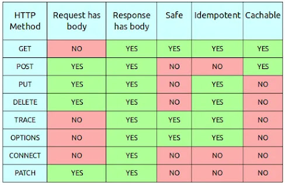
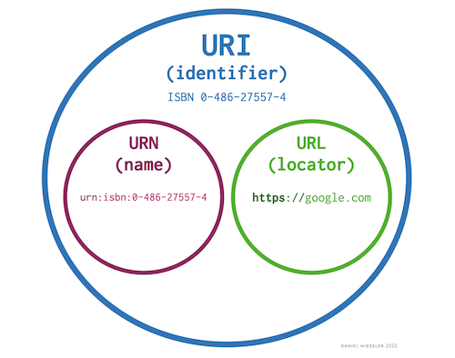
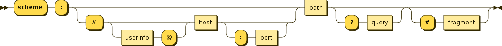

# [HTTP - HyperText Transfer Protocol](https://developer.mozilla.org/en-US/docs/Web/HTTP)

* Usado na **transferência** e **manipulação** de **recursos**;
* Executa sobre **TCP**;
* **Client-Server** protocol;
* **Stateless** - servidor não mantém dados sobre os requests;
* **Sessionful** - mantém uma sessão.

---

## Requests

* **Method** - descreve a operação do cliente;
* **Path** - path do recurso;
* **Version** - versão do protocolo;
* **Headers** - informação adicional;
* **Body** - contém o recurso enviado (apenas em alguns métodos).

    

---

### [Request Methods](https://developer.mozilla.org/en-US/docs/Web/HTTP/Methods)

* GET - pede a representação de um recurso;
* HEAD - igual a um GET só que sem o body;
* DELETE - apaga o recurso;
* POST - envia uma entidade ao recurso, mudando o estado do servidor ou tendo outros side-effects;
* PUT - substitui todas as representações do recurso com a representação enviada; também pode criar um novo recurso;
* PATCH - 

#### Propriedades

* **Safe** - an HTTP method is safe if it doesn't alter the state of the server;
* **Idempotent** - an HTTP method is idempotent if an identical request can be made once or several times in a row with the same effect while leaving the server in the same state. In other words, an idempotent method should not have any side effects — unless those side effects are also idempotent;
* **Cacheable** - a cacheable response is an HTTP response that can be cached, that is stored to be retrieved and used later, saving a new request to the server.

    

---

## Responses

* Version - versão do protocolo;
* Status code - código da resposta;
* Status message - descreve o status code;
* Headers - informação sobre a resposta;
* Body - recurso pedido, dependendo do request.

    

---

## [Status Codes](https://developer.mozilla.org/en-US/docs/Web/HTTP/Status)

* 1xx - Informational responses;
* 2xx - Successful responses;
* 3xx -  Redirection messages;
* 4xx - Client error responses;
* 5xx - Server error responses.

Status code comuns:

* 200 Ok - sucesso;
* 201 Created - recurso criado com sucesso;
* 301 Moved Permanently - recurso mudou de URL;
* 400 Bad Request - servidor não compreendeu o pedido;
* 401 Unauthorized - utilizador não autenticado;
* 403 Forbidden - utilizador não tem permissão para aceder ao recurso;
* 404 Not Found - recurso não encontrado;
* 500 Internal Server Error - erro do servidor.

---
---

# Nota: [Identificar Recursos](https://danielmiessler.com/study/difference-between-uri-url/)

* Recursos são identificados por um URI (Uniform Resource Identifier)

    

    

* Scheme - indica que protocolo o browser deve usar;
* Authority - domain name, user information and port;
* Path - path do recurso;
* Query - parâmetros extra;
* Fragment - anchor para outra parte do recurso.