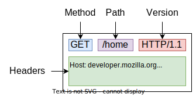

# [HTTP - HyperText Transfer Protocol](https://developer.mozilla.org/en-US/docs/Web/HTTP)

> The HTTP is an **application layer** protocol is the foundation of the web.

* Used to **transfer** and **manipulate** **data** on the web;
* This data is called "**resources**";
* Executes over **TCP/IP**;
* Its a **client-server model**, meaning that a client **opens a connection** to make a request, and waits until it receives a response from the server;
* **Stateless** protocol, meaning that each time a request is made, the server has **no knowledge of the previous request**;
* **Sessionful** protocol, meaning that the server can hold information about the client, by using **cookies**;

> The target of an HTTP request is called a "resource". HTTP does not limit the nature of a resource; it merely defines an interface that might be used to interact with resources. Each resource is identified by a Uniform Resource Identifier (URI), as described in Section 2.7 of [RFC7230].

---

## Uniform Interface

> HTTP provides a uniform interface for interacting with a resource, regardless of its type, nature, or implementation, via the manipulation and transfer of representations.

* The HTTP is nor resource-specific, meaning that it can be used to transfer any type of data;
* Requests are directed to resources using a generic interface, with standard semantics;
* This helps to decouple the client and the server, allowing them to evolve independently;

---
---

# [HTTP Messages](https://developer.mozilla.org/en-US/docs/Web/HTTP/Overview#http_messages)

> There are two types of HTTP messages, **requests** and **responses**, each with its own format.

## [Requests](https://developer.mozilla.org/en-US/docs/Web/HTTP/Overview#responses)

* **Method** - defines the **action** to be performed;
* **Path** - the **path to the resource**;
* **Version** - the HTTP version;
* **Headers** - **optional** headers, containing **additional information** about the request;
* **Body** - contains the data to be sent to the server, **optional**;

    

### [Request Methods](https://developer.mozilla.org/en-US/docs/Web/HTTP/Methods)

* `GET` - **requests a representation** of the specified resource. Requests using GET should only retrieve data;
* `HEAD` - same as GET, but **without the response body**, only the headers;
* `POST` - used to **submit an entity** to the specified resource, often **causing a change in state or side effects** on the server;
* `PUT` - **replaces all current representations** of the target resource with the request payload;
* `DELETE` - **deletes** the specified resource;
* `PATCH` - used to apply **partial modifications** to a resource;
* ...

#### Propriedades

* **Safe** - an HTTP method is safe if it **doesn't alter the state** of the server;
* **Idempotent** - an HTTP method is idempotent if **an identical request can be made once or several times in a row with the same effect** while **leaving the server in the same state**. In other words, an idempotent method **should not have any side effects** — unless those side effects are also idempotent;
* **Cacheable** - a cacheable response is an HTTP response that **can be cached**, that is stored to be retrieved and used later, saving a new request to the server.

| **Method** | **Safe** | **Idempotent** | **Cacheable** |
| ---------- | -------- | -------------- | ------------- |
| `GET`      | Yes      | Yes            | Yes           |
| `HEAD`     | Yes      | Yes            | Yes           |
| `POST`     | No       | No             | Yes           |
| `PUT`      | No       | Yes            | No            |
| `DELETE`   | No       | Yes            | No            |
| `PATCH`    | No       | No             | No            |

---

## [Responses](https://developer.mozilla.org/en-US/docs/Web/HTTP/Overview#responses)

* **Version** - the HTTP version;
* **Status code** - a **3-digit** number that **indicates the status of the response**;
* **Status message** - a **textual description** of the status code;
* **Headers** - **optional** headers, containing **additional information** about the response;
* **Body** - contains the data to be sent to the client, **optional**.

    

### [Status Codes](https://developer.mozilla.org/en-US/docs/Web/HTTP/Status)

* `1xx` - **Informational** responses;
* `2xx` - **Successful** responses;
* `3xx` -  **Redirection** messages;
* `4xx` - **Client error** responses;
* `5xx` - **Server error** responses.

More relevant status codes:

* `200` - **OK** - the request has succeeded;
* `201` - **Created** - the request has succeeded and a new resource has been created as a result;
* `301` - **Moved Permanently** - the target resource has been assigned a new permanent URI and any future references to this resource should use one of the enclosed URIs;
* `304` - **Not Modified** - indicates that the resource has not been modified since the version specified by the request headers If-Modified-Since or If-None-Match;
* `400` - **Bad Request** - the server cannot or will not process the request due to an apparent client error;
* `401` - **Unauthorized** - similar to 403 Forbidden, but specifically for use when authentication is required and has failed or has not yet been provided;
* `403` - **Forbidden** - the request was a valid request, but the server is refusing to respond to it;
* `404` - **Not Found** - the requested resource could not be found but may be available in the future;
* `500` - **Internal Server Error** - a generic error message, given when an unexpected condition was encountered and no more specific message is suitable.

---
---

## Web Resources

> The target of an HTTP request is called a "resource". HTTP does not limit the nature of a resource; it merely defines an interface that might be used to interact with resources. Each resource is identified by a **Uniform Resource Identifier (URI)**, as described in Section 2.7 of [RFC7230].

* Resources are **identified** by a [**URI**](https://en.wikipedia.org/wiki/Uniform_Resource_Identifier);
* URI have an uniform format: `scheme:[//authority][/]path[?query][#fragment]`;
  * **Scheme** - the protocol used to access the resource, like `http` or `https` or `mailto`.
  * **Authority** - composed by three components: `[user:password@]host[:port]`:
    * The **userinfo**, which is optional, may contain a **username** and **password** used for authentication;
    * The **host**, which identifies the network location of the resource;
    * The **port**, which is optional and defaults to the standard port if not specified;
  * **Path** - the path to the resource;
  * **Query** - the query string, which is optional;
  * **Fragment** - the fragment identifier, which is optional;