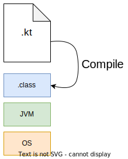
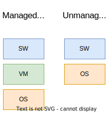
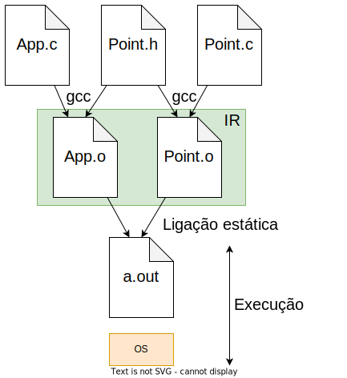
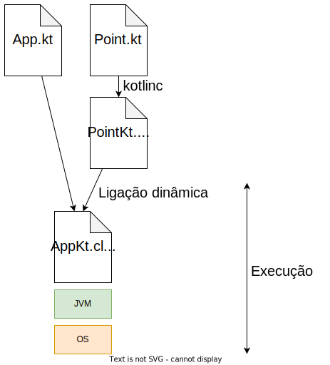

# Virtual Machines

* **Managed runtime** or execution environment;
* System virtual machines: full virtualization;
* **Process virtual machines**: executes programs.

| Virtual Machine | IR           | Language            |
| --------------- | ------------ | ------------------- |
| JVM             | **bytecode** | Java, Kotlin, Scala |
| .NET            | IL           | C#, F#, VB          |
| Node.js         | JavaScript   | JS, TS, Kotlin      |

**IR**: Intermediate Representation;

---

## Managed Runtime

* **Portability**: Compile once and run everywhere;
* **Safety**: No invalid memory accesses;
* **Garbage collection**;
* **Jitter**: Just-in-time compiler; compiles IR to native code (e.g. x86, amd64, ppc) at runtime;
* **Classloader**: lazy file loader (only loaded when needed) and dynamic (loaded at runtime);
* **Interoperability** between the languages of the same VM (ex.: Java <=> Kotlin);
* **Type system**: Set of rules and principles that specify how types are defined and behave.

`Software components = bytecodes + metadata`

### Metadata

* Describes the software;
* Data with information about other data;
* Equivalent to the **header file**.

In Kotlin, each class has an associated `.class` file, containing bytecode and metadata:

    

A `.class` file is generated for each type (class or interface).
Files `.class` are also generated for global functions, with `$$` in the file name.

---

## Kotlin/Java Type System

* A type system is a **set of principles and rules** that specify how types are defined and behave;
* Types are defined by classes or interfaces;
* Classes have **members**:

| JVM     | Kotlin     |
| ------- | ---------- |
| Fields  | Properties |
| Methods | Functions  |

The concept of **property** does not exist in JVM.

A property in Kotlin can generate:

* **Field**: slot in memory where the property value is stored; accessed through the `getfield` instruction in bytecode;
* **Getter**: method that returns the property value;
* **Setter**: method that defines the property value.

The base type of the Kotlin type hierarchy is `Any`, while in Java it is `Object`:

| Kotlin         | Java           |
| -------------- | -------------- |
| `Any`          | `Object`       |
| `val`          | `final`        |
| `new` implicit | `new` explicit |

---

## Software Component

* **Reusable** software unit;
* Contains **IR** and **metadata**;
* **Ready to use**: no need for static compilation;
* **Indivisible**;
* Provided by the provider and used by the client;

The software developed by components promotes the reuse of code and reduces the complexity of development.

---

## Notes

**Compile**: Translate/convert from one language to another;
  * **Dynamic**: at runtime;
  * **Static**: at build time;

**Transpile**: compilation from a high-level language to another.

**Verbose**: something expressed by more words than necessary (Java).

**Implicit**: something that is not formally expressed (in the source code) but is generated by the compiler.

**Abstraction**: separate the essential from the accessory, to focus attention on more important details.

**WARNING**: never give more permissions than necessary:
* Immutability (`val` > `var`);
* Privacy (`private` > `protected` > `public`).

---

## Unmanaged Runtime vs. Managed Runtime

    

### Unmanaged Runtime

* Component is not a unit, but `header + object` files:
  * **header** <=> metadata;
  * **object** <=> IR;
* **Static linking**;
* Structural modification: compilation + link;
* Behavioral modification: link.

    

When the link is static, the object files can be deleted and a.out runs the same.

### Managed Runtime

* Component is a unit: `.class` file;
* **Dynamic linking**;
* Jitter;
* Lazy loading.

    

