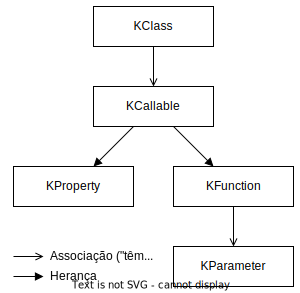

# [Reflection](https://kotlinlang.org/docs/reflection.html)

> Reflection is the ability of a program to examine its own structure and behavior at runtime. Reflection is a powerful tool, but it should be used with care. It is easy to write programs that use reflection to do things that would be much better done in a more straightforward way. Reflection is also a source of considerable complexity, and it is easy to write programs that are hard to understand because they use reflection in complex ways.

* Object oriented API for metadata;
* Set of features that allow to examine the code structure at runtime.

| Kotlin         | Java              |
| -------------- | ----------------- |
| kotlin.reflect | java.lang.reflect |
| KClass         | Class             |
| KCallable      | Member            |
| KFunction      | Method            |
| KProperty      | Field             |

* `KClass.java -> Class`;
* `Class.kotlin -> KClass`.

<p align="center">
    
</p>

---

## [KClass](https://kotlinlang.org/api/latest/jvm/stdlib/kotlin.reflect/-k-class/)

_Represents a class and provides introspection capabilities._

```kotlin
val c: KClass<MyClass> = MyClass::class
// or
val instance = MyClass()
val c: KClass<MyClass> = instance::class
```

Relevant properties and methods:

* `constructors`;
* `isAbstract`;
* `isCompanion`;
* `isData`;
* `isSealed`;
* `members`;
* `objectInstance`;
* `qualifiedName`;
* `simpleName`;
* `visibility`: returns [`KVisibility`](https://kotlinlang.org/api/latest/jvm/stdlib/kotlin.reflect/-k-visibility/), which can be `PUBLIC`, `PROTECTED`, `INTERNAL` ou `PRIVATE`;
* `annotations`;
* `memberProperties`;
* `memberExtensionProperties`;
* `declaredMemberProperties`;
* `declaredMemberExtensionProperties`;
* `memberFunctions`;
* `memberExtensionFunctions`;
* `declaredMemberFunctions`;
* `declaredMemberExtensionFunctions`;
* `declaredMembers`;
* `java`
* `primaryConstructor`;
* `createInstance`
* `createType`: returns [`KType](https://kotlinlang.org/api/latest/jvm/stdlib/kotlin.reflect/-k-type/)`;
* `findAnnotation`;
* `hasAnnotation`;
* `isSubclassOf`;
* `isSuperclassOf`;

| Methods                          | Extension | Non-Extension | Declared only in this class | Declared in this class and superclasses |
| -------------------------------- | --------- | ------------- | --------------------------- | --------------------------------------- |
| memberProperties                 |           | X             |                             | X                                       |
| memberExtensionProperties        | X         |               |                             | X                                       |
| declaredMemberProperties         |           | X             | X                           |                                         |
| declaredMemberExtensionFunctions | X         |               | X                           |                                         |
| static                           |           | X             | X                           |                                         |


| Methods                          | Type       |
| -------------------------------- | ---------- |
| memberProperties                 | KProperty1 |
| declaredMemberProperties         | KProperty1 |
| memberExtensionProperties        | KProperty2 |
| declaredMemberExtensionFunctions | KProperty2 |

---

## [KCallable](https://kotlinlang.org/api/latest/jvm/stdlib/kotlin.reflect/-k-callable/)

_Represents a callable entity, such as a function or a property._

Relevant properties and methods:

* `KCallable<out R>.call(args):R`;
* `name`;
* `parameters`;
* `returnType`: returns [`KType](https://kotlinlang.org/api/latest/jvm/stdlib/kotlin.reflect/-k-type/)`;
* `typeParameters`;
* `visibility`;
* `annotations`;
* `callBy`;
* `instanceParameter`;
* `findParameterByName`;
* `findAnnotation`;
* `hasAnnotation`;

### [KProperty](https://kotlinlang.org/api/latest/jvm/stdlib/kotlin.reflect/-k-property/)

_Represents a property, such as a named val or var declaration._

To access properties as first-class objects in Kotlin, use the `::` operator:

```kotlin
var x = 1

::x.get()
::x.set(2)
::x.name
```

The expression `::x` evaluates to a `KProperty<Int>` type property object.

Relevant properties and methods:

* `isConst`;
* `isLateinit`;
* `getter`;

Is **superclass** of `KMutableProperty`, which has the `setter` property and the `set(instance, value)` method, equivalent to `setter.call(instance, value)`.

### [KFunction](https://kotlinlang.org/api/latest/jvm/stdlib/kotlin.reflect/-k-function/)

_Represents a function with introspection capabilities._

You can use the function as a function type value, that is, pass it to another function. To do so, use the `::` operator:

`fun isOdd(x: Int) = x % 2 != 0` is referenced by `::isOdd` -> here `::isOdd` is a value of function type `(Int) -> Boolean`.

Relevant properties and methods:

* `isInline`;
* `isOperator`;
* `isSuspend`;

#### [KParameter](https://kotlinlang.org/api/latest/jvm/stdlib/kotlin.reflect/-k-parameter/)

_Represents a parameter passed to a function or a property getter/setter, including this and extension receiver parameters._

Relevant properties and methods:

* `isOptional`;
* `isVararg`;
* `kind`;
* `name`;
* `type`;
* `findAnnotation`;
* `hasAnnotation`;

---

### [KType](https://kotlinlang.org/api/latest/jvm/stdlib/kotlin.reflect/-k-type/)

_Represents a type. Type is usually either a class with optional type arguments, or a type parameter of some declaration, plus nullability._

To get the `KClass` associated with a `KType` there are two ways:

* `KType.classifier as KClass<*>`;
* `KType.jvmErasure`;

---
---

# [Annotations](https://kotlinlang.org/docs/annotations.html)

> Annotations are metadata that you can add to your code to convey information to the compiler and other tools.

* Allow us to add metadata to our code.
* Are created by using the `annotation` keyword: 

```kotlin
annotation class Fancy
```

We can annotate annotations with other annotations:

```kotlin
@Target(AnnotationTarget.CLASS)
annotation class Fancy
```

`@Target`: specifies the **possible kinds of elements which can be annotated** with the annotation (such as classes, functions, properties, and expressions); receives a list of `AnnotationTarget` values:

* `CLASS`;
* `ANNOTATION_CLASS`;
* `PROPERTY`;
* `FIELD`;
* `CONSTRUCTOR`;
* `FUNCTION`;
* `PROPERTY_GETTER`;
* `PROPERTY_SETTER`;
* `TYPE`;
* `TYPE_PARAMETER`;
* `LOCAL_VARIABLE`;
* `VALUE_PARAMETER`;
* `EXPRESSION`;
* `FILE`;
* `TYPEALIAS`.

`@Retention`: specifies the **retention policy of the annotation** (whether the annotation is stored in the compiled class file, is available in the reflection information, or is ignored by the compiler); receives a `AnnotationRetention` value:

* `SOURCE`: the annotation is **not stored in the compiled** class file, **only in the source code**;
* `RUNTIME`: the annotation is **stored in the compiled class file** and is **available in the reflection** information;
* `BINARY`: the annotation is **stored in the compiled class file**, but is **not available in the reflection** information.

`@Repeatable`: allows using the same annotation on a single element multiple times;

The allowed parameters in annotation constructors are:

* Primitive types;
* String;
* KClass;
* Enum;
* Annotations;
* Arrays.

In the Reflection API, the `KAnnotatedElement` type is the superclass of all annotated element types, such as `KClass`, `KCallable`, `KParameter`, etc.

This type has the `annotations` property, which returns a list of `Annotation` objects.
Also contains the following methods:

* `hasAnnotation<T: Annotation>(): Boolean`;
* `findAnnotation<T: Annotation>(): T?`.
