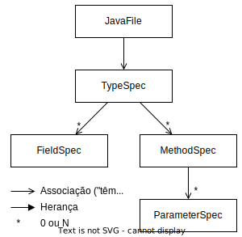

# Metaprogramming

> Metaprogramming is the writing of computer programs that write or manipulate other programs (or themselves) as their data, or that do part of the work at compile time that would otherwise be done at run time.

* Ability to read, generate, transform or modify programs **dynamically** (*at runtime*);
* Has the objective of **increasing performance**, since reflection has high costs.

---

## [JavaPoet](https://github.com/square/javapoet)

_`JavaPoet` is a Java API for generating `.java` source files._


<p align="center">
    
</p>

### [JavaFile](https://square.github.io/javapoet/1.x/javapoet/com/squareup/javapoet/JavaFile.html)

_Represents a Java file containing a single top level class._

Example:

```kotlin
val file = JavaFile
    .builder("com.example", typeSpec)
    .build()
```

### [TypeSpec](https://square.github.io/javapoet/1.x/javapoet/com/squareup/javapoet/TypeSpec.html)

_Represents a generated class, interface, or enum declaration._

Example:

```kotlin
val typeSpec = TypeSpec
    .classBuilder("MyClass")
    .addField(fieldSpec)
    .addMethod(methodSpec)
    .build()
```

### [FieldSpec](https://square.github.io/javapoet/1.x/javapoet/com/squareup/javapoet/FieldSpec.html)

_Represents a generated field declaration._

Example:

```kotlin
val fieldSpec = FieldSpec
    .builder(String::class.java)
    .addModifiers(Modifier.PRIVATE)
    .build()
```

### [MethodSpec](https://square.github.io/javapoet/1.x/javapoet/com/squareup/javapoet/MethodSpec.html)

_Represents a generated constructor or method declaration._

Example:

```kotlin
val methodSpec = MethodSpec
    .methodBuilder("myMethod")
    .addModifiers(Modifier.PUBLIC)
    .addParameter(parameterSpec)
    .returns(String::class.java)
    .addStatement("return \"Hello, World!\"")
    .build()
```

To define a constructor, use the `constructorBuilder` method instead of `methodBuilder`.

#### [ParameterSpec](https://square.github.io/javapoet/1.x/javapoet/com/squareup/javapoet/ParameterSpec.html)

_Represents a generated parameter declaration._

It is **not very used**, since the parameters are defined directly in the `addParameter` method.
