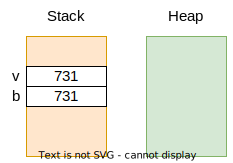
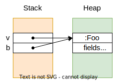

# JVM Type System

The types in the JVM are divided into **primitive types** and **reference types**:

| **Primitive Types**      | **Reference Types**  |
| ------------------------ | -------------------- |
| "value"                  | "object"             |
| local instances on stack | instances on heap    |
| copy is by value         | copy is by reference |
| cannot be null           | can be null          |

* The **lifetime of local variables** (on the stack) is equal to the execution time of the function to which they belong;
* The **lifetime of objects on the heap** is longer than the execution time of the function, and is the target of GC when the objects are _unreachable_, that is, there is no reference to them.

---

## Primitive Types (Value Types)

| Java    | Kotlin  |
| ------- | ------- |
| int     | Int     |
| long    | Long    |
| float   | Float   |
| double  | Double  |
| char    | Char    |
| boolean | Boolean |
| byte    | Byte    |
| short   | Short   |


Example:

```kotlin
fun bar() {
    val v: Int = 731
    val b = v
}
```

* The variables v and b are local to `bar`;
* The copy of v is made by value; b gets a copy of the value of v:

<p align="center">
    
</p>

---

## Reference Types (Object Types or Wrapper Types)

| Java      | Kotlin   |
| --------- | -------- |
| Integer   | Int?     |
| Long      | Long?    |
| Float     | Float?   |
| Double    | Double?  |
| Character | Char?    |
| Boolean   | Boolean? |
| Byte      | Byte?    |
| Short     | Short?   |


Example:

```kotlin
class Foo {};

fun bar() {
    val v = Foo()
    val b = v
}
```

* The variables v and b are local to `bar`;
* The copy of v is made by reference; b points to the same object:

<p align="center">
    
</p>

---

## Type Conversion

* TR -> TR: casting;
* TP -> TP: coercion;
* TP -> TR: boxing;
* TR -> TP: unboxing.

* `RT -> RT`: **Casting**: maintains the instance and changes the reference;
* `PT -> PT`: **Coercion**: changes the value of the instance;
* `PT -> RT`: **Boxing**: copy of the primitive value to the heap - `<Wrapper>.valueOf(<primitive>)`;
* `RT -> PT`: **Unboxing**: copy of the heap value to the primitive value - `<Wrapper>.<primitive>Value()`.

[**Autoboxing**](https://docs.oracle.com/javase/tutorial/java/data/autoboxing.html) is the automatic conversion that the Java compiler makes between the primitive types and their corresponding object wrapper classes.

Two types of casting:

* **Upcasting**: generalization; "Child -> Parent";
* **Downcasting**: specificationF; "Child -> Child".

### `checkcast` Instruction

* Checks if the reference at the top of the stack is compatible with the specified reference type;
* Compatibility means being of the same type or of a derived type;
* Used only in **downcasting**.

If the check is successful, the cast is performed, otherwise the `ClassCastException` exception is thrown.
