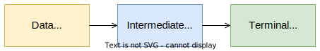

# [Collection Pipeline](https://martinfowler.com/articles/collection-pipeline/)

> A collection pipeline is a sequence of operations on a collection. The operations are chained together, and the result of each operation is passed to the next operation. The result of the pipeline is the result of the last operation.

* Operation chaining on data that form a _query_;
* A collection is the output of an operation and the input of another.

<p align="center">
    
</p>

**Method Chaining:**

```kotlin
val result = listOf(1, 2, 3)
        .map { it * 2 }
        .filter { it > 5 }
        .distinct()
        .count()
```

**Nested Methods:**

```kotlin
val result = count(
    distinct(
        filter(
            map(
                listOf(1, 2, 3)
            ) { it * 2 }
        ) { it > 5 }
    )
)
```

* **General-purpose language**: a programming language that is capable of creating all types of programs; e.g. Kotlin, Java, C#, C++, etc.
* **Domain-specific language**:  a computer language specialized to a particular application domain; e.g. SQL, HTML, Latex, etc.

---
---

# [Generics](https://kotlinlang.org/docs/generics.html)

> Generics are a way to make your code more flexible and reusable. They allow you to define classes and methods that work with a variety of types, while providing compile-time type safety.

With generics, you get:

* Type safety;
* Expressiveness;
* Implicit casting.

Generics in classes: `class Fancy <T, ...> (...) {...}`

Generics in functions: `fun <T, ...> foo (...) {...}`


`out` keyword:

* e.g. `<out T>`;
* means that we can assign to that type parameter **superclasses of T**.

`in` keyword:

* e.g. `<in T>`;
* means that we can assign to that type parameter **subclasses of T**.

---

## Type Erasure

> _Type erasure is the load-time process by which explicit type annotations are removed from a program, before it is executed at run-time._

* Mechanism that replaces all generic types by `Object`;
* Generic types are **not preserved at runtime**.

The solution is the use of `reified type parameters` and `inline functions`.

[**Reified type**](https://kotlinlang.org/docs/inline-functions.html#reified-type-parameters):

* Allows access to the information of the generic type;
* Declared only in inline functions.

[**Inline function**](https://kotlinlang.org/docs/inline-functions.html):

* The compiler copies the function to where it is called, so in bytecode there is no `invoke` instruction.

---
---

# [Sequences](https://kotlinlang.org/docs/sequences.html)

> A sequence is a lazily evaluated collection of elements. It is a sequence of elements that can be iterated over. It is a sequence of elements that can be iterated over. It is a sequence of elements that can be iterated over.

* Similar to `Iterable`;
* **Lazy** (elements are only processed when necessary).

> **Note:** Iterable is **eager**, i.e., elements are loaded as soon as the code is executed.

Useful functions:

* `Iterable<T>.asSequence(): Sequence<T>` - converts an `Iterable` to a `Sequence`.
* `sequence { SequenceScope -> ... }` - creates a `Sequence` from a lambda.

Example:

```kotlin
val result = listOf(1, 2, 3)
        .asSequence()
        .map { it * 2 }
        .filter { it > 5 }
        .distinct()
        .count()

val result = sequence {
    yield(1)
    yieldAll(listOf(2, 3))
    yieldAll(listOf(4, 5))
}
```

* A generator function is a function that returns a sequence;
* The `yield` instruction is similar to a `return`, but it returns an element of the sequence, creating a **suspension point**;
* The `yieldAll` instruction is similar to a `yield`, but it returns a sequence of elements, creating a **suspension point**.