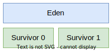

# [Garbage Collection](https://www.oracle.com/webfolder/technetwork/tutorials/obe/java/gc01/index.html#t2)

> _Process of looking ate heap memory, identifying unused objects (unreferenced objects), and freeing them._

**Referenced object** (in use):

* Some part of your program still maintains a pointer to that object;
* Referenced by a root.

**Root Reference**:

* Local variables: stored in the stack of the thread;
* Static variables: stored in the class type.

---

## Garbage Collection Phases

1. **Mark**: identify the referenced objects, and mark them using a **flag at the object header**;
2. **Delete**: delete the unreferenced objects;
   * Approach 1:
     * List of free blocks;
     * Problems:
       * **fragmentation**;
       * memory allocation is slow;
   * Approach 2:
     * **Compacting**, so there is no fragmentation;
     * Memory allocation is fast;
     * Problems:
       * Longer processing time.

---

## Generational Garbage Collection

* Higher performance;
* Usually, **new objects have a shorter life time**, so the GC is more efficient in the younger generations.

### JVM Generations

* **Young**: new objects;
* **Old**: long survived objects;
* **Permanent**: metadata, class definitions, method definitions, etc.

#### Young Generation

    

* New objects are stored in **Eden**;
* After the GC, Eden and one of the survivors are **empty**;
* Surviving objects alternate between the survivors, until they are **promoted** to the Old Generation.

### Stop the World Events

* **Minor GC**: acts on the Young Generation;
* **Major GC**: acts on the Old Generation;
* **Full GC**: acts on the Young and Old Generations.

---

## GC Properties

> _G1 is a generational, incremental, parallel, mostly concurrent, stop-the-world, and evacuating garbage
collector_ ~ from [here](https://docs.oracle.com/javase/9/gctuning/garbage-first-garbage-collector.htm#JSGCT-GUID-CE6F94B6-71AF-45D5-829E-DEADD9BA929D)

* **Generational**: Objects are separated into generations, based on their lifetime;
* **Incremental**: _An incremental garbage collector is any garbage-collector that can run incrementally (meaning that it can do a little work, then some more work, then some more work), instead of having to run the whole collection without interruption;_
* **Parallel**: _Multiple threads are used to speed up garbage collection;_
* **Mostly Concurrent**: _Managed threads can continue to run most of the time while the concurrent garbage collection thread is running;_
* **Stop-the-World**: _The execution of the program is suspended for GC till all objects in the heap are processed;_
* **Evacuating**: _Live objects found within selected memory areas to collect are copied into new memory areas, compacting them in the process. After an evacuation has been completed, the space previously occupied by live objects is reused for allocation by the application._

---
---

# [Finalization](https://www.oracle.com/technical-resources/articles/javase/finalization.html)

> _Finalization is a process that occurs when the garbage collector determines that there are no more references to an object. The garbage collector calls the finalize method of the object, which is a method defined in the Object class. The finalize method is called only once by the garbage collector on an object._

* Management of native resources associated with an object;
* Cleaning of objects that the GC considered unreachable;
* Object life cycle:
  * Created;
  * Unreachable;
  * Added to the finalization queue;
  * Finalized;
  * GC deleted.

**Problems**:

* Delays the GC;
* Memory retention;
* Object life time is longer;
* There is no guarantee that the finalization will be executed;
* Object can be resurrected.

> **Warning:** Do not use the following methods:

* `System.gc()`: executes the GC, but there is no guarantee that the finalization will be executed;
* `System.runFinalization()`: executes the finalization, but there is no guarantee that the GC will be executed.

---

## [try-with-resources statement](https://docs.oracle.com/javase/tutorial/essential/exceptions/tryResourceClose.html)

* Declares one or more resources;
* A resource is an object that must be closed after the program is finished with it.

Resource can be:

* Declared in the try block, and are closed automatically after its scope;
  * Only in Java;
  * Example: `try (FileWriter fw = new FileWriter("file.txt")) {...}`;
* Declared before the try block, and are closed manually in the finally block;
  * Example: `try { FileWriter fw = new FileWriter("file.txt") } finally { fw.close() }`;
* Method `.use(block: (T) -> R): T`;
  * Only in Kotlin.

> **Note:** `Closeable` and `AutoCloseable` are equivalent interfaces; `AutoCloseable` was introduced with the try-with-resources statement in Java, so in Kotlin they are equivalent. A class with a Closeable/AutoCloseable field, must also implement this interface.

---
---

# [Cleaner](https://docs.oracle.com/en/java/javase/17/docs/api/java.base/java/lang/ref/Cleaner.html)

* Manages a set of object references and corresponding cleaning actions;
* Explicit invocation of the `clean()` method when the object is closed or is no longer needed;
* `Cleanable` interface represents an object and a cleaning action registered in a Cleaner;
  * Contains a single `clean()` method, which executes the cleaning action and removes the object's registration.
* `Cleanable register(Object obj, Runnable action)`: registers an object and a cleaning action with this cleaner.