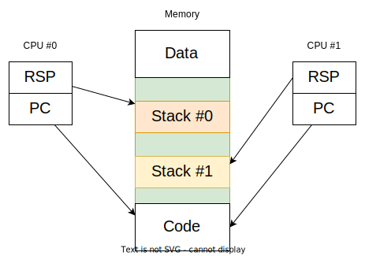
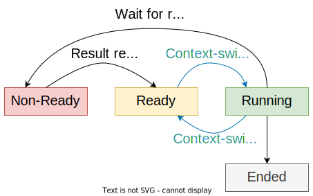

# Threads

* **Sequential computation**;
* Mechanism provided by the OS to allow the existence of multiple sequencial computations executing simultaneously in the same process;
* In the JVM, a thread is created by calling the constructor **Thread**, passing a **Runnable** (object with the method run, that defines a sequential computation) to it as an argument;
* The OSs allow the implementation of multiple threads through time multiplexing of a set of M Threads through N CPUs; this is done by a component named **scheduler**.

## Motivation

* **Performance**: take advantage of the existence of multiple CPUs;
* **Code organization**: sometimes it is simpler to organize the code in multiple sequential computations.

### NOTE: Virtual memory

* There exists a physical addressing space and multiple virtual ones;
* Mapping of virtual addresses to physical ones;
* Each process uses its virtual memory.

---

## Relationship between Threads

* Threads of the same process aren't isolated, therefore they **share the same memory space**, including the code and the data;
* However, there exists **a stack for each computation**, given that the computation state is stored in that stack.

    

**NOTE**: this doesn't mean that there's a stack per CPU, but per computation, because the computation can be executed in multiple CPUs.

### Stack

* Stack of stack frames;
* LIFO: last in first out;
* Stores:
  * function invocations;
  * local variables;
  * arguments;
* In x86, the stack grows downwards.

### Disadvantages

* A protection against thread interference does not exist;
* This is dangerous in the case of mutable data sharing -> **Concurrency Hazards**.

---

## Thread States

A thread that still isn't done is in one of these 3 states:

* **Running**: atributed to a CPU;
* **Ready**: not atributed to a CPU, because there aren't available CPUs;
* **Non-Ready**: not atributed to a CPU, because it can only execute after a condition is fulfilled.

    

### Running -> Ready (Context-Switch)

* Can happen in two cases:
  * **Cooperative**: the thread itself solicits the OS to give up on the CPU (yield);
  * **Promotive**: 
    * the scheduler decides that the running thread has to be replaced; 
    * this can happen because it has been using the CPU for too much time;
    * occurs through the interruption system, between assembly instructions.
* Is called **context-switch** because the **context of the thread** that was running is stored in memory and the context of the thread that was ready is loaded.

#### Thread Context

* Information that is required to be saved in memory for the same thread to be correctly resumed, when that information is loaded to the CPU;
* Stack pointer, instruction pointer, etc.

### Ready -> Running

* When the scheduler decides to atribute a CPU to a read thread;
* This also implies context-switch.

### Running -> Non-Ready

* When a thread executes an operation whose result isn't available yet, so it can't continue to execute.

### Non-Ready -> Ready

* When the condition required for the thread to continue to execute is fulfilled.

---

## [Threads in JVM](https://docs.oracle.com/javase/8/docs/api/java/lang/Thread.html)

* Represented by the class `Thread`;
* Has a state of the type `Thread.State`:
  * `NEW`: non-initialized thread;
  * `RUNNABLE`: thread to execute;
  * `BLOCKED`: blocked thread, waiting for a lock;
  * `WAITING`: thread passively waiting for a condition;
  * `TIMED_WAITED`: in passive waiting with wait time (`Thread.sleep()`);
  * `TERMINATED`: terminated.

Some relevant methods:

* `start()`: starts the thread;
* `sleep(long millis)`: suspends the thread for a specified time;
* `join()`: synchronizes itself with the thread termination;
* `interrupt()`: interrupts the thread, therefore setting the interrupt status to true;
* `interrupted()`: verifies if the interrupt status is true.

### Interruptions

* Mechanism implemented to support cancelling;
* An `InterruptException` can be thrown by blocking methods when the interrupt status is true;
* The thread has a flag called **interrupt status**;
* Some blocking methods clear the status and throw the exception.
