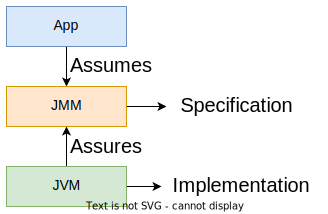
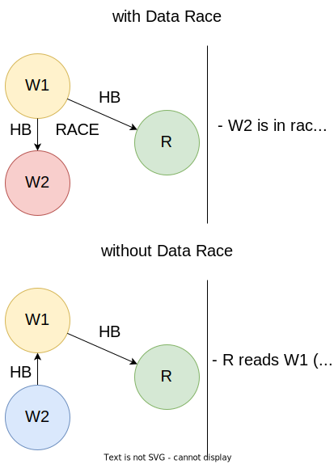

# [Java Memory Model - JMM](https://docs.oracle.com/javase/specs/jls/se8/html/jls-17.html)

Define o comportamento permito em programas multithreaded.

    

* A aplicação não pode assumir mais que a especificação especifica;
* A implementação não pode garantir menos do que a especificação especifica.

## Ações

* Escritas em memória;
* Leitura em memória;
* Escritas voláteis em memória;
* Leituras voláteis em memória.
* ...

As escritas/leituras voláteis são realizadas sobre uma variável marcada com a anotação `@Volatile`.

## "Happens-Before" (HB)

* Relação de ordem parcial sobre as ações;
* O nome da relação é apenas **abstrato**, não querendo dizer "acontece antes";
* Axiomas de HB:

1. **Transitividade**: `HB(x, y) e HB(y, z) => HB(x, z)`;
2. **Program Order**: Se x e y são ações da **mesma thread**, e x está primeiro que y em **program order**, então `HB(x, y)`;
3. **Volátil**: Se x é uma **escrita volátil** e y é uma **leitura volátil da mesma variável**, e y **lê o valor escrito** po x, então `HB(x, y)`; não é necessário que x e y sejam da mesma thread;
4. **Locks**: Se x é um **lock release** e y um **lock acquire do mesmo lock**, então `HB(x, y)`;
5. **Thread Start**: Se x é um **thread start** e y é a **primeira operação dessa thread**, então `HB(x, y)`;
6. **Thread Join**: Se x é a **última ação** de uma thread e y é um **thread join com a mesma thread**, então `HB(x, y)`;
7. **Thread Interruption**: Se x é uma **ação de interruption** e y é uma ação que **vê essa interrupção**, então `HB(x, y)`.

### O que HB garante?

**Se x é uma escrita e y uma leitura, e HB(x, y), e não existe um data race e x é a última escrita relacionada com y, então y lê o valor escrito por x.**

Um **data race** é quando duas ou mais threads acedem ao mesmo recurso concorrentemente, e pelo menos uma é de escrita e nenhuma usa locks:

    

