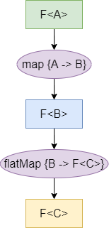
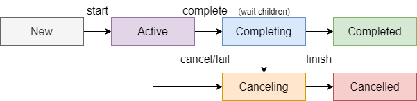

# Asynchronous Programming

* Técnica que permite que um programa não fique bloqueado numa operação potencialmente bloqueante;
* Em vez de esperar que a operação termine, o programa pode continuar a executar outras operações;
* O término da função pode ocorrer antes do término da operação.

    

### Desvantagens

* Uma thread ocupa recursos, tanto em memória, quanto no CPU;
* Cenários _thread per client_ ou _thread per request_ não são escaláveis.

---

## [NIO2](https://docs.oracle.com/javase/8/docs/technotes/guides/io/index.html)

* "New IO 2";
* Permite realiza operações de IO assincronamente.

---

## Callbacks

* Passar uma função como argumento de outra função, sendo invocada quando a operação terminar;
* A função retorna instantaneamente, sem esperar o fim da operação.

### [CompletionHandler<V, A>](https://docs.oracle.com/javase/8/docs/api/java/nio/channels/CompletionHandler.html)

* Handler para consumir o resultado de uma operação assíncrona;
* V: tipo resultante da execução da operação;
* Métodos:
  * `completed(V result, A attachment)`: invocado quando a operação foi terminada com sucesso;
  * `failed(Throwable exc, A attachment)`: invocado quando a operação falhou.

**AVISO**: a execução síncrona de CompletionHandlers aninhados pode causar **stack overflow**, devido às reentrâncias.

---

### NOTA: [Thread Local Storage](https://docs.microsoft.com/en-us/cpp/parallel/thread-local-storage-tls?view=msvc-170)

* Forma de ter variáveis locais globais a uma thread;
* Variáveis do tipo [ThreadLocal](https://docs.oracle.com/javase/8/docs/api/java/lang/ThreadLocal.html).
* Tem de se ter cuidado a utilizar este mecanismo, visto que outra computação pode ser executada na mesma thread e esta também tem acesso às variáveis.

---

## Futures e Promises

* Representam uma operação;
* Permite obter o estado da operação e o seu resultado;
* Formas de sincronização com a operação:
  1. **Polling** -> "perguntar múltiplas vezes se já terminou";
  2. Bloqueio com timeout;
* Ambas as ações acima descritas sõa bloqueantes, algo que não queremos na programação assíncrona, logo o tipo `CompletableFuture` fornece uma terceira opção:

### [CompletableFuture](https://docs.oracle.com/javase/8/docs/api/java/util/concurrent/CompletableFuture.html)

3. Agendamento de uma continuação da operação, produzindo um novo CompletableFuture;

* Tem um funcionamento similar às Promises do Javascript;

    

* Como é possível observar, o flatMap retorna um Future de C (`F<C>`) e não um Future de F<C> (`F<F<C>>`);
* Os erros não se perdem, propagam-se pelo pipeline de continuações.
* O método `get` é bloqueante;
* É compatível com a atribuição de um valor, com o método `complete`;
* O map é realizado pelo método `thenApply` e o flatMap pelo método `thenCompose`;
* Estes métodos executam a continuação na chamada do `complete`, ou seja, na thread que a completou; existe as variações `thenApplyAsync` e `thenComposeAsync` que executam a continuação numa thread de uma thread pool, que evita as reentrâncias.

---
---

## [Kotlin Coroutines](https://kotlinlang.org/docs/coroutines-overview.html)

* Computações sequencias passíveis de suspensão;
* Não existe uma relação de 1-1 de computação por thread;
* Uma coroutine pode suspender a sua execução numa thread e retomar noutra;
* Podem ser vistas como _light-weight threads_.

### Suspending Function

* Função que pode ser suspensa e retomada posteriormente;
* Keyword `suspend`;
* Só podem ser chamadas por outras suspending functions ou numa coroutine.

---

### Concorrência Estruturada

* Novas coroutines só podem ser lançadas num `CoroutineScope`, que **delimita o tempo de vida de uma coroutine**;
* Um scope não termina até todas as coroutines dentro dele terminarem;

#### [CoroutineScope](https://kotlinlang.org/api/kotlinx.coroutines/kotlinx-coroutines-core/kotlinx.coroutines/-coroutine-scope/)

* Define o scope das coroutines;
* Todos os coroutine builders são extensão de CoroutineScope (à exceção de `runBlocking`), e herdam automaticamente o contexto.

#### [CoroutineContext](https://kotlinlang.org/api/latest/jvm/stdlib/kotlin.coroutines/-coroutine-context/)

* Conjunto de elementos, usados para influenciar a execução de uma coroutine;
* Pode-se mudar o contexto de uma coroutine através do método `withContext`.

---

### [Job](https://kotlinlang.org/api/kotlinx.coroutines/kotlinx-coroutines-core/kotlinx.coroutines/-job/)

* Representa algo com um ciclo de vida, que pode ser cancelado ou concluído;
* Representa uma coroutine;
* Tem hierarquia "pais-filhos";
  * Quando um pai é cancelado, todos os filhos também o são;
  * Quando um filho é cancelado, é lançada `CancellationException`, que cancela o pai, e por consequente todos os filhos.
* Tem métodos como `cancel` e `join`;
* Estados:

    

---

### Funções relevantes

#### launch

* Coroutine builder;
* Lança uma nova coroutine concorrentemente com o resto do código.

#### runBlocking

* Coroutine builder;
* Bloqueia a thread onde é chamado;
* Cria um CoroutineScope;
* Thread bloqueada até todas as coroutines dentro do CoroutineScope terminarem.

#### delay

* Suspending function;
* Suspende a coroutine por um tempo especificado;
* Semelhante ao `Thread.sleep`.

#### coroutineScope

* Fornece um CoroutineScope;
* Semelhante ao `runBlocking`, só que não bloqueia a thread, apenas suspende;
* Outra diferença é q é uma suspending function.

#### suspendCoroutine

* Obtém a continuação da mesma, e suspende a coroutine até esta ser retomada;
* Cria um ponto de suspensão;
* `Continuation.resume` e `Continuation.resumeWithException` são utilizadas para retomar a coroutine.

#### suspendCancellableCoroutine

* Suspende a coroutine como o método acima, mas fornecendo uma `CancellableContinuation`;
* Uma continuação é _single-shot_, significando que só é executada uma vez.