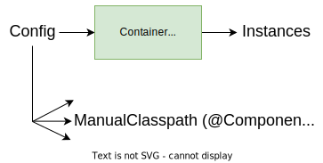

# [Spring Context](https://docs.spring.io/spring-framework/docs/current/reference/html/core.html#beans-introduction)

> Spring Context is a container that instantiates, configures, and manages a set of objects (beans) that are defined with a configuration metadata.

* **Dependency Injection (DI) container**;
  * Given a set of type information, including their dependencies, it creates the graph of component instances;
* System that allows us to **manage the composition and life cycle of objects and their dependencies, dynamically**;
* *The context is the Spring component responsible for instantiating and managing instances, such as controller instances.*

## Dependency Injection (DI) and Inversion of Control (IoC)

* Creation of the application **graph of objects**;
* Instantiation of the objects and their dependencies, **passing the dependencies** to the objects.

> The dependent object receives and uses the dependencies, but it does not create them.

<p align="center">
    
</p>

* **Constructor injection**: Dependency injection through the **constructor** - the **preferable way** of dependency injection;
* **Field/Property injection**: Dependencies are passed in **after object creation**, via the assignment of fields or the executions of property setter methods:
  * Requires **mutable** dependency fields;
  * Objects are not ready to operate after construction;
  * **Use only when the constructor injection is not possible**;
* **Wiring**: Establish the dependencies between objects;
* **Class stereotype**: Containers of functionality (components) vs containers of data.

---

### Examples

Steps:

1. Creation of the context;
2. Add the bean definitions to the context;
3. Refresh the context, to take in consideration the new bean definitions;
4. Use the context to get the beans.

**Bean**: *A bean is an object that is created and managed by the context.*

#### 1st Example

Considering the following classes and dependencies (*dependent -> dependency*):

ComponentC -> ComponentB ->  ComponentA

```kotlin
 // Create the context
val context = AnnotationConfigApplicationContext()

// Add the bean definitions
context.register(
    ComponentA::class.java,
    ComponentB::class.java,
    ComponentC::class.java
)

// Refresh the context
context.refresh()

// Get the beans (example: ComponentB)
val componentB = context.getBean<ComponentB>()
```

* If the ComponentA was not registered, the context would not be able to create the ComponentB, throwing an exception;
* If the ComponentB was not registered, the context would not be able to create it, throwing an exception.

#### 2nd Example

You can also add the bean definitions given a package, using the `scan` method. In this case, the context will search for the classes annotated with `@Component` and register them:

```kotlin
// Create the context
val context = AnnotationConfigApplicationContext()

// Add the bean definitions
context.scan("package.name")
```

**Note**: You can also use the context with components initialized with **lists of dependencies**. This can be useful, for example, when creating a router, where you can have a list of controllers and inject them into the router.


#### 3rd Example

If a component registered in the context is not initialized by a constructor, but with a static method, you can use the `@Bean` annotation to register it.

For example, a HttpClient is initialized with the `newBuilder` method, so we create a function that returns a HttpClient and annotate it with `@Bean`:

```kotlin
@Configuration
class BeanConfig {
    @Bean
    fun httpClient(cookieHandler: CookieHandler): HttpClient = HttpClient
        .newBuilder()
        .cookieHandler(cookieHandler)
        .build()
}

// Create the context
val context = AnnotationConfigApplicationContext()

// Add the bean definitions
context.register(BeanConfig::class.java)
```

---

## Container Overview

* `BeanFactory`: The core container interface;
  * `ApplicationContext`: The interface that extends the `BeanFactory`;
    * `AnnotationConfigApplicationContext`: The class that implements the `AbstractApplicationContext` and is used to create the context from annotations.

The Spring context is a DI container that needs configuration metadata to create the application objects. The metadata can be provided in different ways:

* XML configuration files;
* Java annotations or code.

<p align="center">
    
</p>

### Annotation-based Container Configuration

* The `@Configuration` annotation indicates that a class declares one or more `@Bean` methods and may be processed by the Spring container to generate bean definitions and service requests for those beans at runtime;
* The `@Bean` annotation tells Spring that a method annotated with `@Bean` will return an object that should be registered as a bean in the Spring application context;
* The `@Autowired` annotation is used to autowire bean on the setter method, constructor or a property;
* The `@Component` annotation is a generic stereotype for any Spring-managed component;
  * The `@Service` annotation is a specialization of the `@Component` annotation for service layer;
  * The `@Repository` annotation is a specialization of the `@Component` annotation for persistence layer;
  * The `@Controller` annotation is a specialization of the `@Component` annotation for presentation layer (check the next section for more details).
