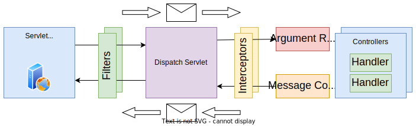

# [Spring MVC](https://docs.spring.io/spring-framework/docs/3.2.x/spring-framework-reference/html/mvc.html)

> Spring MVC is a library/framework for handling HTTP requests, providing higher level features on top of the [Java Servlet API](https://javaee.github.io/servlet-spec/).

* Based on the [Model-View-Controller](https://en.wikipedia.org/wiki/Model%E2%80%93view%E2%80%93controller) (MVC) pattern;

---

## [Servlet](https://docs.oracle.com/javaee/6/tutorial/doc/bnafe.html)

> A servlet is a Java programming language class that is used to extend the capabilities of servers that host applications accessed by means of a request-response programming model.

* Allow **request handlers** (**servlets**) and **intermediaries** (**filters**) to run on **multiple web servers**, the so called servlet containers;
* Final handler for an HTTP request;
  * [`HttpServletRequest`](https://docs.oracle.com/javaee/6/api/javax/servlet/http/HttpServletRequest.html) - represents the request information;
  * [`HttpServletResponse`](https://docs.oracle.com/javaee/6/api/javax/servlet/http/HttpServletResponse.html) - represents the response information produced so far;
  * Both `HttpServletRequest` and `HttpServletResponse` are **unique** for each request-response pair;

## Filter

* Intermediary that can perform:
  * **Pre-processing**, before the request-response pair is passed in to the next intermediary or final handler;
  * **Post-processing**, after the next intermediary or final handler returned
  * **Short-circuit** the request processing, by not calling the next intermediary or final handler.

---
---

## Design

* Usage of an underlying **servlet server**, such as [Jetty](https://www.eclipse.org/jetty/), [Tomcat](https://tomcat.apache.org/), etc;
* A **dispatch servlet** that is registered on top of that servlet server, for all paths below a base path;
* **Request handlers** that are responsible for processing the requests for specific request mappings - one way to define handlers is via instance methods of a **controller class**;

    

### Argument Binding

* Mechanism by which Spring MVC **computes the arguments** to pass to the handlers;
* An argument resolver is a component that is responsible for **resolving** a method parameter into an argument value from a given request;
* A **controller** is a class annotated with `@Controller` or `@RestController` that contains **request handling methods**;
  * A controller is **singleton** by default, this means that the same instance is used for all requests;
    * This happens because the Spring MVC follows the **Singleton pattern**, that ensures only one instance of an object exists per application.
* An **handler** method is an instance method inside a controller class, annotated with `@RequestMapping` or `@GetMapping`, `@PostMapping`, etc;
  * The same handler can be called concurrently by multiple threads, since each request is handled by a different thread;

> **Note - @Controller vs @RestController**: The `@RestController` annotation is a specialization of the `@Controller` annotation, with the added behavior that **the return value of each method is automatically serialized into JSON** and passed back into the `HttpServletResponse` object.

* The Spring MVC uses Java Reflection to locate 
  * all classes that are controllers, via the presence of the `@RestController` annotation;
  * all the methods that are handlers, via the presence of the `@<Method>Mapping` annotation.

### Message Conversion

* Mechanism responsible for **translating HTTP messages** payloads into objects and vice-versa;
* Spring MVC provides built-in support for **JSON** format, using the [Jackson](https://github.com/FasterXML/jackson) library;
* It is possible to add support for other formats, using the `HttpMessageConverter` interface.

---

### Pipeline Processing

There are **two distinct ways** of adding code to be **executed before and after the handler** execution:

#### Servlet Filters

* Mechanism defined by the Java Servlet API;
* Allow for **code to be executed before and after** the request is processed by the servlet;
* They can also short-circuit the request processing, by ending the request-response cycle;
* They do not have access to Spring-specific information, such as the handler that is going to be executed.

#### Handler Interceptors

* Spring-specific mechanism to intercept the call to the request handler, i.e. to have **code executed before and after the handler** is executed;
* They can access handler-specific information;
* **Disadvantage**: They run later in the pipeline, after the dispatch servlet.

---

### [Exception Handling](https://spring.io/blog/2013/11/01/exception-handling-in-spring-mvc)

* The `@ControllerAdvice` annotation allows to define a class that is going to be used to **handle exceptions** thrown by handlers;
* There are **two ways** to represent errors in a API:
  * **Exception-based**:
    * The handler throws an exception;
    * The exception is handled by a `@ControllerAdvice` annotated class;
    * The exception is translated into a HTTP response;
  * **Return-based**:
    * The handler returns a `ResponseEntity` object;
    * The `ResponseEntity` object is translated into a HTTP response.