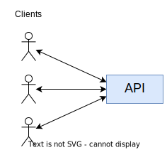
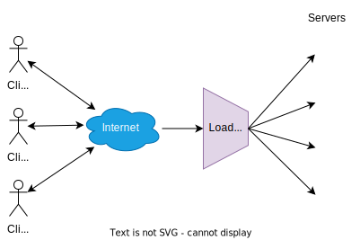
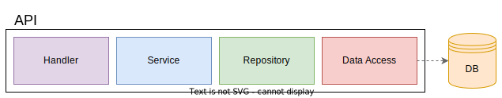

# Web APIs

> A **Web API** is a set of functions and procedures that allow for the **creation of applications** that access the features or data of an operating system, application, or other service.

## Client Scenarios

### Single Client - Same Organization Boundary

* High **coordination between client and HTTP API**;
* **Easy** to add and coordinate changes on both the client and the API;
* **Short-lived**: months;
* **Data-oriented**;
* Provides data for clients to use on **their own ways**.

    

### Multiple Clients - Different Organization Boundaries

* **Difficult to coordinate** changes on both the clients and the APIs;
* **Long-lived**: years, decades;
* **Journey-oriented** (process-oriented);
* Exposes functionality for clients to provide **very well defined journeys/processes**.
* **Hypermedia** is a way to reduce coupling between clients and a specific HTTP API implementation.

    

---

## System Architecture

* **Backend**:
  * **Service** responsible to ensure data integrity, namely that all domain rules are respected - **business logic**;
  * **Server-side**.

* **Frontend**:
  * Responsible for the **user interaction**;
  * **Client-side**.

> The interaction between the **frontend** and the **backend** is done through an **HTTP API**, provided by the **backend service**:

* The **communication initiative** is always on the API's **client**;
* The backend service **only communicates information** to the frontend service in the context of an **HTTP response**;
* Implies **polling by the frontend** application to check for asynchronous state changes.

### Backend Service Architecture

* A **DBMS (Database Management System)**, holding the **system state/data**;
* One or more **servers**, running an application, hosting the **HTTP request handling logic**, **domain logic**, and **data access logic**;
* **Load-Balancer**, to distribute the load across multiple servers:

    

---

## API Design

    

* **Handler**:
  * Knows how to **handle** a **request**;
  * Knows how to **serialize** and **deserialize** the **request** and **response**;
  * Knows **HTTP**;
  * Does not know **business logic**;
* **Service**;
  * Contains the **business logic**;
  * Does not know **HTTP**;
  * Does not know how to interact with the **database**;
* **Repository**;
  * Knows how to interact with the **database**;
  * Does not know **business logic**;
* **Data Access** (DBMS);
  * Knows how to interact with the **database**;
  * Does not know **business logic**.