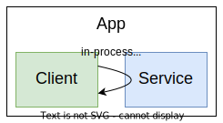
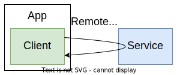

# Web APIs

> A **Web API** is a set of functions and procedures that allow for the **creation of applications** that access the features or data of an operating system, application, or other service.

## In-process APIs Vs. Remote APIs

### In-process APIs

* **Security is not a concern** - no authentication, no authorization, no confidentiality or integrity protection;
* **No I/O** - **synchronous** calls;
* **Same type system** - object sharing between client and API provider;

    

### Remote APIs

* **Security is a concern** - authentication, authorization, confidentiality and integrity protection;
* **I/O** - **asynchronous** calls;
* Different type systems - **serialization** and **deserialization** of objects;
* Message **exchanges**, not direct calls;

    

---

## Client Scenarios

* **Single client** on the **same organization** boundary;
* **Multiple clients** on the **same organization** boundary;
* **Multiple clients** on **different organization** boundaries;
* **Multiple clients** and **multiple providers** on **different organization** boundaries;

---

## API Design/Functionality

    

* **Handler**:
  * Knows how to **handle** a **request**;
  * Knows how to **serialize** and **deserialize** the **request** and **response**;
  * Knows **HTTP**;
  * Does not know **business logic**;
* **Service**;
  * Contains the **business logic**;
  * Does not know **HTTP**;
  * Does not know how to interact with the **database**;
* **Repository**;
  * Knows how to interact with the **database**;
  * Does not know **business logic**;
* **Data Access**;