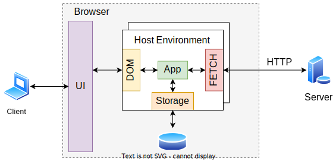

# The Browser Application Platform

> The browser is a platform to execute applications - **host environment**.

<p align="center">
    
</p>

* When running on the browser, the JS code executes in a different host environment than the one in which it executes when running on Node.js;

---

## Modularity

* By default, on the browser all the code runs in the **top-level scope**, which is the global scope - multiple `script` elements exist in the **same scope**;
* A **module system** provides:
  * **Isolation**;
  * **Reusability**;
  * **Code execution** on initialization;
  * **Export** behavior and data to other modules;
* Node.js uses the **CommonJS** (CJS) module system;
* Browser uses the **ES6** (ESM) module system.
* We **should not** need to reduce the module count for efficiency purposes. The solution to this is **bundling multiple modules** into a single load level modules;
* This means that a **build process** is required to bundle the modules into a single file.

---

## [Webpack](https://webpack.js.org/)

> _**Webpack is a module bundler.** Its main purpose is to bundle JavaScript files for usage in a browser, yet it is also capable of transforming, bundling, or packaging just about any resource or asset._

Using webpack:

```bash
npm install webpack-cli --save-dev  # install webpack
npx webpack                         # run webpack
npm install webpack-dev-server      # install webpack dev server
```

* `webpack-clie` is a command line interface (**CLI**) for webpack;
* The webpack configuration file is `webpack.config.js`;
* The webpack also has a **development server** that can be used to serve the application;
* By default, webpack will bundle all the modules in the `src` folder into a single file in the `dist` folder named `main.js`.

---

## [TypeScript](https://www.typescriptlang.org/)

> _**TypeScript is a typed superset of JavaScript that compiles to plain JavaScript.**_

Using TypeScript:

```bash
npm install typescript ts-loader --save-dev  # install typescript
```

* `ts-loader` is a TypeScript loader for webpack;
* The TypeScript configuration file is `tsconfig.json`;
* The type information in the source files is checked and erased on the compiled files;