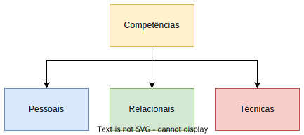

# The Entrepreneur

> A palavra empreendedor (**entrepreneur**) surgiu em França por volta dos séculos XVII e XVIII, com o objetivo de designar aquelas **pessoas ousadas que estimulavam o progresso económico, mediante novas e melhores formas de agir**.

* Responsável pelo desenvolvimento e crescimento económico, sendo o empreendedor uma pessoa que cria e que inova e, como tal, um agente de mudança.
* Idealiza, desenvolve e realiza os seus próprios desejos, criando valor.

---

## Mitos sobre o empreendedor

1. Os empreendedores são jogadores/apostadores que assumem riscos excessivos;
   * Assumem riscos, mas calculados;
   * Dividem o risco com terceiros;
   * Evitam riscos desnecessários;
2. Os empreendedores são patrões de si próprios - lonely wolves;
   * Tendem a ser bons líderes;
   * Criam equipas motivadas;
   * Estabelecem bom relacionamento;
3. Os empreendedores são motivados apenas pelo dinheiro;
   * Raramente são motivados apenas pelo dinheiro;
4. Os empreendedores são jovens e enérgicos;
   * Pode-se ser empreendedor em qualquer idade;
5. O empreendedor nasce não se faz;
   * Está ao alcance de qualquer individuo;
6. Qualquer pessoa com uma boa ideia pode enriquecer;
   * Não basta uma boa ideia;
7. O empreendedorismo é apenas para os ricos;
   * Não é necessário ser rico para dar inicio a um negócio de sucesso.

---

## Características de um empreendedor

* A identificação de uma **necessidade não colmatada**;
* O **sentido de oportunidade** que possibilita um novo avanço;
* O **espírito de iniciativa**;
* Saber que cada pequeno avanço é um passo no caminho da solução;
* O desejo de **novos desafios** e o **gosto pela mudança**;
* A **criatividade**, capacidade de **inovação**, e **disponibilidade** para aprender de forma continuada;
* A **resiliência** e a **auto confiança** que são essenciais quando o resultado não é o esperado;
* Estar disposto a **correr riscos**, a aceitação do risco;
* **Não temer o fracasso**;
* etc.

---

## Competências de um empreendedor

    

### Competências Pessoais

* Honestidade;
* Ambição;
* Espírito de iniciativa;
* Criatividade;
* Capacidade de enfrentar riscos;
* Autoconfiança;
* Autodisciplina;
* Espírito de observação;
* Capacidade de análise síntese;
* Capacidade de enfrentar riscos;
* Poder de comunicação;
* etc.

### Competências Relacionais

* Empatia - capacidade de compreender os outros;
* Projeção - capacidade de se focar nos objetivos;
* Capacidade de interação;
* Espírito de equipa;
* etc.

---

## O inventor versus o empreendedor

* O que distingue os dois é a **execução**;
* O inventor **cria** algo novo;
* O empreendedor **dá vida** à ideia, colocando-a em **prática**:
  * Cria um plano de negócios, elabora o planeamento estratégico, estrutura um modelo de negócios e explora comercialmente a oportunidade criada.
* Ambos os papéis não têm de ser disjuntos.
