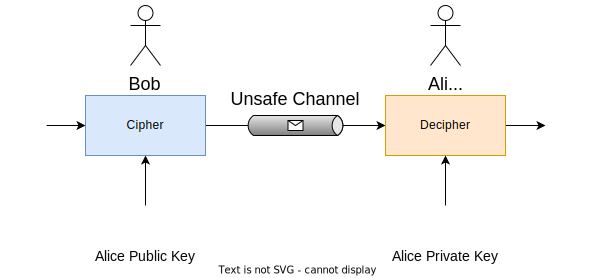
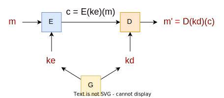
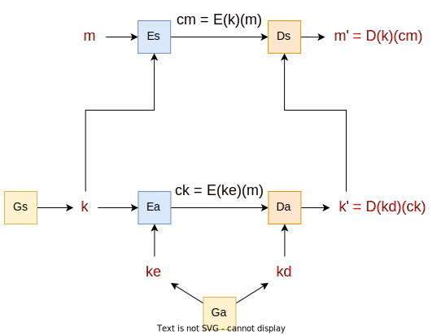
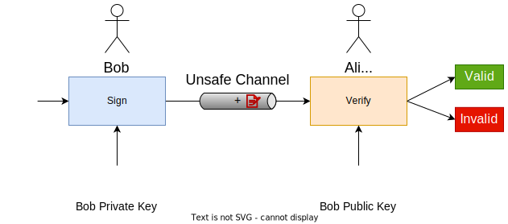
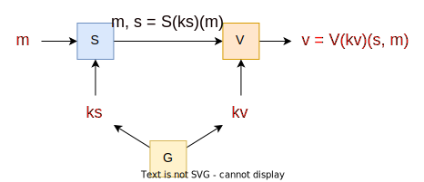

# Asymmetric Schemes

* Process of **protection** and **deprotection** uses **different keys**;
* **Keys** are usually used during a **long period** of time;
* There are **public keys** and **private keys**;
* Used in:
  * **Asymmetric cipher**;
  * **Digital signature**.

## Asymmetric Cipher

    

Algorithms `(G, E, D)`:
* `G` - **probabilistic** function for **key generation**;
  * `G :-> KeysPairs`, where `KeysPairs = PublicKeys x PrivateKeys`;
* `E` - **probabilistic** function for cipher;
  * `E: PublicKeys -> PlainTexts -> CipherTexts`;
* `D` - **deterministic** function for decipher;
  * `D: PrivateKeys -> CipherTexts -> PlainTexts`.

    

### Properties

* **Correctness property**: `KeyPairs: D(kd)(E(ke)(m)) = m`;
* **Security property**: It is computationally infeasible to get `m` from `c`, without the knowledge of `kd`;
* **Asymmetric schemes** use **different keys** for **cipher** and **decipher**;
* **PlainTexts**: space of messages;
* **CipherTexts**: space of ciphered messages;
* **Does not guarantee data integrity**;
* Computational **cost is significantly higher** than symmetric schemes;
* Limitations in the dimension of the ciphered information;
* **Hybrid schemes**:
  * **Asymmetric** scheme used to **cipher a symmetric key - key transport**;
  * **Symmetric** scheme used to **cipher the information**.

---

## RSA Primitive

* `P` and `Q` are **distinct primes** and `N = PQ`:
  * Typical dimensions: `2^1023 <= N <= 2^4095`;
* `E` and `D` such that `ED mod (P-1)(Q-1) = 1`;
* Key pairs:
  * Public key: `(E, N)`;
  * Private key: `(D, N)`;
* Public operation - used in cipher: `C = M^E mod N`;
* Private operation - used in decipher: `M = C^D mod N`;
* The **prime numbers factorization** is the problem that supports the RSA primitive.

---

## Hybrid Scheme

    

---

## Digital Signature

* Each participant has 1 key pair for each digital identity;
* **Signature** process uses **private key**;
* **Verification** process uses **public key**;
* Key pairs are usually used during a **long period** of time;
* Public key diffused through a **certificate**;

    

ALgorithms `(G, S, V)`:
* `G` - **probabilistic** function for **key generation**;
  * `G :-> KeyPairs`, where `KeyPairs = PublicKeys x PrivateKeys`;
* `S` - **probabilistic** function for **signature**;
  * `S: PrivateKeys -> {0,1}* -> Signatures`;
* `V` - **deterministic** function for **verification**;
  * `V: PublicKeys -> (Signatures x {0,1}*) -> {true,false}`.

    

### Properties

* **Correctness property**: `KeyPairs: V(kv)(S(ks)(m),m) = true`;
* **Security property**: Without the knowledge of `ks` it is computationally infeasible:
  * **selective forgery** - given `m`, find `s` such that `V(kv)(s, m) = true`;
  * **existential forgery** - find the pair `(m, s)` such that `V(kv)(s,m) = true`;
* **Signature** `s` typically has a **fixed dimension** (ex: 160, 1024, 2048 bits);
* Computational cost is **significantly higher** than symmetric schemes;
* **Asymmetric schemes** use **different keys** for **signature** and **verification**;
* **Message** `m` is a sequence of bytes of variable dimension;
* **Sign != Cipher** and **Verify != Decipher**.