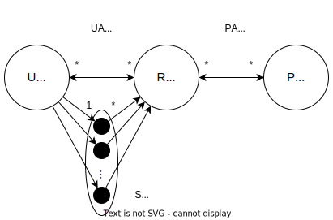
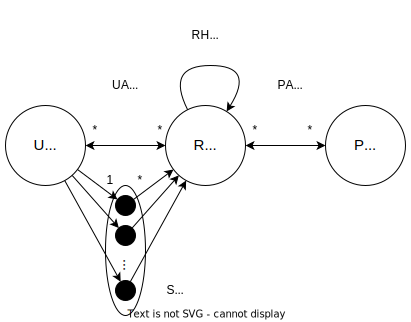

# Role-Based Access Control (RBAC)

> The access control is based on the **role** of the subject in the system and the **rules that are defined for that role**.

* In organizations, the permissions of the people are defined by their role in the organization;
* The role permissions **change less frequently** than the permissions of the people;

### RBAC Family

There are four models in the RBAC family:

    

They serve as reference for the implementation of RBAC in the systems.

---

## RBAC0 

    

* A **user can have multiple roles** and a **role can be assigned to multiple users**;
* A **session** is a set of **roles** that a **user** has at a given time;
* The permissions are **always positive**.

### Definitions

* `U`, `R`, `P` and `S` - sets of users, roles, permissions and sessions, respectively;
* `UA ⊆ U × R` - set of user-role assignments;
* `PA ⊆ R × P` - set of role-permission assignments;
* `user: S -> U` - function that returns the user of a session;
* `roles: S -> 2^R` - function that returns the roles of a session;
* `roles(si) ⊆ {r ∈ R | (user(si), r) ∈ UA}` - function that returns the roles of a session;

---

## RBAC1

The **RBAC1** model is a **RBAC0** model with **hierarchical roles**:

    

* The user **inherits the permissions** of **the role** and the permissions of the **parent roles** of the role that the user has;

### Definitions

* `RH ⊆ R × R` - set of role hierarchy;
* `roles: S -> 2^R` - function that returns the roles of a session;
* `roles(si) ⊆ {r ∈ R | ( ∃ r’ ≥ r) [(user(si), r’) ∈ UA]}` - function that returns the roles of a session;

---

## RBAC2

The **RBAC2** model is a **RBAC1** model with **constraints**:

* Constraints are **rules** that **restrict** the **permissions** of the **roles**;
* Represented by **predicates**, returning **allowed** or **denied**;
* Examples of constraints:
  * Separation of duties;
  * Cardinality constraints;
  * Pre-conditions.

---

## RBAC3

The **RBAC3** model combines the **RBAC1** and **RBAC2** models, so it has **hierarchical roles** and **constraints**.
