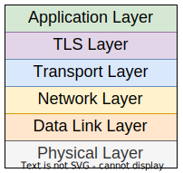
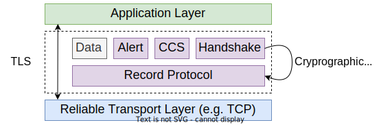
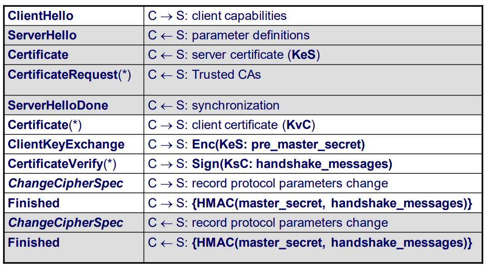

# Transport Layer Security

> **Transport Layer Security (TLS)** is a cryptographic protocol designed to provide communications security over a computer network. TLS is often used in conjunction with the **Secure Sockets Layer (SSL)** protocol to secure HTTP communications, but can be used with other protocols as well. TLS is an IETF standard, and is specified in RFC 5246.

## Goals

* Protocol that provides a **secure channel between two endpoints**;
* The channel has three properties:
  * **Confidentiality** - no one besides the endpoints **can see the content** of the data transmitted;
  * **Integrity** - no one besides the endpoints **can change the content** of the data transmitted;
  * **Authentication** - **at least one** endpoint of the channel **needs to be authenticated** so that the other endpoint has guarantees about who it is connected to.

    

---

## TLS Layer

* The TLS layer is a protocol that runs **between the application layer and the transport layer**;
* The **unencrypted data** is provided by the **application layer**;
* The TLS **encrypts and authenticates** the data it **sends/receives** from the transport layer;
* The TLS requires a **reliable transport layer**, such as **TCP**.

    

* The TLS is divided into two subprotocols:
  * **Handshake Protocol** - establishes the secure channel;
  * **Record Protocol** - transmits the encrypted data.

    

---

## Record Protocol

* **Fragments**, **compresses**, **authenticates** (MAC) and **encrypts** the data;
* **Same TCP connection**, with **two independent streams** of data - client write and server write;
* Keys, IVs and sequence numbers are **different for each stream**;

<!-- Add Diagram -->

* **Message repetition** is detected by the **Sequence Number**;
* **Message reflection** is detected by the **MAC**, through keys separated for each direction;
* **Keystream reuse**: keys and IVs separated for each direction;
* **Traffic analysis** through separate encryption keys.

### Cryptographic Schemes

* Depends on the **cipher suite** agreed;
* The cipher suite and the compression algorithms are **negotiated by the handshake protocol**;
* A cipher suite defines:
  * The **hash function** used by the **HMAC**;
  * The **symmetric scheme**: supports block or stream modes;
  * **Key establishment scheme** - RSA or Diffie-Hellman.

---

## Handshake Protocol
  
* Responsible for:
  * **Negotiation** of the operating parameters;
  * **Authentication** of the endpoints;
  * **Establishment** of a **secure key**;
* Endpoint authentication and key establishment:
  * Authentication is **optional** on both ends;
  * Supports several cryptographic techniques:
    * **Key transport** - RSA;
    * **Key agreement** - DH;
  
### RSA Based

    

---
---

## HTTPS

* **HTTP over TLS**;
* Omission port: **443**;
* Check between the **URI and the certificate**:
  * `subjectAltName` extension of type `dNSName` (if exists);
  * The `Common Name` field in the `Subject field`.

### Message Repetition and Modification

* Handshake **message modification** is detected with the **Finished** message, which guarantees that **both endpoints receive the same message**;
* Handshake **message repetition** of handshake implies that the Finished message is **different for each handshake**.

---

### Master Secret

* The **change of keys with RSA** implies that the browser uses the **server's public key to encrypt** the ***pre master secret***;
* The **server decrypts** the *pre master secret* using its **private key**;
* This process is **secure** and guarantees the confidentiality of the *pre master secret*;
* ***Perfect forward secrecy*** is the property of the handshake that guarantees that, **if the private key is compromised**, **it is not possible to decrypt previous master secrets**, and, consequently, **it is not possible to decrypt record protocol messages**.

---
---

## TLS Sockets in Java

<!--Add graph-->

* `SSLSocketFactory` and `SSLServerSocketFactory`:
  * Obtainment of supported **cipher suites** by default;
  * Creation of **socket instances**;
* `SSLSocket` and `SSLServerSocket`:
  * **Starts the handshake** and receives notifications of its completion
  * **Defines the enabled protocols** (SSL v3.0, TLS v1.0) and enabled cipher suites;
  * Accept/require **client authentication**;
  * Obtain the **negotiated session**;
* `SSLSession`:
* Obtain the **negotiated cipher suite**;
* Get the **authenticated peer identity and certificate chain**.