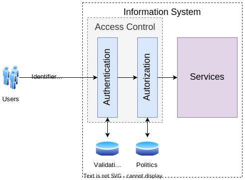
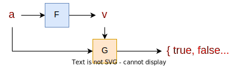

# Authentication

* Authentication is the process of **verifying a claim of identity**;
* Motivations:
  * Used in the **access control model** to determine whether a user is allowed to access a resource;
  * Used in personalization actions;
  * **Audit information**;
* Example:
  * `user` - **identification**;
  * `password` - **authentication**;

---

## Authentication Methods

* Something you **know**:
  * Password;
  * PIN;
  * Secret question;
* Something you **have**:
  * Token;
  * Smart card;
* Something you **are**:
  * Biometrics;
  * Fingerprint;
  * Voice;
  * Face;
  * Iris;
  * DNA;
* Something you **do**:
  * Typing rhythm;
  * Signature;
  * Gait;
  * Keystroke dynamics.

---
---

## Access Control

    

---
---

## Authentication System

* `A` - set of **authentication information**;
* `V` - set of **validation information**;
* `f: A -> V` - **authentication function**;
* `g: V -> A -> {true, false}` - **validation function**;

    

Example:

* `f(a) = H(a)` - **hash function**;
* `g(v)(a) = v == H(a)` - **hash comparison**;

---
---

## Dictionary Attacks

* An attacker tries to **guess the password** by trying all the words in a **dictionary**;
* Protection against this attack:
  * Increase the **password incertitude**;
  * **Control the access** of the verification information;
  * Increase the **processing time** of the authentication function;
  * Increase the **processing time** of the validation function.

---

### Attack of Type 1

* Input: `v` - **validation information**;	
* Output: `a` - **authentication information**;
* For each `a'`in the dictionary:
  * If `f(a') == v` then return `a'`;
* Return `null`.

#### Pre-Computed Dictionary Attacks

* Based on the fact that the **authentication function** is equal to all the users;
* `D` - **dictionary**;
* `M` - associative array of the form `M: V -> A`;
* Pre-compute `M`:
  * For each `a'` in `D`:
    * `M[f(a')] = a'`;
* Attack:
  * Given `v`:
    * If `v` is in `M` then return `M[v]`;
    * Else return `null`.

#### Salt

* **Protection** against pre-computed dictionary attacks;
* Solution: make the **authentication function** different for each user;
* In this scenario, the pre-compute depends on the **salt**:
  * **Specific** to each user;
  * Can not be used to attack all the system users.

---

### Attack of Type 2

* Input: `g(v)` - **validation function**;
* Output: `a` - **authentication information**;
* For each `a'`in the dictionary:
  * If `g(v)(a') == true` then return `a'`;
* Return `null`.

#### Protection

* Limit the access of the **validation function** after the detection of a certain number of **authentication failures**;
* Technics:
  * **Back-off** - increase the time between the authentication attempts;
  * **Connection termination** - terminate the connection after a certain number of authentication failures;
  * **Blocking** - block the user after a certain number of authentication failures;
  * **Jailing** - service access with limited functionality after a certain number of authentication failures.

---
---

## Increase Request Cost

* Decrease the number of requests through the increase of the **authentication cost** to the client;
* Computational challenge has to be in the **client side**, before the request is sent to the server;
* [**CAPTCHA**](http://www.captcha.net/) - **Completely Automated Public Turing test to tell Computers and Humans Apart**.
