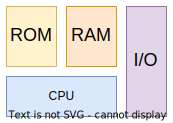
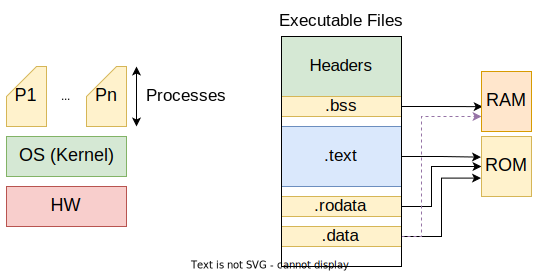
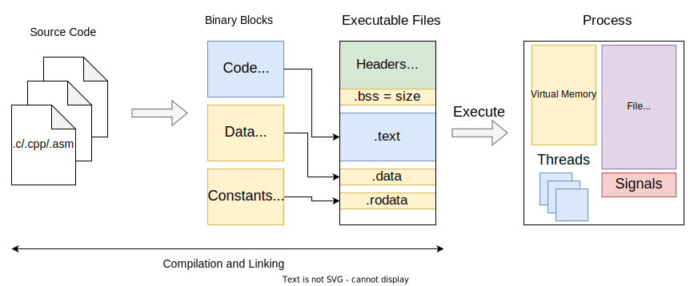

# Introduction

## Syllabus

0. Review concepts from **Computer Architecture** and **Computer Systems Programming**;
1. Unix computing model;
2. Kernel and processes isolation; communication between processes;
3. System shared environment;
4. Hypervisors;
5. Containers.

---

## Computer Architecture and Systems

    

### CPU

The **CPU** (Central Processing Unit) follows the **instruction cycle** to execute instructions:

1. **Fetch** - fetch the instruction from memory;
2. **Decode** - decode the instruction;
3. **Execute** - execute the instruction.

### I/O

* Input/Output (I/O) is the communication between the CPU and external devices;
* Read/Write (R/W), as in the computer memory;
* Address Bus, Data Bus.

---

### Process

* A process is a program in execution;
* Each process is associated with a program, and a program can have multiple processes;
* The programs execute in isolated environments called processes:

    

* The **.text** and .**rodata** sections are read-only, so they are in the read-only memory (**ROM**);
* The **.data** is stored in the **ROM**, but in **run-time it is copied to the RAM**;
* The **.bss** is stored in the **RAM**, but it is not initialized;

    

* A process is like a "virtual machine" that has its own memory, registers, and stack;
* The "virtual CPU" is called **thread**;
* The "virtual memory" is called **address space** and contains:
  * executable file information, line .text, .data, .rodata, .bss, etc;
  * the stack for each thread;
* The I/O is represented by **file descriptors** in the **file descriptor table**;
* The **signals** module is used to communicate between processes; interruption mechanism;

### OS operations that interact with the address space

* Create a new process;
* Dynamically allocate memory;
* Thread creation (it needs to be allocated space to store the stack);
* Dynamically load a library (.so / .dll);
* File mapping (map a file to memory);
* Share memory between processes;
* Share read-only memory (libraries, source code, etc) between processes, to save memory;
* Extend physical memory with disk space.
