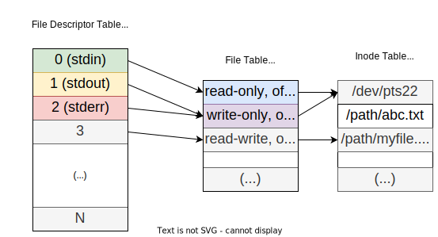
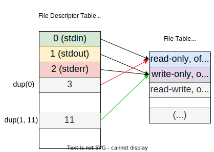
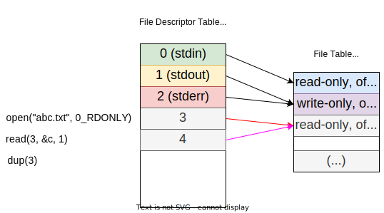

# Unix Computing Model

## Kernel

* *It is the core that provides basic services for all other parts of the OS;*
* Has privileged access to the hardware;

## Shell Pipeline and Redirection

* The most famous shell is [**BASH**](https://en.wikipedia.org/wiki/Bash_(Unix_shell)) - The Bourne Again SHell;
* The [`/etc/passwd`](https://www.cyberciti.biz/faq/understanding-etcpasswd-file-format/) file keeps track of every registered user that has access to the system;
  * Contains one entry per line for each user;
  * All fields are separated by a colon `:` character;
  * E.g. `root:x:0:0:root:/root:/bin/bash`;
  * username, password, user ID, group ID, user description, home directory, shell.
* The `/dev/null` file is a special file that discards all data written to it;

### Pipeline

* The pipeline is a way to **connect the output of one command to the input of another** command;
* Commands are separated by the pipe character `|`;
* The pipes are synchronous objects and have a **buffer** to receive data;
* The pipes **synchronize the producer/consumer rate**;
* Example:

```bash
$ cat abc.txt | grep hello | wc -l
```

---

In this example, the output of `cat abc.txt` is piped to the input of `grep "hello"`, and the output of `grep "hello"` is piped to the input of `wc -l`.

---
---

## [File Descriptor Table](https://users.cs.jmu.edu/bernstdh/web/common/lectures/summary_unix_file-descriptors.php)

* *The collection of integer array indices that are file descriptors in which elements are pointers to file table entries;*
* **In each process, there is a file descriptor table**;
* Each entry in the file descriptor table is a **pointer** to a file table entry:

<p align="center">
    
</p>

* The first three entries in the file descriptor table are the following:
  * 0 - stdin;
  * 1 - stdout;
  * 2 - stderr;
* To write to a file, its used the function `write(fd, buffer, size)`, C;

```c
int res = write(1, "prog running\n", 14); // write(int fd, const void *buf, size_t count);
```

In this example, the `write` function writes the string `"prog running\n"` to the file descriptor `1`, which is the standard output.

* The `errno` variable is used to store the error code of the last system call;
* The `perror` function prints the error message associated with the error code stored in the `errno` variable;

---

### Redirection

* The redirection is a way to **connect the output of one command to a file**;
* It is done using the `>` character;
* It is possible to connect the input of a command to a file using the `<` character;
* Examples:

```bash
$ cat abc.txt > def.txt  # Redirects the output of cat abc.txt to def.txt
...
$ cat < abc.txt          # Redirects the input of cat to abc.txt
...
# Executes the program and redirects the stdout to the file out.txt
$ ./a.out > out.txt # Its the same as ./a.out 1> out.txt
...
$ ./a.out 2> error.txt # Redirects the stderr to the file out.txt
...
$ ./a.out 3>&1 # Redirects the file descriptor 3 to the file descriptor 1
...
$ ./a.out 1> result.txt 2>&1 # Redirects the stdout and stderr to the file result.txt
```

---

### Duplication

* The `int dup(int oldfd)` function duplicates a file descriptor entry to the first available file descriptor entry;
* The `int dup2(int oldfd, int newfd)`function duplicates a file descriptor entry to a specific file descriptor (closing the previous one);

```c
int fd = dup(1); // Duplicates the file descriptor 1 to the next available file descriptor
int fd = dup2(1, 11); // Duplicates the file descriptor 1 to the file descriptor 11
```

<p align="center">
    
</p>

---

### Fork and Wait

* The `fork` function creates a new process;
  * Its called once, but returns twice, once in the parent process and once in the child process;
    * The return type of the `fork` function is `pid_t`;
    * The return value of the child process is `0`;
    * The return value of the parent process is the PID of the child process;
  * The execution point is the same in both processes;

#### Parent and child process

* Each process has a **parent process**, except for the first process, which is the root process;
* Each process has a **unique process ID (PID)**;
  * To get the PID of the current process, use the `getpid` function;
  * To get the PID of the parent process, use the `getppid` function;
* The return value of the child process is passed to the parent process, and the parent process can get it only once;
* If the parent process does not wait for the child process, the child process becomes a **zombie process** - a process that has finished execution but still has an entry in the process table;
* The `wait` and `waitpid` functions are used to wait for the child process to finish execution;
  * The `wait` function waits for any child process to finish execution;
  * The `waitpid` function waits for a specific child process to finish execution;

---

### Exec

* The `exec` family of functions replaces the current process with a new process;
* Changes the **process image**;
* The **address space and the virtual CPU are replaced**;
* The **file descriptor table is not replaced**.

#### File permissions

* The file permissions are divided into three categories:
  * **User** (owner) - The user that owns the file;
  * **Group** - The group that owns the file;
  * **Others** - All other users;
* The permissions are represented by three characters:
  * **Read** - `r`;
  * **Write** - `w`;
  * **Execute** - `x`;
* The file permissions are represented by the following format: `rwxrwxrwx` (9 bits);
* Before the file permissions, there is a character that represents the **file type**:
  * `-` - Regular file;
  * `d` - Directory;
  * etc.
* If the file type is a **directory**, the `x` permission is used to check if the user **can access the directory**.

---

### Open and Close

* The `open` function opens a file and **returns a file descriptor**;
  * Adds a **new entry** to the file descriptor table;
  * `int open(const char *pathname, int flags, mode_t mode);`
    * `pathname` - The path to the file;
    * `flags` - The flags to open the file;
      * `O_RDONLY` - Open the file for reading;
      * `O_WRONLY` - Open the file for writing;
      * `O_RDWR` - Open the file for reading and writing;
      * `O_CREAT` - Create the file if it does not exist;
      * `O_TRUNC` - Truncate the file to zero length;
      * `O_APPEND` - Append to the file;
    * `mode` - The file permissions;
* The `close` function closes a file descriptor;
  * Closes the file descriptor and **removes the entry** from the file descriptor table;

### Read and Write

* The `read` function reads from a file;
  * `ssize_t read(int fd, void *buf, size_t count);`
    * `fd` - The file descriptor;
    * `buf` - The buffer to store the data;
    * `count` - The number of bytes to read;
  * Increments the file offset by the number of bytes read;
* The `write` function writes to a file;
  * `ssize_t write(int fd, const void *buf, size_t count);`
    * `fd` - The file descriptor;
    * `buf` - The buffer to write;
    * `count` - The number of bytes to write;

<p align="center">
    
</p

---

### Pipe

* To create a pipe, use the `pipe` function;
* The pipe function receives an array of two integers, which are the file descriptors of the pipe: `int pipe(int pipefd[2])`;
  * The first file descriptor is the **read end** of the pipe;
  * The second file descriptor is the **write end** of the pipe;
* When a **process ends**, the **file descriptors are closed**;
* To **correctly use a pipe**, the following steps must be followed:
  * Create a pipe;
  * Create a child process;
  * Close the file descriptors that will not be used;
  * Redirect the file descriptors that will be used;
  * Execute the program;

---
---

## Signals

* A **signal** is an **asynchronous event** that **interrupts the execution of a process**;
* To see more information about the signals, use the `man 7 signal` command;
* The `pause` function suspends the execution of the process until a signal is received;
* There are 31 available signals;
* Some of the signals are:
  * `SIGINT` - interrupt (CTRL + C);
  * `SIGKILL` - termination request;
  * `SIGTERM` - controlled termination request;
  * `SIGSTOP` - stop request (CTRL + Z);
  * `SIGCHLD` - child process terminated, stopped, or continued;
  * `SIGILL` - illegal instruction;
  * `SIGSEGV` - segmentation violation;
  * `SIGFPE` - floating point exception;
  * `SIGALRM` - timer signal from `alarm`; the `alarm` function sets a timer that sends a `SIGALRM` signal after a specified number of seconds;
  * `SIGUSR1` - user-defined signal 1;
  * `SIGUSR2` - user-defined signal 2.

* The exit status of a process is an integer value that is the sum of the exit code and the signal number;
  * The exit code is the **least significant 8 bits**;
  * The signal number is the **most significant 8 bits**;
* To get the exit code of the last process executed, use `echo $?`;

* To kill a process, use the `kill` command;
  * `kill -l` - List all signals;
  * `kill -s <signal> <pid>` - Send a signal to a process;

### Signal disposition

* The **signal disposition** is a pre-processing action that is performed before the signal handler is called;
* The signal disposition can be:
  * **Default** - The **default** action for the signal - `SIG_DFL`;
  * **Ignore** - The signal is **ignored** - `SIG_IGN`;
  * **Handler** - The signal is **handled** by a function - `signal_handler`.
* To change the signal disposition, use the `signal` and `sigaction` functions;
  * `void (*signal(int signum, void (*handler)(int)))(int);`
    * `signum` - The signal number;
    * `handler` - The signal handler;
  * `int sigaction(int signum, const struct sigaction *act, struct sigaction *oldact);`
    * `signum` - The signal number;
    * `act` - The new signal disposition;
    * `oldact` - The old signal disposition;
  * The `SIGKILL` and `SIGSTOP` signals cannot be ignored or handled;

---
---

## File System

> File System is a collection of data structures and algorithms that manages the storage and retrieval of files from the disk.

* **Unique file system**, without drivers, only a **directory tree**;
* Partially normalized - [FHS](https://en.wikipedia.org/wiki/Filesystem_Hierarchy_Standard);
* Directories, files and other objects;
* **Files doesn't have a name -> a name has a file**;

File systems:

* **Windows**: FAT, NTFS, ReFS;
* **Linux**: ext2, ext3, ext4;

**Journaling** - a mechanism that records all file system changes to a special file, called a **journal**, before they are applied to the file system. If the system crashes, the journal can be used to **restore** the file system to a consistent state.

**Mount point** - a directory in the file system that is used to **attach** another file system to the directory tree. e.g. `/mnt` or `/media`.

---

## File Types

| File Type        | Location | Denoted by |
| ---------------- | -------- | ---------- |
| Regular File     | Anywhere | `-`        |
| Directory        | Anywhere | `d`        |
| Symbolic Link    | /dev     | `l`        |
| Block Device     | /dev     | `b`        |
| Character Device | /dev     | `c`        |
| Socket           | /dev     | `s`        |
| Named Pipe       | /dev     | `p`        |


---

## [Root Directories](https://averagelinuxuser.com/linux-root-folders-explained/)

* `/bin` - user binaries; programs that are used by **all users**;
* `/sbin` - system binaries; programs that are used by the **superuser**;
* `/boot` - boot files; contains the **kernel** and the **boot loader**;
* `dev` - device files; 
* `/etc` - configuration files;
* `/home` - home directories; private directories **for each user**;
* `/lib` - libraries; libraries used by the system;
* `/mnt` - **mount point**; used to mount other file systems;
* `/proc` - **kernel files**;
* `/root` - root home directory.