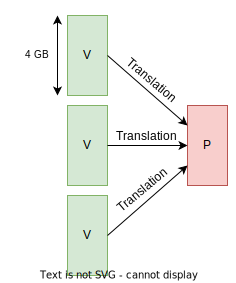
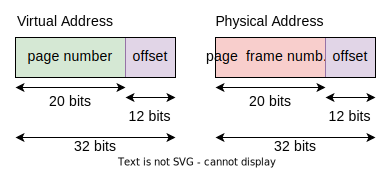
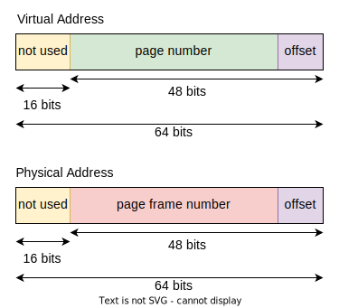
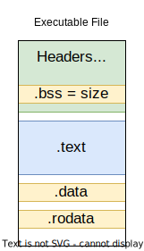
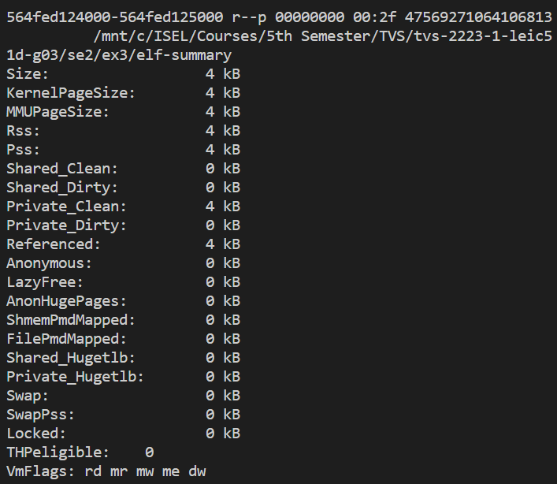

# Kernel and Processes Isolation

> Isolation is a very important concept in operating systems. It is the ability of the operating system to provide a secure environment for the execution of processes. In this chapter, we will discuss the isolation of processes and kernels.

* **CPU**: running time of each process is limited;
* **Mem**: processes can't access each other's memory;
* **I/O**: assure that the OS controls all I/O operations.

## Resources to Protect

* **Interrupt system**:
  * It needs to be protected, because its used to control the execution of processes, like the **scheduler** (to remove a process from the CPU and put another one in the CPU);
  * It is also used in the **I/O** system, to control the I/O devices;
* **Memory Access**:
  * Validate the memory access of a process, to assure that it is not accessing memory that it is not allowed to access;
  * **Validate all memory access operations**, like `fetch`, `load`, `store`, etc;
* **I/O Operations (if they exist)**: e.g. in x86, the instructions `in` and `out` are used to access I/O devices
* **Configuration mechanisms** of the previous resources.

---

### x86 Isolation Evolution

* **x86**: the first x86 processors didn't have any protection mechanism;
* 1978 - **i8086**: the beginning of the x86 architecture;
* 1982 - **i286**: the first x86 processor with protection mechanisms;
* 1985 - **i386**: the first x86 processor with **virtual memory** - [**IA-32**](https://en.wikipedia.org/wiki/IA-32);
* 2003 - **AMD64**: the first x86-64 processor - [**x86-64**](https://en.wikipedia.org/wiki/X86-64); extended the x86 architecture to 64 bits and removed unnecessary elements;

---

### Memory Protection

* Each process has its own **virtual memory** and a **memory map** (a table that maps the virtual memory to the physical memory);
* The CPU only receives the **virtual memory** address and uses the **memory map** to translate it to the **physical memory** address;
* The memory map address is stored in the register **CR3**, and the access to this register is a **privileged operation**;
* With the translation, there are configuration bits that define the **access permissions** of the memory:
  * read-only;
  * executable/non-executable;
  * **kernel space/user space**;

### Interrupt System Protection

* The system has a table with the configuration of the **interrupts**: the **Interrupt Descriptor Table** (**IDT**);
* This table address is stored in the register **IDTR**, inaccessible by the processes;
* Stored in **kernel space**;
* Contains the **interrupt handlers**, which are the functions that are executed when an interrupt occurs.

---

### Privilege Levels

* The x86 architecture has **privilege levels**:
  * **0**: the **most privileged level**, used by the **kernel**;
  * **1**: used by the kernel to execute processes;
  * **2**: used by the kernel to execute processes;
  * **3**: the **least privileged level**, used by the **processes**;
* x86 CPUs startup with the **privilege level 0** and transition to **level 3** when a process is executed;
* In each interruption, its indicated the **privilege level** that the interruption was executed and the **interruption handler**;
* To transition from a **higher privilege level** to a **lower privilege level**, the CPU needs to **switch the privilege level**, using the **interrupt system**.

---
---

## Virtual Memory Translation

* The **virtual memory** is translated to the **physical memory** using the **memory map**;
* The maximum size of the **virtual memory** for each process is **4GB**;
* Each process has its own address space (virtual memory), but the **physical memory** is shared between all processes;

    

---

### 80386 (IA-32)

* 32 bits for virtual addresses: 20 bits for the **page number** and 12 bits for the **offset**;
* 32 bits for physical addresses: 20 bits for the **page frame number** and 12 bits for the **offset**;
* The virtual memory is divided in **pages** of **4KB**;
* The physical memory is divided in **page frames** of **4KB**;

    

---

### x86-64 (AMD64/Intel64)

* 64 bits for virtual addresses: 48 bits for the translation (36 for the **page number** and 12 for the **offset**) and other 16 that are not used;
* 64 bits for physical addresses: 48 bits for the translation and other 16 that are not used;
* Page size is **4KB**;
* 4 levels of **page tables**;
* Translation lookaside buffer (**TLB**): a cache that stores the **page table entries** (PTEs) of the last **page table** used;

    

---

### Protection Bits

* `P`: **present** bit, indicates if the page is in the physical memory;
* `R/W`: **read/write** bit, indicates if the page is read-only or read-write;
* `U/S`: **user/supervisor** bit, indicates if the page is in **kernel space** or **user space**;
* `NX`: **no execute** bit, indicates if the page is executable or non-executable - only in x86-64;

#### Segmentation Fault Causes

* **Page not present**:
  * The page is not in the physical memory;
  * The page is in the physical memory, but the `P` bit is not set;
* Trying to access a **read-only** page with a **write operation**;
* Trying to access a **non-executable** page with an **execute operation**;
* Trying to access a **kernel space** page with a **user space** process.

---
---

## System Calls

* TODO

---
---

## Process Address Space

* Each process has its own address space;
* Its used the executable file to build the address space, taking into account the **libraries** used;
* The executable file is the representation of the program, and has some sections like:
  * Header section: it contains the **information about the executable** format, the **entry point** of the executable, the **sections**, etc;
  * `.text` section: it contains the code (executables) of the program;
  * `.data` section: it contains the **initialized data** (globals) of the program;
  * `.rodata` section: it contains the **readonly data** of the program;
  * `.bss` section: it contains uninitialized global variables; the size of this section is stored in a header field;
  * Etc...
* The size of the sections is multiple of **4kB**, because the pages has this size;
* Each section has 4 flags:
  * `r`: **read**;
  * `w`: **write**;
  * `x`: **execute**;
  * `p`: **private**.s
* **Demand Paging**:
  * Load one page at a time, without any optimization;
  * Keep in the physical memory (RAM) only the current used pages;
* Usefull commands:
  * `objdump` displays information from object files and executables, like the size of the sections;
  * `less /proc/{pid}/maps` to show the **memory mapped pages** for the process with the given **pid**;
  * `less /proc/{pid}/smaps` to show the **memory mapped pages** for the process with the given **pid**, with more information;

    

* The order and the distance between the sections is the same in each process, but the position of the segments in the **virtual memory** may change;
  * This happens to prevent code injection attacks;
  * To change this behavior, change the value of `/proc/randomize_va_space`:
    * 0 - **disable randomization**;
    * 1 - randomizes the virtual address by 16MB;
    * 2 - **randomizes** the virtual address more.

---

### Management of the Process Address Space

* The initial structure is defined by the **executable image** and the **libraries** expressed as explicit dependencies;
* During the **process lifecycle**, the address space can **change**, as consequence of some system operations:
  * **Memory allocation** of big objects;
  * **Loading of shared objects** by dynamic linker;
  * **Memory mapping of files**;
  * **Anonymous memory mapping** - `malloc()`.

#### ELF - Executable and Linkable Format

* A **shared object** is in the same format as the **executable**, without an **entry point**;
* **DLL** - **dynamic link library**, is a shared object that define names used by other shared objects.
* To generate a **shared object**, you need to use the `-shared` option in the compile step: `# gcc -shared -fPIC $c -o $so`;
* Useful commands:
  * `dlopen()` - system call to **load some shared object**;
  * `dlsym()` - system call to **return the pointer to the designated symbol**;
  * `dlclose()` - to **unload a shared object**;
  * [`readelf`](https://man7.org/linux/man-pages/man1/readelf.1.html) - displays information from an ELF file;
  * [`mmap()`](https://man7.org/linux/man-pages/man2/mmap.2.html) - system call to make **anonymous memory mapping**;
  * [`lseek`](https://man7.org/linux/man-pages/man2/lseek.2.html) - system call to **change the file offset**.

#### Process Memory Consumption

* The `less /proc/{pid}/smaps` command shows the **memory mapped pages** for the process with the given **pid**, with more information;
* It shows multiple blocks of information, each one with the information about a specific **memory mapped section**;
* Each section contains some of the following information:
  * 4 flags: `r`, `w`, `x`, `p`;
  * `Size`: the size of the section;
  * `Rss`: the **resident set size** of the section;
  * `Pss`: the **proportional set size** of the section;
  * `Shared_Clean`: the **shared clean pages** of the section;
  * `Shared_Dirty`: the **shared dirty pages** of the section;
  * `Private_Clean`: the **private clean pages** of the section;
  * `Private_Dirty`: the **private dirty pages** of the section;
  * `Anonymous`: the **anonymous pages** of the section.

    

* If the sections is `clean`, it means that the pages are not modified, the same as the original file;
* If the sections is `dirty`, it means that the pages are modified, and the modifications are not saved in the original file, but in a copy of the file;
* If the sections is `shared`, it means that the pages are shared with other processes;
  * Some sections are shared by default, like the **code** and the **read-only data**;
* If the sections is `private`, it means that the pages are not shared with other processes.

#### COW - Copy-On-Write 

* Used to **share resources** between processes;
* Initially, a page is **clean** and **shared**, and the `R/W` flag is set to 0;
* When some process writes in such page, it is **copied** and converted to **dirty** and **private** in the current process.