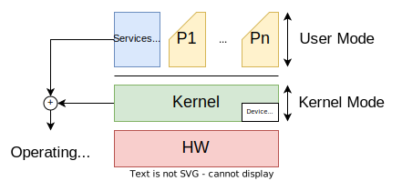

# System Shared Environment

    

## IPC - Inter-Process Communication

* Shared Memory;
* Data exchange via Kernel;
  * **Named Pipes** (fifo);
  * **Unix Domain Sockets**.

### Named Pipes

* **FIFO** - First In First Out;
* Extension to the traditional pipe concept on Unix, and is one of the methods of inter-process communication;
* Created by the `mkfifo` function;
* **Unidirectional** communication.

### Unix Domain Sockets

* **AF_UNIX** - Address Family Unix;
* **Bidirectional** communication;
* Functions:
  * `socket()` - create a socket;
  * `bind()` - bind a name to a socket;
  * `listen()` - listen for connections on a socket;
  * `accept()` - accept a connection on a socket;
  * `connect()` - initiate a connection on a socket.