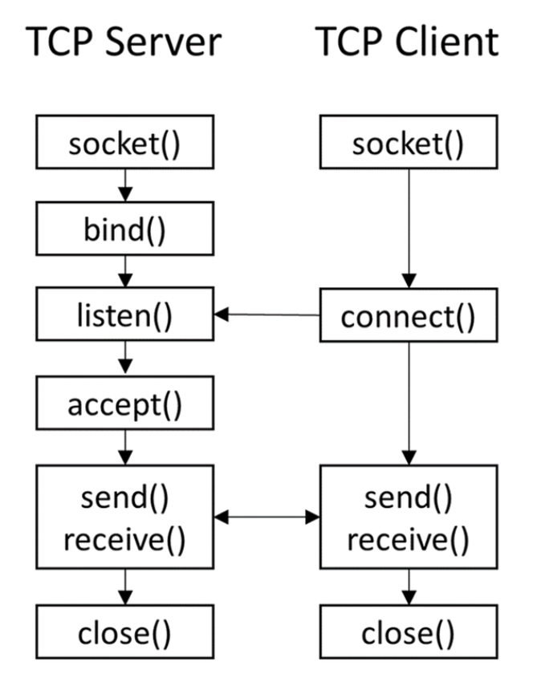

# Remote Calls

> There are multiple ways (middlewares) to implement remote calls in distributed systems:
>
> * **Sockets TCP/IP**
> * **Remote Method Invocation (RMI) - Java RMI**
> * **Remote Procedure Call (RPC) - Google RPC (gRPC)**

| [API Protocol](https://www.mertech.com/blog/know-your-api-protocols) | Release | Formatting Type | Key Feature                            |
| -------------------------------------------------------------------- | ------- | --------------- | -------------------------------------- |
| SOAP                                                                 | 1998    | XML             | Widely used and established            |
| REST                                                                 | 2000    | JSON, XML, ...  | Flexible data formatting               |
| gRPC                                                                 | 2015    | Protobuf        | Ability to define any type of function |
| GraphQL                                                              | 2015    | JSON            | Flexible data structuring              |

---

## Sockets TCP/IP

* **TCP** is a **connection oriented** protocol that allows two hosts to establish a connection and exchange **streams** of data;
  * One host is the **client** and the other is the **server**;
  * The server is always listening for connections and the client initiates the connection;
* Once the connection is established, the client and server can exchange data, in a **reliable** way, through streams in **both directions**, until the connection is closed;
* To allow the existence of multiple connections, `(IP Address, Port)` pairs are used to identify the connections;

| Primitive          | Description                                        |
| ------------------ | -------------------------------------------------- |
| `socket()`         | Creates a socket                                   |
| `bind()`           | Binds a socket to a pair `(IP, port)`              |
| `listen()`         | Puts the socket in listening mode                  |
| `accept()`         | Blocks until a connection is established           |
| `connect()`        | Establishes a connection to a server               |
| `send()`/`write()` | Sends data to the other end of the connection      |
| `recv()`/`read()`  | Receives data from the other end of the connection |
| `close()`          | Closes the socket                                  |

<p align="center">
    
</p>

> **Note**: In Java, the `Socket` class represents a socket and the `ServerSocket` class represents a server socket. This classes are implemented in the `java.net` package.

Other useful classes:

* `InetSocketAddress` - Represents a socket address (IP address + port number) for the `Socket` and `ServerSocket` classes;
* `BufferedReader` - Reads text from a character-input stream, buffering characters so as to provide for the efficient reading of characters, arrays, and lines;
* `PrintWriter` - Prints formatted representations of objects to a text-output stream.

### Example of Client and Server

```java
public class Client {
  public static void main(String[] args) throws Exception {
    Socket socket = new Socket(args[0], Integer.parseInt(args[1])); // IP server, port
    PrintWriter out = new PrintWriter(socket.getOutputStream(), true); // autoFlush
    BufferedReader in = new BufferedReader(new InputStreamReader(socket.getInputStream()));
    out.println("Hello World!");
    System.out.println(in.readLine());
    socket.close();
  }
}
```	

The server must create a concurrent thread for each connection:

```java
public class Server {
  public static void main(String[] args) throws Exception {
    ServerSocket serverSocket = new ServerSocket(Integer.parseInt(args[0])); // port
    ExecutorService executor = Executors.newFiexedThreadPool(5);
    int sessionId = 0;
    while (true) {
      Socket socket = serverSocket.accept();
      Runnable worker = new Worker(socket, sessionId++);
      executor.execute(worker);
    }
  }
}

public class Session implements Runnable {
  private Socket socket;
  private int sessionId;
  private BufferedReader in;
  private PrintWriter out;

  public Session(Socket socket, int sessionId) {
    this.socket = socket;
    this.sessionId = sessionId;
    try {
      this.in = new BufferedReader(new InputStreamReader(socket.getInputStream()));
      this.out = new PrintWriter(socket.getOutputStream(), true); // autoFlush
    } catch (IOException e) {
      e.printStackTrace();
    }
  }

  @Override
  public void run() {
    try {
      String line = in.readLine();
      System.out.println("Session " + sessionId + ": " + line);
      out.println("Echo: " + line);
      socket.close();
    } catch (IOException e) {
      e.printStackTrace();
    }
  }
}
```

### Conclusions

* The concurrency in the server must be explicit, and handled by the programmer;
* The protocol to exchange data depend on the stream of data, and implies the use of a **serialization** mechanism, like **XML** or **JSON**;
* Due to the existence of other middlewares with higher abstraction levels, this approach is not very common nowadays.