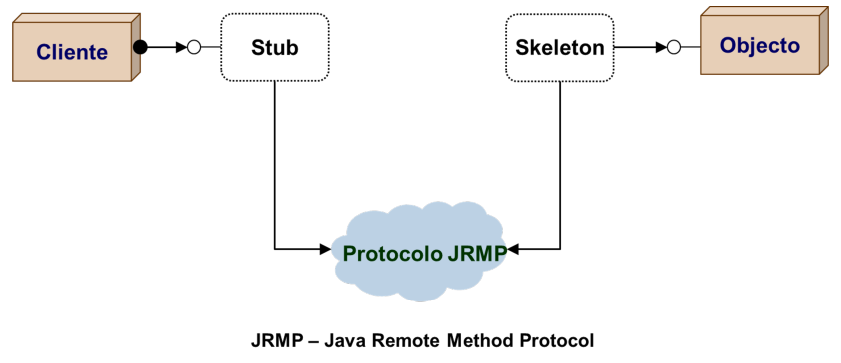
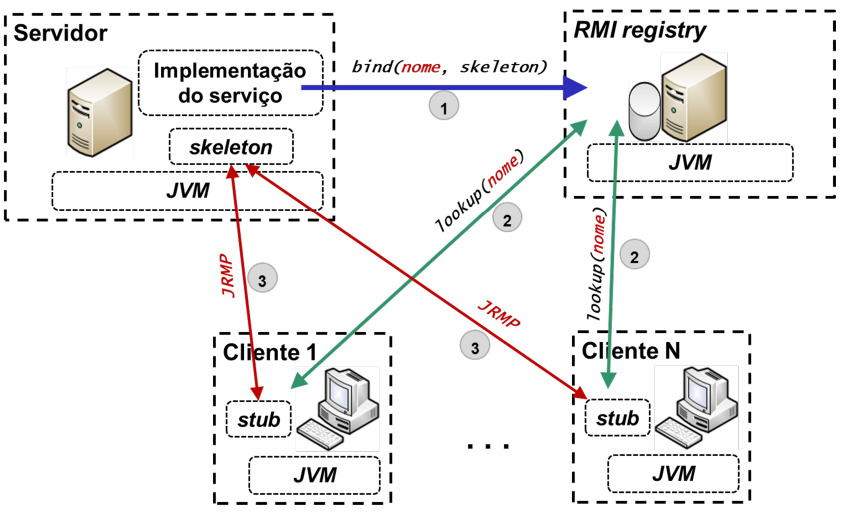

# Remote Method Invocation (RMI)

> A **remote method invocation** is a **request** to execute a **method** on an **object** that resides in a **different address space**.

> A **remote object** is an **object** that **resides** in a **different address space**, providing an accessible **remote interface** allowing **remote method invocation**.

<p align="center">
    
</p>

---

## Proxy (Client) and Skeleton (Server)

* A **proxy** is an **object** that **resides** in the **client address space** and **implements** the **remote interface**;
  * When receives a **remote method invocation**, the **proxy** **serializes**(**marshalling**) the **arguments** and **sends** them to the **skeleton**;

* A **skeleton** is an **object** that **resides** in the **server address space** and **implements** the **remote interface**;
  * When receives a **remote method invocation**, the **skeleton** **deserializes**(**unmarshalling**) the **arguments**, **executes** the **method** and **serializes**(**marshalling**) the **result**;

> **Note**: The **proxy** and **skeleton** are **transparent** to the **client** and **server**, and are usually called **stubs**.

## Registry Intermediary

* In the 80/90s, was defined an standard called **DCE (Distributed Computing Environment)**, that defines a triangle of **communication** between the **client**, the **server** and the **registry**;
  * An intermediary service called **registry** or **directory server** is used to **register** the **remote objects** by the **server** - **service provider**;
  * The **client** uses the **registry** to **lookup** the **remote object** - **service consumer**;
* A **DCE daemon** allowed that the same machine provided multiple services in different ports;

<p align="center">
    
</p>

---

## Remote Calls Semantics vs. Fault Tolerance

### Exactly Once

* In a call, is assured that the **target** is **executed** **exactly once**;
* Calls in a local environment use this semantics;
* But in a remote environment faults can occur, and need to be handled using retransmission or other techniques;

### Maybe Once

* In a call, it's not possible to assure that the **target** is executer or not;

### At Least Once

* In a call, is assured that the **target** is **executed** **at least once**, always receiving a result or an exception;
* If message retransmission occurs, the **target** can be executed more than once;
* The target must be **idempotent** - the result of executing the target multiple times is the same as executing it once.

### At Most Once

* In a call, a result is always received, knowing that the **target** is executed only once, or an exception is received;
* This semantics is the **most used actually**;
* It requires fault tolerance and timeout mechanisms.

---

## [Java RMI](https://docs.oracle.com/javase/7/docs/technotes/guides/rmi/hello/hello-world.html)

> **Java RMI** is a **Java API** that **enables** a **Java application** to **invoke methods** on **objects** that **reside** in **different address spaces**.

<p align="center">
    
</p>

A **Java RMI** application consists of:

* **Remote interfaces** that **extend** the `java.rmi.Remote` interface;
* **Server** - **remote objects** that **implement** the **remote interfaces**;
* **Client** - client that invokes **remote methods** on **remote objects**;

<p align="center">
    
</p>


### Remote Interface

* A **remote interface** extends the interface `java.rmi.Remote` and declares a set of remote methods;
* Each remote method must declare `java.rmi.RemoteException` (or a superclass of `RemoteException`) in its throws clause, in addition to any application-specific exceptions.

An example of a **remote interface**:

```java
public interface RMIContract extends Remote {
    Reply doSomething(Request request) throws RemoteException;
}

public class Request implements Serializable {
    private List<String> lines;
    public List<String> getLines() { return lines; }
    public void setLines(List<String> lines) { this.lines = lines; }
}

public class Reply implements Serializable {
    private String word;
    public String getWord() { return word; }
    public void setWord(String word) { this.word = word; }
}
```

### Server - Remote Object

The server's main method does the following:

* Create and export a **remote object**;
* Register the **remote object** with the **RMI registry**.

```java
public class RMIServer implements RMIContract {
    private static String RMI_HOST = "localhost";
    private static int REGISTRY_PORT = 7000;
    private static int SERVER_PORT = 7001;
    private static RMIServer server;

    public static void main(String args[]) {
        try {
            Properties props = System.getProperties();
            props.put("java.rmi.server.hostname", RMI_HOST);

            svc = new ServerRMI();
            RMIContract stubSvc = (RMIContract) UnicastRemoteObject.exportObject(svc, SERVER_PORT);
            Registry registry = LocateRegistry.createRegistry(REGISTRY_PORT);

            registry.rebind("RMIServer", stubSvc); // bind the remote object's stub in the registry

            System.out.println("Server ready: Press any key to finish server");
            java.util.Scanner scanner = new java.util.Scanner(System.in);
            scanner.nextLine();
            System.exit(0);
        } catch (RemoteException e) {
            e.printStackTrace();
        } catch (Exception ex) {
            System.err.println("Server unhandled exception: " + ex);
            ex.printStackTrace();
        }
    }

    @Override
    public Reply doSomething(Request request) throws RemoteException {
        System.out.println("Server received request: " + request.getLines());
        Reply reply = new Reply();
        reply.setWord("Hello World!");
        return reply;
    }
}
```

As you can see, the remote object is exported using the `UnicastRemoteObject.exportObject()` method, which returns a **stub** for the remote object in the local address space.

Then the **stub** is bound in the **registry** using the `Registry.bind()` method.

### Client

The client program obtains the **stub** for the remote object from the **registry** and invokes the remote method on the remote object.

```java
public class RMIClient {
    private static String RMI_HOST = "localhost";
    private static int REGISTRY_PORT = 7000;

    public static void main(String args[]) {
        try {
            Registry registry = LocateRegistry.getRegistry(RMI_HOST, REGISTRY_PORT);
            RMIContract stub = (RMIContract) registry.lookup("RMIServer");

            Request request = new Request();
            request.setLines(Arrays.asList("Hello", "World!"));
            Reply response = stub.doSomething(request);

            System.err.println("Server response: " + response);
        } catch (Exception e) {
            System.err.println("Client exception: " + e.toString());
            e.printStackTrace();
        }
    }
}
```

---

## Coupling

* **Tight coupling** is when two parts are **highly dependent** on each other - **RMI**;
* **Loose coupling** is when two parts are **independent** of each other;
  * The interface/contract can be defined using specific languages, like IDL, XML, WSDL, **Protobuf** (used in gRPC), etc;

---

## Limitations of Java RMI

* Depends on **Java**;
* Difficult to use between **different languages**;
* Depends on **TCP/IP**, namely **sockets**;
* Without intrinsic support for **asynchronous calls**;
* Doing remote calls with the same semantics as local calls can induce the programmer to not consider the **fault tolerance**.
