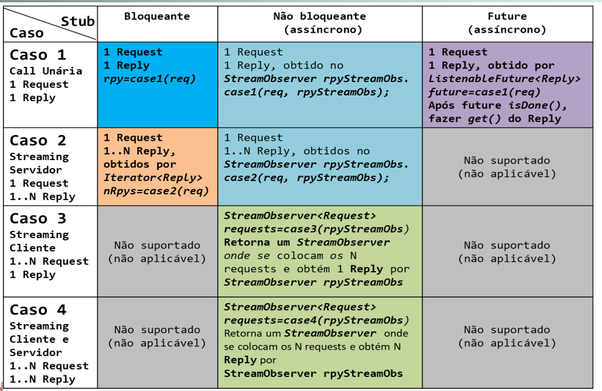

# RPC - Remote Procedure Call

> **RPC** (**Remote Procedure Call**) is a **protocol** that **allows** a **computer program** to **call** a **procedure** that **resides** in **another address space** (**computer** on a **different** **host**), which is **encoded** as **data** in **binary** form (**message**) and is **transmitted** to the **remote** **address space** to **be executed** there as a **procedure call**.

* The client and the server communicate through **stubs**;
* The two stubs communicate through the network.

<p align="center">
    
</p>

---

## [gRPC](https://grpc.io/)

> **gRPC** is a **modern** **open source** **high performance** **RPC** **framework** that can run in **any environment**.

* Uses **HTTP/2** as the transport protocol;
* **Protobuf** as the interface definition language;
* The contract compiler generates **client** and **server** **stubs** in **many languages** (e.g. Java, C#, etc.).

There are 4 types of calls:

1. **Unary** - **one request** and **one response**;
2. **Server streaming** - **one request** and **many responses**;
3. **Client streaming** - **many requests** and **one response**;
4. **Bidirectional streaming** - **many requests** and **many responses** (the number of requests and responses can be different).

> ### HTTP/2
>
> **HTTP/2** is a **major revision** of the **HTTP** network protocol used
> by the **World Wide Web**.
>
> * **Binary** instead of **text**;
> * Header compression;
> * Low latency;
> * Allows **multiplexing**, which means that **multiple requests** can be
> **in flight** at the same time, using the same **TCP connection** (instead
> of opening a new connection for each request - **HTTP/1.1**);

### [Protocol Buffers (Protobuf)](https://protobuf.dev/)

> The service contract is defined using **Protocol Buffers** (Protobuf), a **language-neutral**, **platform-neutral**, **extensible** mechanism for **serializing** structured data – think XML, but smaller, faster, and simpler.

* There are plugins to compile the `.proto` files to **Java**, **C#** and other languages;

Types of calls:

1. **Unary** - `rpc oper(Request) returns (Reply)`
2. **Server streaming** - `rpc oper(Request) returns (stream Reply)`
3. **Client streaming** - `rpc oper(stream Request) returns (Reply)`
4. **Bidirectional streaming** - `rpc oper(stream Request) returns (stream Reply)`

<p align="center">
    
</p>

### StreamObserver Interface

> The **StreamObserver** interface is used to **send** and **receive** messages, using the **observer pattern**:

```java
public interface StreamObserver<T> {
  void onNext(T value);
  void onError(Throwable t);
  void onCompleted();
}
```

* `onNext()` - send one more message to the stream;
* `onError()` - send an error to the stream;
* `onCompleted()` - send a completion signal to the stream, indicating that no more messages will be sent.

> **Note**: The `onError` receives a `Throwable` object, which can be used to send an error message to the client. The gRPC provides specific exceptions for each error type, such as `StatusRuntimeException` and `StatusException`. Other exceptions will not be sent to the client, being UNKNOWN instead.

### Client Stubs

> The **client stub** is a **local proxy** that **encodes** and **transmits** a method call, **waits** for a response, and **decodes** the response back into a **Java object**.

The client stub can be:

* **Blocking** - the client makes a **synchronous** call to the server, and **waits** for the response;
  * Only **unary** and **server streaming** calls are supported;
* **Future** - the client makes an **asynchronous** call to the server, and **waits** for the response;
  * Only **unary** calls are supported;
* **Async (Non-blocking)** - the client makes an **asynchronous** call to the server, and **registers** a **callback** to be **invoked** when the response is received.

| Call type               | Blocking           | Future             | Async              |
| ----------------------- | ------------------ | ------------------ | ------------------ |
| Unary                   | :white_check_mark: | :white_check_mark: | :white_check_mark: |
| Server streaming        | :white_check_mark: | :x:                | :white_check_mark: |
| Client streaming        | :x:                | :x:                | :white_check_mark: |
| Bidirectional streaming | :x:                | :x:                | :white_check_mark: |

---

## Conclusions

* Transparent interactions between **clients** and **servers**;
* Flexible and low latency, using **HTTP/2**;
* Contract defined using **Protobuf**;
* **Duplex** communication;
* **Sync and async calls**;
* Support for **many languages** and used in many products (e.g. Google Cloud, Netflix, Docker, Cisco, etc.).

| Feature         | gRPC                        | REST                      |
| --------------- | --------------------------- | ------------------------- |
| Protocol        | HTTP/2 (fast)               | HTTP/1.1 (slow)           |
| Payload         | Protobuf (binary, small)    | JSON (text, large)        |
| API Contract    | Strict, required (`.proto`) | Loose, optional (OpenAPI) |
| Code Generation | Built-in (protoc)           | External (Swagger)        |
| Security        | TLS                         | TLS                       |
| Streaming       | Bidirectional               | Unidirectional            |
| Browser Support | Limited (requires gRPC-Web) | Full                      |

---
---

## Examples

### Contract

```protobuf
syntax = "proto3";

import "google/protobuf/timestamp.proto";
option java_multiple_files = true;
option java_package = "rpcstubs";
package baseservice;

service BaseService {
  rpc case1(Request) returns (Reply);
  rpc case2 (Request) returns (stream Reply);
  rpc case3(stream Request) returns (Reply);
  rpc case4(stream Request) returns (stream Reply);
  
  // Utilização de parâmetro e retorno Void
  rpc pingServer(Void) returns (Reply);
  rpc publishNews(News) returns (Void);
}

message Request {
  int32 reqID = 1;
  string txt = 2;
}
message Reply {
  int32 rplyID = 1;
  string txt = 2;
}

message Void {
}
message News {
  google.protobuf.Timestamp ts = 1;
  string texto = 2;
}
```

### Server

```java
public class Server extends BaseServiceGrpc.BaseServiceImplBase {
  private static int SVC_PORT = 8000;

  public static void main(String[] args) {
    io.grpc.Server server = io.grpc.ServerBuilder.forPort(SVC_PORT)
        .addService(new Server())
        .build();

    try {
      server.start();
      System.out.println("Server started, listening on " + SVC_PORT);
      server.awaitTermination();
    } catch (IOException | InterruptedException e) {
      e.printStackTrace();
    }
  }

  @Override
  public void case1(Request request, StreamObserver<Reply> responseObserver) {
    Reply reply = Reply.newBuilder()
        .setRplyID(request.getReqID())
        .setTxt("case1: " + request.getTxt())
        .build();
    responseObserver.onNext(reply);
    responseObserver.onCompleted();
  }

  @Override
  public void case2(Request request, StreamObserver<Reply> responseObserver) {
    for (int i = 0; i < 10; i++) {
      Reply reply = Reply.newBuilder()
          .setRplyID(request.getReqID())
          .setTxt("case2: " + request.getTxt() + " - " + i)
          .build();
      responseObserver.onNext(reply);
    }
    responseObserver.onCompleted();
  }

  @Override
  public StreamObserver<Request> case3(StreamObserver<Reply> responseObserver) {
    return new StreamObserver<Request>() {
      @Override
      public void onNext(Request request) {
        Reply reply = Reply.newBuilder()
            .setRplyID(request.getReqID())
            .setTxt("case3: " + request.getTxt())
            .build();
        responseObserver.onNext(reply);
      }

      @Override
      public void onError(Throwable throwable) {
        System.out.println("case3 error: " + throwable.getMessage());
      }

      @Override
      public void onCompleted() {
        responseObserver.onCompleted();
      }
    };
  }

  @Override
  public StreamObserver<Request> case4(StreamObserver<Reply> responseObserver) {
    return new StreamObserver<Request>() {
      @Override
      public void onNext(Request request) {
        for (int i = 0; i < 10; i++) {
          Reply reply = Reply.newBuilder()
              .setRplyID(request.getReqID())
              .setTxt("case4: " + request.getTxt() + " - " + i)
              .build();
          responseObserver.onNext(reply);
        }
      }

      @Override
      public void onError(Throwable throwable) {
        System.out.println("case4 error: " + throwable.getMessage());
      }

      @Override
      public void onCompleted() {
        responseObserver.onCompleted();
      }
    };
  }
}
```

### Client

```java
public class Client {
  private static final int SVC_PORT = 8000;
  private static final String SVC_HOST = "localhost"; 

  private static ManagedChannel channel;
  private static BaseServiceGrpc.BaseServiceBlockingStub blockingStub;
  private static BaseServiceGrpc.BaseServiceStub stub; // non-blocking

  public static void main(String[] args) throws Exception {
    channel = ManagedChannelBuilder.forAddress(SVC_HOST, SVC_PORT)
      .usePlaintext()
      .build();
    stub = BaseServiceGrpc.newStub(channel);
    blockingStub = BaseServiceGrpc.newBlockingStub(channel);

    case1();
    case2();
    case3();
    case4();

    // ...
  }

  static void case1() {
    Request request = Request.newBuilder()
        .setReqID(1)
        .setTxt("case1")
        .build();
    Reply reply = blockingStub.case1(request);
    System.out.println("case1: " + reply.getTxt());
  }

  // or

  static void case1() {
    Request request = Request.newBuilder()
        .setReqID(1)
        .setTxt("case1")
        .build();
    stub.case1(request, new StreamObserver<Reply>() {
      @Override
      public void onNext(Reply reply) {
        System.out.println("case1: " + reply.getTxt());
      }

      @Override
      public void onError(Throwable throwable) {
        System.out.println("case1 error: " + throwable.getMessage());
      }

      @Override
      public void onCompleted() {
        System.out.println("case1 completed");
      }
    });
  }

  static void case2() {
    Request request = Request.newBuilder()
        .setReqID(2)
        .setTxt("case2")
        .build();
    stub.case2(request, new StreamObserver<Reply>() {
      @Override
      public void onNext(Reply reply) {
        System.out.println("case2: " + reply.getTxt());
      }

      @Override
      public void onError(Throwable throwable) {
        System.out.println("case2 error: " + throwable.getMessage());
      }

      @Override
      public void onCompleted() {
        System.out.println("case2 completed");
      }
    });
  }

  static void case3() {
    StreamObserver<Request> requestStreamObserver = stub.case3(new StreamObserver<Reply>() {
      @Override
      public void onNext(Reply reply) {
        System.out.println("case3: " + reply.getTxt());
      }

      @Override
      public void onError(Throwable throwable) {
        System.out.println("case3 error: " + throwable.getMessage());
      }

      @Override
      public void onCompleted() {
        System.out.println("case3 completed");
      }
    });

    for (int i = 0; i < 10; i++) {
      Request request = Request.newBuilder()
          .setReqID(3)
          .setTxt("case3")
          .build();
      requestStreamObserver.onNext(request);
    }
    requestStreamObserver.onCompleted();
  }

  static void case4() {
    StreamObserver<Request> requestStreamObserver = stub.case4(new StreamObserver<Reply>() {
      @Override
      public void onNext(Reply reply) {
        System.out.println("case4: " + reply.getTxt());
      }

      @Override
      public void onError(Throwable throwable) {
        System.out.println("case4 error: " + throwable.getMessage());
      }

      @Override
      public void onCompleted() {
        System.out.println("case4 completed");
      }
    });

    for (int i = 0; i < 10; i++) {
      Request request = Request.newBuilder()
          .setReqID(4)
          .setTxt("case4")
          .build();
      requestStreamObserver.onNext(request);
    }
    requestStreamObserver.onCompleted();
  }
}
```