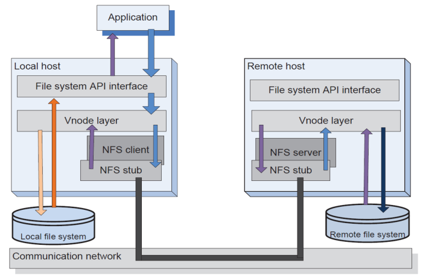
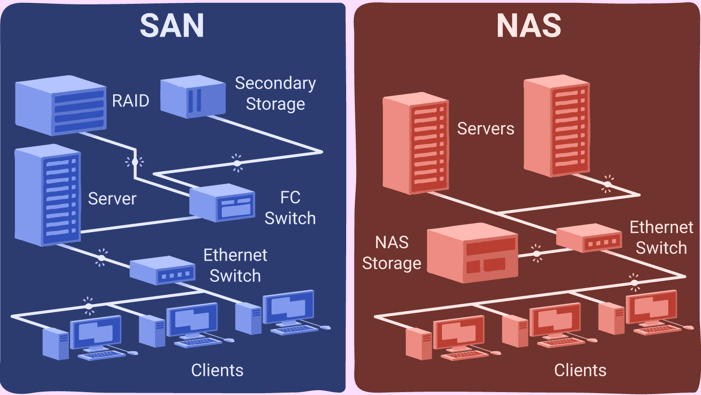
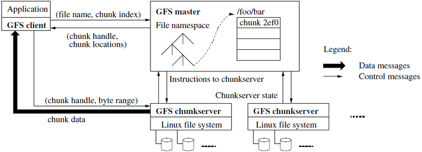

# Distributed File Systems

> Distributed file systems are a class of distributed systems that provide a way to store and access files across multiple computers. Distributed file systems are designed to provide high availability and scalability, and to be fault-tolerant. They are often used in large-scale distributed computing environments, such as cloud computing.

---
---

## Historic Overview (90s - 2010s)

* Necessity to share files between computers in local networks of organizations (intranets);
* The traditional file systems of the operating systems were not designed to support this, so they were extended, creating a global namespace based on subtrees:
  * **NFS** (Network File System);
  * **SAN** (Storage Area Network) - high speed network that makes connections between storage devices and servers;
  * **NAS** (Network Attached Storage) - shares files over the network;
  * **HDFS** (Hadoop Distributed File System) - a distributed file system designed to run on commodity hardware;

---

### NFS (Network File System)

    

* NFS is a distributed file system protocol originally developed by Sun Microsystems (1984);
* It allows a user on a client computer to access files over a computer network much like local storage is accessed, abstracting the physical location of the stored data.

---

### SAN (Storage Area Network) vs. NAS (Network Attached Storage)

    

* SAN (Storage Area Network) - high speed network that makes connections between storage devices and servers;
  * SAN is a dedicated network that is used to connect storage devices to servers;
* NAS (Network Attached Storage) - shares files over the network;
  * NAS is a storage device that is connected to a network and can be accessed by multiple computers.

---

### Problems of Hierarchical File Systems

* Multiple accesses to the disk in order to locate file blocks;
* Read/write can be slow when the depth of the tree is large;
* Consistent replication of the file system is difficult;
* Problems in NFS, SAN and NAS:
  * Bottlenecks in the network;
  * Cache in memory, that leads to performance problems in the case of multiple accesses to the same file.

---

### Big Data

> Big data is a term that describes the large volume of data – both structured and unstructured – that inundates a business on a day-to-day basis.

* Large volumes of data;
* Large variety of data;
* Large processing power;
* Large replication in order to guarantee fault tolerance and increase availability;
  * Updates are not frequent, so it does not decrease performance;

---
---

## Google File System

> The Google File System (GFS) is a distributed file system designed to provide fault-tolerant, scalable, and highly available storage for large distributed data-intensive applications.

* **Scalable** and **fault-tolerant**;
* **Large volumes of data**;
* **Sequential** access:
* Random writes are not frequent - usually, they are done at the end of the file (**append**);
* Process large amounts of data without worrying about the time of read/write of individual files;
* Relax consistency, privileging **replication** to increase availability.

### Architecture

* A file is divided into **chunks**;
* The **append** operation is atomic, supporting concurrent writes;
* Eliminates the client-side cache in order to avoid the problem of multiple accesses to the same file;
* Ensure consistency in critical operations (write, delete, etc.) by using **master-slave** architecture;
* Supports **checkpoints**, **recovery** mechanisms and **garbage collection**;

    

* A **master** is responsible for a set of **chunk servers**, maintaining the metadata of the files consistent;
  * File metadata consists of file name, location of the chunks and the state of each chunk server;
* The master is responsible for the **checkpoint** and **recovery** mechanisms, using a **log** to store the operations performed;
* The chunk servers are Linux, and each chunk is a file with a handle;
  * A client communicates with the master to obtain the location of the chunks.