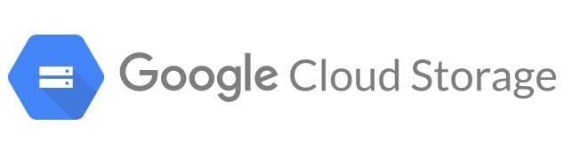
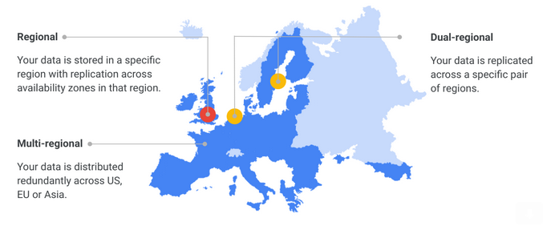
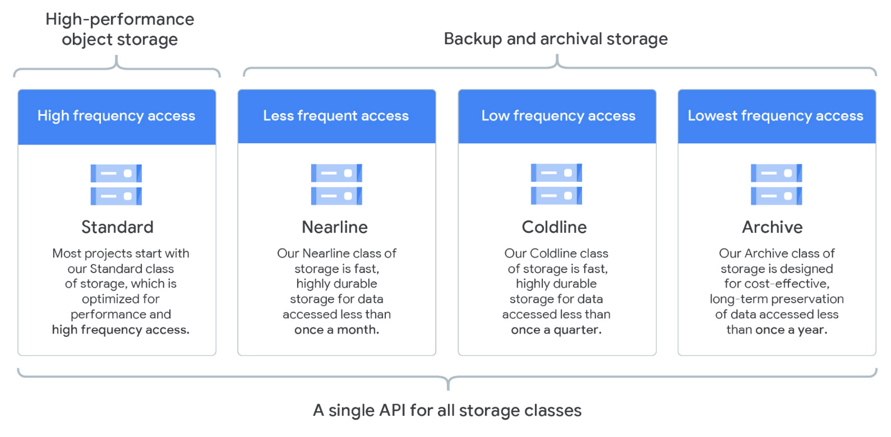

# Google Cloud Storage

> Google Cloud Storage (GCS) is a RESTful online file storage web service for storing and accessing data on Google Cloud Platform infrastructure. The service combines the performance and scalability of Google's cloud with advanced security and sharing capabilities.

<p align="center">
    
</p>

## Binary Large Objects (BLOBs)

> A binary large object (BLOB) is a collection of binary data stored as a single entity in a database management system. BLOBs are typically images, audio or other multimedia objects, though sometimes binary executable code is stored as a BLOB.

* In hierarchical file systems, files are stored in folders;
* The cloud storage uses a **flat structure** (or **data lake**), where files are stored in **buckets**;
* A BLOB is identified by a **unique ID** (key) and a **set of metadata** (name, size, type, etc.);
  * Immutable - cannot be changed.

---
---

## GCS Requirements

* **Locations** (regional, dual-regional, multi-regional, etc.);
* **Storage classes** (standard, nearline, coldline, archive);
* **High availability** (> 99%) with **geographic replication**;
* **Fault-tolerant**;
* Response time < 100 ms;
* An object can be **up to 5 TB**;
* Consistency model: **strong**.

---

### [Locations](https://cloud.google.com/storage/docs/locations)

* **Regional** (e.g. `us-central1`) - data is stored in a single region, without geographic replication;
* **Dual-regional** (e.g. `eur4` - Netherlands and Finland) - data is stored in two regions, with geographic replication; Availability in the presence of faults and **disaster recovery**;
* **Multi-regional** (e.g. `us`, `eu`, `asia`) - data is stored in multiple regions, with geographic replication; Availability in the presence of faults and **disaster recovery**; Ideal for frequently accessed data;

<p align="center">
    
</p>

---

### [Storage Classes](https://cloud.google.com/storage/docs/storage-classes)

There is a single API for all storage classes, but the data is stored in different storage tiers:

<p align="center">
    
</p>

Each storage class has a different **cost** and **performance** - [pricing](https://cloud.google.com/storage/pricing#price-tables).

---

### Buckets and Objects

Buckets and BLOBs can be created and accessed via:

* GCP Console;
* URL of **public** BLOBs;
* [gsutil command-line tool](https://cloud.google.com/sdk/);
  * Command list [here](https://cloud.google.com/storage/docs/gsutil/commands/ls);
* gRPC or REST APIs;

> Bucket names must be **globally unique**.
>
> Blob names must be **unique** within a bucket.

---

### Namespaces

* The **namespace** is the **global** set of buckets, and so the **names** of buckets must be **unique**;
* The BLOBs names can contain a slash (`/`) to give the illusion of a hierarchical structure.

<p align="center">
    
</p>

---

### Access Control

Buckets can have the following **policies**:

* **Uniform** - all objects in the bucket have the same access control - **ACL**;
* **Fine-grained** - each object can have its own ACL.

`allUsers` and `allAuthenticatedUsers` are **special groups**:
* `allUsers` - all users, including anonymous users - without GCP account;
* `allAuthenticatedUsers` - all users that are authenticated - with GCP account.

---

### Object Metadata

Each object has a set of **metadata** in the form of key-value pairs:

* **Content-Type** - MIME type;
* **Content-Language** - language of the object data;
* [**Content-Encoding**](https://cloud.google.com/storage/docs/transcoding) - compression type;
* [**Content-Disposition**](https://tools.ietf.org/html/rfc6266) - how to display the object in the browser;
* [**Cache-Control**](https://cloud.google.com/storage/docs/metadata#cache-control) - how to cache the object;
* [**Access Control Metadata**](https://cloud.google.com/storage/docs/access-control/lists) - ACL, owner, etc.

Additional metadata can be added by the user, but each character of the key and value counts as **1 byte**.

---

### [Cache-Control](https://peering.google.com/#/)

* The **Cache-Control** metadata can be used to **control** the **caching** of objects;
* Data centers;
* Edge Points of Presence (PoPs) have **caches** for content delivery;
* Google Global Cache (GGC) is a **global** cache for **popular** content.

---

### [Consistency](https://cloud.google.com/storage/docs/consistency)

Most operations have **strong consistency**:

* **Read-after-write** - a read operation returns the data written in a previous write operation;
* **Read-after-metadata-update** - a read operation returns the metadata updated in a previous metadata update operation;
* **Read-after-delete** - a read operation fails because the object was deleted in a previous delete operation;
* **Bucket listing** - a list operation returns the objects created in a previous create operation;
* **Object listing** - a list operation returns the objects created in a previous create operation.

Operations with **eventual consistency**:

* **Granting or Revoking access** - accesses after granting or revoking access;
* Objects with active caching in the cache-control metadata.

---

### Good Practices

* Do not use sensitive data in the object name (email, project IDs, etc.);
* Different names can be generated using **GUIDs**;
* After errors, **retry** the operation following the [**exponential backoff** pattern](https://cloud.google.com/storage/docs/exponential-backoff).


### Limits

* BLOBs can be up to **5 TB**;
* [Naming rules](https://cloud.google.com/storage/docs/naming#requirements);
* Creation and deletion of objects is **rate-limited**;
* Ramp up request rate gradually;
* **Sharding** BLOBs into multiple servers.

---
---

## Java API

```java
public class StorageClient {
    static StorageOperations soper;

    public static void main(String[] args) {
        StorageOptions options = StorageOptions.getDefaultInstance();
        Storage storage = options.getService();
        String projectId = options.getProjectId();

        soper = new StorageOperations(storage);

        // ...
    }
}

public class StorageOperations {
    Storage storage;

    public StorageOperations(Storage storage) {
        this.storage = storage;
    }

    public Bucket createBucket(String bucketName) {
        return storage.create(
            BucketInfo.newBuilder(bucketName)
                .setStorageClass(StorageClass.STANDARD) // STANDARD, NEARLINE, COLDLINE, ARCHIVE
                .setLocation("EUROPE-WEST1")
                .build()
        );
    }

    public void deleteBucket(String bucketName) {
        Bucket bucket = storage.get(bucketName);
        bucket.delete();
    }

    public void uploadBlobToBucket(String bucketName, String blobName, String absFileName) throws IOException {
        Path uploadFrom = Paths.get(absFileName);
        String contentType = Files.probeContentType(uploadFrom);
        BlobId blobId = BlobId.of(bucketName, blobName);
        BlobInfo blobInfo = BlobInfo.newBuilder(blobId).setContentType(contentType).build();

        if (Files.size(uploadFrom) > 1_000_000) {
            // When content is not available or large (1MB or more) it is recommended
            // to write it in chunks via the blob's channel writer.
            try (WriteChannel writer = storage.writer(blobInfo)) {
                byte[] buffer = new byte[1024];
                try (InputStream input = Files.newInputStream(uploadFrom)) {
                    int limit;
                    while ((limit = input.read(buffer)) >= 0) {
                        try {
                            writer.write(ByteBuffer.wrap(buffer, 0, limit));
                        } catch (Exception ex) {
                            ex.printStackTrace();
                        }
                    }
                }
            }
        } else {
            byte[] bytes = Files.readAllBytes(uploadFrom);
            storage.create(blobInfo, bytes);
        }
    }

    public void downloadBlobFromBucket(String bucketName, String blobName, String absFileName) throws IOException {
        Path downloadTo = Paths.get(absFileName);
        BlobId blobId = BlobId.of(bucketName, blobName);
        Blob blob = storage.get(blobId);
        if (blob == null)
            throw new IllegalArgumentException("No such Blob exists !");

        if (!Files.exists(downloadTo.getParent()))
            Files.createDirectories(downloadTo.getParent());

        // Check if the file exists and create it if not
        if (!Files.exists(downloadTo))
            Files.createFile(downloadTo);

        PrintStream writeTo = new PrintStream(Files.newOutputStream(downloadTo));
        if (blob.getSize() < 1_000_000) {
            // Blob is small read all its content in one request
            byte[] content = blob.getContent();
            writeTo.write(content);
        } else {
            // When Blob size is big or unknown use the blob's channel reader.
            try (ReadChannel reader = blob.reader()) {
                WritableByteChannel channel = Channels.newChannel(writeTo);
                ByteBuffer bytes = ByteBuffer.allocate(64 * 1024);
                while (reader.read(bytes) > 0) {
                    bytes.flip();
                    channel.write(bytes);
                    bytes.clear();
                }
            }
        }
        writeTo.close();
    }

    public void makeBlobPublic(String bucketName, String blobName) {
        BlobId blobId = BlobId.of(bucketName, blobName);
        Blob blob = storage.get(blobId);
        if (blob == null)
            throw new IllegalArgumentException("No such Blob exists !");

        Acl.Entity aclEnt = Acl.User.ofAllUsers();
        Acl.Role role = Acl.Role.READER;

        Acl acl = Acl.newBuilder(aclEnt, role).build();
        blob.createAcl(acl);
    }

    public boolean checkBlobExists(String bucketName, String blobName) {
        BlobId blobId = BlobId.of(bucketName, blobName);
        Blob blob = storage.get(blobId);
        return blob != null;
    }

    public void listBuckets(String projID) {
    for (Bucket bucket : storage.list().iterateAll()) {
        System.out.println(" " + bucket.toString());
        for (Blob blob : bucket.list().iterateAll()) {
            System.out.println(" "+blob.toString());
        }
    }
    }
```