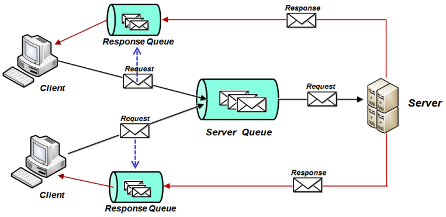
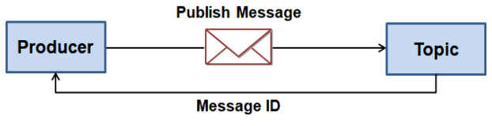
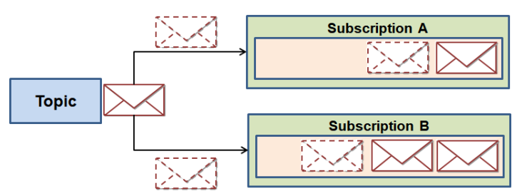
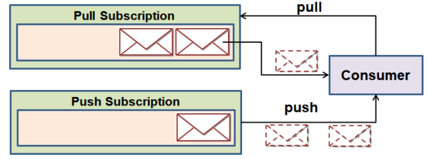
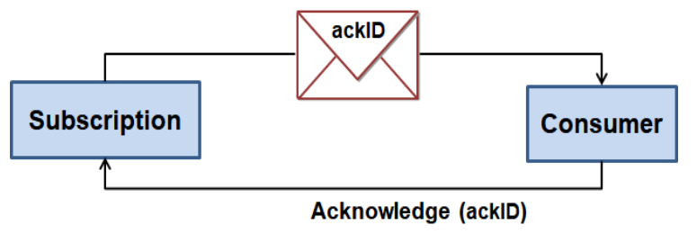
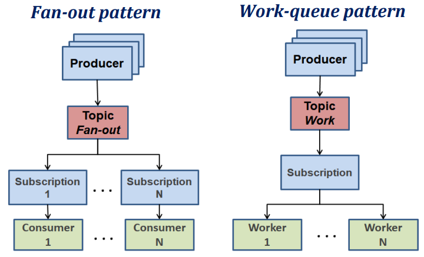

# Pub/Sub

There are many ways to implement a distributed system. One of them is the **publish/subscribe** model.

Other models are:

* **Client/Server**;
  * Requests/Reply;
  * Most common model;
  * Limited to 1:1 communication;
  * Both participants must be online at the same time;
  * **Pull-based synchronous communication**;
* **RPC** over full-duplex TCP/IP;
  * Supports streaming and asynchronous communication;
* **Message Queues**.

### Event-Driven Architecture (Messages)

* **Loosely coupled** between producers and consumers;
* Different rates of production and consumption - asynchronous;
  * Messages typically stored in a **queue**;
* Producers send messages to **queues** or **topics**;
* A consumer or a group of consumers **subscribe** to a queue or topic, to receive messages;
* **Disadvantage:** requires a middleware called **message broker** or **mediator** (e.g. RabbitMQ, Kafka, ActiveMQ, etc.).

<p align="center">
    
</p>

* Each client sends the name of its own **response queue** to the server in the request message;
* Multiple servers share a **single global request queue**, allowing them to **balance the load**.

---

## Publish/Subscribe Model

* An intermediary called **message broker** or **mediator** keeps track of the **topics** and **subscribers**;
* Each subscriber **subscribes** to one or more topics;

### Examples of Message Systems

* Java Message System (JMS);
* Microsoft Message Queue (MSMQ);
* Advanced Message Queuing Protocol (AMQP) - open standard;
* Apache Kafka;
* ZeroMQ - asynchronous messaging framework with low latency;
* Cloud Amazon Simple Queue Service (SQS);
* Azure Queue Storage;
* **Google Pub/Sub**.

---
---

## Google Pub/Sub

> Google Cloud Pub/Sub is a fully-managed real-time messaging service that allows you to send and receive messages between independent applications. You can leverage Pub/Sub’s flexibility to decouple systems and components hosted on Google Cloud or elsewhere on the Internet.

### Message Flow

The message flow in Google Pub/Sub is as follows:

1. The producer chooses a **topic** which will be the destination of the message;
2. The producer sends (**publishes**) the message to the topic;
3. The infrastructure receives the message, assigns an unique **ID** in the topic and returns it to the producer, as confirmation of the message being published;

<p align="center">
    
</p>

4. A topic can have one or more **subscriptions**; each message published in a topic is replicated to all queues subscribed to that topic;

<p align="center">
    
</p>

1. The messages can be delivered to the subscribers in two ways:
   * **Pull** - the subscriber **pulls** the messages from the topic;
   * **Push** - the messages are **pushed** to the subscriber.

<p align="center">
    
</p>

6. The subscriber receives the message and sends an **acknowledgement** to the infrastructure;
   * The acknowledgement needs to be sent within a **deadline** defined in the subscription;
   * If the deadline is exceeded, the message is sent again to the subscriber; this way, the message is guaranteed to be delivered at least once.

<p align="center">
    
</p>

---

### Multiple Subscriptions and Consumers

<p align="center">
    
</p>

* Each message published in topic 1, is replicated to all subscriptions of topic 1;
* Each message published in topic 2 is only read by one consumer, since there is only one subscription to topic 2;

---

### Patterns

* **Fan-out pattern** - the messages are replicated to all subscribers; one subscription per consumer;
* **Work queue pattern** - work is distributed among multiple workers; one subscription to all workers;

<p align="center">
    
</p>

---

## Concepts

* **Topic** - a named resource to which messages are sent by publishers;
  * **topic ID**, e.g. `my-topic`;
  * **topic name**, e.g. `projects/my-project/topics/my-topic`;

* **Schema** - a description of the format of the data to be published to a topic; the schema is **optional**;
  * **schema ID**, e.g. `my-schema`;
  * **schema name**, e.g. `projects/my-project/schemas/my-schema`;
  * **schema type**, e.g. `AVRO`, `PROTOCOL_BUFFER`, `JSON`; the schema type determines the format of the message payload;
  * **schema definition**, e.g. `{"type": "string"}`;

* **Message** - a combination of data and attributes that a publisher sends to a topic and is eventually delivered to subscribers;
  * **payload/data**, e.g. `{"name": "John"}`; if empty, the message must contain non-empty attributes;
  * **attributes**, e.g. `{"age": "30"}`; the attributes are **optional** and contain metadata about the message; if its empty, the message must contain non-empty data;
  * **message ID**, e.g. `1234567890`; the message ID is assigned by the infrastructure when the message is published; unique within the topic; it must not be populated by the publisher;
  * **publishTime**; it must not be populated by the publisher;
  * **orderingKey**.

* **Subscription** - represents intention of receiving messages in a topic;
  * **subscription ID**, e.g. `my-subscription`;
  * **subscription name**, e.g. `projects/my-project/subscriptions/my-subscription`;
  * **delivery type**, e.g. `PULL`, `PUSH`; the delivery type determines how the messages are delivered to the subscriber;
  * **message retention duration**; default is 7 days;
  * **acknowledgement deadline**; default is 10 seconds;
  * message queue;
  * **filter** messages by attributes;
  * **order** messages by ordering key - marks the messages with a key and the messages with the same key are delivered to the subscriber in the order they were published.
  * `Exactly Once Delivery` - the message is delivered just once to the subscriber, even if the acknowledgement is not sent within the deadline, it will not be sent again;
  * `Dead Letter` - if active, the messages that are not acknowledged within the deadline are sent to a dead letter topic;

* **Acknowledgement** - a signal sent from the subscriber to the infrastructure, to indicate that the subscriber has received and processed a message;
  * If its positive, the message is removed from the subscription;
  * If its negative or not sent within the deadline, the message is sent again to the subscription, according to the **retry policy**.

---

### [Types of Subscription](https://cloud.google.com/pubsub/docs/subscriber#push_pull)

|                | **PULL**                                                          | **PUSH**                                 |
| -------------- | ----------------------------------------------------------------- | ---------------------------------------- |
| Use case       | Large volume of data                                              | Cloud Functions, App Engine, Cloud Run   |
| Load balancing | Multiple subscribers can pull messages from the same subscription | The push endpoint can be a load balancer |

#### Push Subscription

The message is sent to the subscriber by the infrastructure, using a **POST** request to the **push endpoint** defined in the subscription.

Example

```
POST https://www.example.com/push-endpoint

{
  "message":{
    "attributes":{
      "key":"value"
    },
    "data":"SGVsbG8gQ2xvdWQgUHViL1N1YiEgSGVyZSBpcyBteSBtZXNzYWdlIQ==",
    "messageId":"136969346945"
  },
  "subscription":"projects/myproject/subscriptions/mysubscription"
}
```

---

### Advantages

* **Decoupling** between producers and consumers;
* Different rates of production and consumption - asynchronous;
* One or more consumers can subscribe to a topic;

### Disadvantages

* **Reliability** - the messages are not guaranteed to be delivered for the publishers;
* **Potencial bottleneck** - the message broker can become a bottleneck if the number of messages is too high;
* **Security** - the messages are not encrypted by default.

---
---

## Java API

```java
// Create a topic
TopicName topicName = TopicName.of(PROJECT_ID, TOPIC_ID);
TopicAdminClient topicAdminClient = TopicAdminClient.create();
Topic topic = topicAdminClient.createTopic(topicName);

// List topics in a project
ProjectName projectName = ProjectName.of(PROJECT_ID);
TopicAdminClient.ListTopicsPagedResponse res = topicAdminClient.listTopics(projectName);
for (Topic t : res.iterateAll()) {
    System.out.println(t.getName());
}

// Create a subscription
SubscriptionName subscriptionName = SubscriptionName.of(PROJECT_ID, SUBSCRIPTION_ID);
SubscriptionAdminClient subscriptionAdminClient = SubscriptionAdminClient.create();
PushConfig pushConfig = PushConfig.getDefaultInstance();

subscriptionAdminClient.createSubscription(subscriptionName, topicName, pushConfig, 0); // default ack deadline is 10 seconds

// Publish a message
Publisher publisher = Publisher.newBuilder(topicName).build();

String message = "Hello World!";
ByteString data = ByteString.copyFromUtf8(message);
PubsubMessage pubsubMessage = PubsubMessage.newBuilder()
              .setData(data)
              .putAttributes("key", "value")
              .build();

ApiFuture<String> messageIdFuture = publisher.publish(pubsubMessage);
String messageId = messageIdFuture.get();
publisher.shutdown();


subscriptionAdminClient.close();
topicAdminClient.close();

// Create a subscriber
ProjectSubscriptionName subscriptionName = ProjectSubscriptionName.of(PROJECT_ID, SUBSCRIPTION_ID);
ExecutorProvider executorProvider = InstantiatingExecutorProvider.newBuilder().setExecutorThreadCount(1).build();

Subscriber subscriber = Subscriber.newBuilder(subscriptionName, new MessageReceiveHandler()).setExecutorProvider(executorProvider).build();

subscriber.startAsync().awaitRunning(); // to terminate: subscriber.stopAsync().awaitTerminated();

// MessageReceiveHandler
public class MessageReceiveHandler implements MessageReceiver {
    @Override
    public void receiveMessage(PubsubMessage message, AckReplyConsumer consumer) {
        System.out.println("Received message: " + message.getData().toStringUtf8());
        consumer.ack();
    }
}
```
