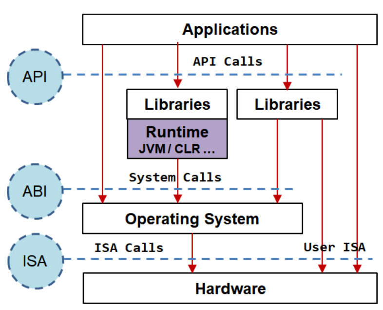

# Compute Engine

## Virtualization

Virtualization can be applied to different levels of the hardware and software stack:

* Software Defined Networks (SDN);
* Virtual Desktop Infrastructure (VDI);
* Software Defined Storage (SDS);
* Virtual Execution Environments (VEE).

### Network Virtualization

* **SDN Applications**: use and API to define the network requirements and the SDN controller will configure the network accordingly;
* **SDN Controller**: provide to the SDN applications a virtual network, which is a logical network that is decoupled from the physical network;
* **OpenFlow**: is a protocol that allows the SDN controller to communicate with the network devices.

### Virtual Desktop Infrastructure (VDI)

* Execute operating systems and desktop applications on a virtual machine in a remote server;
* Users access the virtual machine through a **remote desktop protocol**, e.g. RDP, SPICE;
* The applications are managed **centrally**, which makes it easier to update and maintain them;

---

### Why Virtualization?

* **Secure multiple servers/services on a minimal number of physical machines**;
  * Minimize infrastructure costs;
  * Minimize maintenance costs;
  * Minimize energy costs;
* **Isolation**;
  * Fault isolation: a fault in one virtual machine does not affect the others;
  * VMs can be used as sandboxes, to execute suspicious code or to test new software;
* **Scalability**;
  * VMs can be easily created through a template;
  * VMs can be easily destroyed;
  * To scale up, just add more physical machines;
* **Migration and Load Balancing**;
  * VMs can be easily migrated from one physical machine to another;
  * This allows to perform maintenance on the physical machine without affecting the VMs;
  * This allows to balance the load between the physical machines;
* **Backups**;
  * VMs can be easily backed up, providing a fast recovery in case of failure.

---

### Computational Systems Interfaces

> The architecture of a computational system defines the different interfaces used to communicate between the different layers of the system.

* **ISA** (Instruction Set Architecture): defines the interface between the hardware and the software;
* **ABI** (Application Binary Interface): defines the interface between the operating system and the application;
* **API** (Application Programming Interface): defines the interface between the application and the libraries.

<p align="center">
    
</p>

---

### Virtual Machines

The concept of virtual machine is based on the perspective of the process and the operating system:

* On the **process perspective**, the VM is represented by the **ABI**;
* On the **application perspective**, the VM is represented by the **API**.
* On the **operating system perspective**, the VM is represented by the **ISA**.

The software that supports a process VM is called **runtime environment**.

The software that supports an operating system VM is called **hypervisor**. A hypervisor can be of two types:

* **Type 1**: the hypervisor runs directly on the physical machine;
* **Type 2**: the hypervisor runs on top of the operating system.

* The OS running on the hypervisor is called **guest OS**;
* The OS running on the physical machine is called **host OS**.

To more information about virtualization, see the [System Virtualization Techniques](../../5th-semester/tvs/README.md) notes.

---
---

## Google Compute Engine

> Google Compute Engine is a service that provides virtual machines that run on Google's infrastructure.

### Firewall Rules

* Each project defines a set of firewall rules that apply to different VMs and different networks;
* There is a default set of firewall rules that apply to all the VMs in the project; this set can be modified.
* Creating a new firewall rule:
  * **Name**: the name of the firewall rule;
  * **Targets**: the VMs to which the rule applies; default is *All instances in the network*;
  * **Source IP ranges**: the IP ranges from which the traffic is allowed; e.g. `0.0.0.0/0` allows all traffic;
  * **Protocols and ports**: the protocols and ports to which the traffic is allowed; e.g. `tcp:80` allows TCP traffic on port 80.

---

### Create a VM Instance

To create a simple VM instance:

* **Name**: the name of the VM instance;
* **Series**: E2;
* **Type**: e2-small (2 vCPUs, 2 GB memory);
* **Boot disk**: CentOS Stream 8;
* **Firewall**: Allow HTTP traffic; Allow HTTPS traffic.
* Add SSH keys to allow SSH access to the VM.

After creating the VM instance, it is possible to connect to it through SSH.

To install Java 11: `sudo yum install java-11-openjdk-devel`.

---

### Scalability

An **instance group** is a collection of VM instances that are managed as a single entity.

A **disk** is a block storage device that can be attached to a VM instance.

The *Autoscaling* feature allows to automatically increase or decrease the number of VM instances in an instance group based on the load.

* **On**: create and destroy VM instances automatically;
* **Off**: the number of VM instances is fixed and the applications running on them are responsible for scaling.

To create an instance group from a VM instance:

1. Create a **VM instance**;
2. Create an **Image** using the **disk** associated with the VM instance; the image contains the OS and runtime environment;
3. Create an **Instance Template** using the image;
4. Create an **Instance Group** using the instance template.

---

### Templates

* A **template** is a configuration file that defines the properties of a VM instance.
* Its created in a similar way as a VM instance, selecting an image in the *Boot disk* section. Number of CPUs, memory and disk size can also be defined.
* **Start up and shutdown scripts** can be defined in the *Management* section. Example of a start up script:

```bash
#!/bin/bash
# Some commands in bash
```

---

### Instance Group

An **instance group** is a collection of VM instances that are managed as a single entity.

The Compute Engine provides two types of instance groups:

* **Managed instance groups**: VM instances created from a template, sharing the same configuration;
  * The number of VM instances can be increased or decreased automatically;
  * Can be used in both **stateless** and **stateful** applications;
* **Unmanaged instance groups**: VM instances created from different templates.

---
---

## Java API

```java
// List VM instances
try (InstancesClient client = InstancesClient.create) {
  for (Instance instance : client.list(PROJECT_ID, ZONE).iterateAll()) {
    System.out.println(instance.getName());
    String ip = instance.getNetworkInterfacesList().get(0).getAccessConfigs(0).getNatIP();
    System.out.println(ip);
    System.out.println("Status: " + instance.getStatus());
  }
}

// Start/stop stopped/running VM instance
try (InstancesClient client = InstancesClient.create) {
  StartInstanceRequest request = StartInstanceRequest.newBuilder()
                            .setProject(projectID)
                            .setZone(zone)
                            .setInstance(instanceName)
                            .build();
  OperationFuture<Operation, Operation> response = client.startAsync(request); // stopAsync to stop
  while (!response.isDone()) {
    Thread.sleep(4 * 1000); // wait 4 seconds
  }
}

// List instance groups
try (InstanceGroupManagerClient client = InstanceGroupManagerClient.create()) {
  for (InstanceGroupManager instanceGroupManager : client.list(PROJECT_ID, ZONE).iterateAll()) {
    System.out.println(instanceGroupManager.getName());
    System.out.println("Template: " + instanceGroupManager.getInstanceTemplate());
  }
}

// List VM instances in an instance group
InstanceGroupManagersClient managersClient = InstanceGroupManagersClient.create();
ListManagedInstancesInstanceGroupManagersRequest request =
        ListManagedInstancesInstanceGroupManagersRequest.newBuilder()
                .setInstanceGroupManager(grpName)
                .setProject(projectId)
                .setReturnPartialSuccess(true)
                .setZone(zone)
                .build();
System.out.println("Instances of instance group: " + grpName);
for (ManagedInstance instance :
        managersClient.listManagedInstances(request).iterateAll()) {
    System.out.println(instance.getInstance() + " with STATUS = " + instance.getInstanceStatus());
}

// Resize instance group
InstanceGroupManagersClient managersClient = InstanceGroupManagersClient.create();
OperationFuture<Operation, Operation> result = managersClient.resizeAsync(
        project,
        zone,
        instanceGroupName,
        newSize
);
Operation oper = result.get();
System.out.println("Resizing with status " + oper.getStatus());

// List IP addresses of VM instances in an instance group
try (InstancesClient client = InstancesClient.create()) {
    for (Instance curInst : client.list(projectID, zone).iterateAll()) {
        if (curInst.getName().contains(groupName)) {
            System.out.println("Name: " + curInst.getName() + "  VMId:" + curInst.getId());
            System.out.println("    Number of network interfaces: " + curInst.getNetworkInterfacesCount());
            String ip = curInst.getNetworkInterfaces(0).getAccessConfigs(0).getNatIP();
            System.out.println("    IP: " + ip);
            System.out.println("    Status: " + curInst.getStatus() + " : Last Start time: " + curInst.getLastStartTimestamp());
        }
    }
}
```