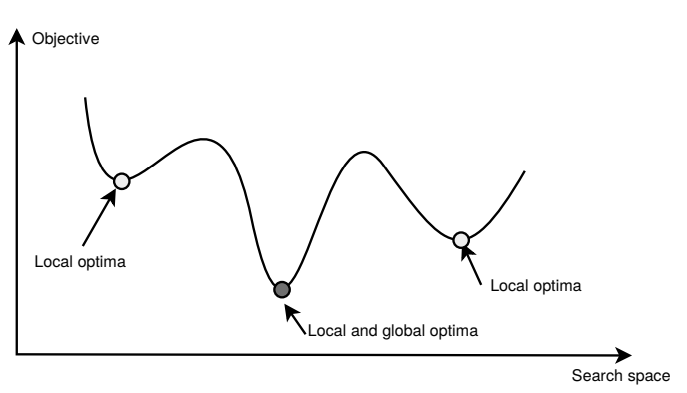

# Optimization Algorithms

> Optimization problem is a problem with multiple solutions, where each solution has a score that we want to either maximize or minimize. The goal is to find the solution with the best score.

> Optimization is the problem of finding a set of inputs to an objective function that results in a maximum or minimum function evaluation. It is the challenging problem that underlies many machine learning algorithms, from fitting logistic regression models to training artificial neural networks.

### Optimization methods

* **Exact methods** - methods that guarantee to find the **optimal solution**; e.g. A*, constraint programming, branch and bound, dynamic programming, etc.
* **Approximate methods** - methods that find a solution that is **close to the optimal solution**; e.g. meta-heuristics, **hill climbing**, **simulated annealing**, **genetic algorithms**, etc.

---

## Concepts

**Local optima** - a solution that is optimal (either maximal or minimal) within a given neighborhood. A local optimum is not necessarily a global optimum. The global optimum is the best solution among all possible solutions, while a local optimum is the best solution among all feasible solutions in a neighborhood of the current solution.

    

**Neighborhood** - a set of solutions that are close to a given solution. The neighborhood is defined by a neighborhood function, which takes a solution as input and returns a set of solutions that are close to the given solution.

**Generic Local Search Algorithm** - a generic algorithm that can be used to solve optimization problems. It is an iterative algorithm that starts with an initial solution and iteratively improves the solution by moving from one solution to a better solution in the neighborhood. The algorithm terminates when no better solution can be found in the neighborhood.

---

## [Hill Climbing Algorithm](https://en.wikipedia.org/wiki/Hill_climbing)

Hill climbing is a simple optimization algorithm that iteratively improves a solution by moving from one solution to a better solution in the neighborhood. The algorithm terminates when no better solution can be found in the neighborhood.

This algorithm is a **greedy local search algorithm** because it always chooses the best solution in the neighborhood, unlike the simulated annealing algorithm, which sometimes chooses a worse solution in the neighborhood.

Hill climbing finds a **local optimum**, which is not necessarily a global optimum. The algorithm can be modified to find a global optimum by running it multiple times with different initial solutions.

---

## Problems

### 1. Traveling Salesman Problem

The traveling salesman problem (TSP) is an NP-hard problem in combinatorial optimization studied in operations research and theoretical computer science. Given a list of cities and the distances between each pair of cities, what is the shortest possible route that visits each city exactly once and returns to the origin city?

### 2. Knapsack Problem

The knapsack problem is a problem in combinatorial optimization: Given a set of items, each with a weight and a value, determine the number of each item to include in a collection so that the total weight is less than or equal to a given limit and the total value is as large as possible.
