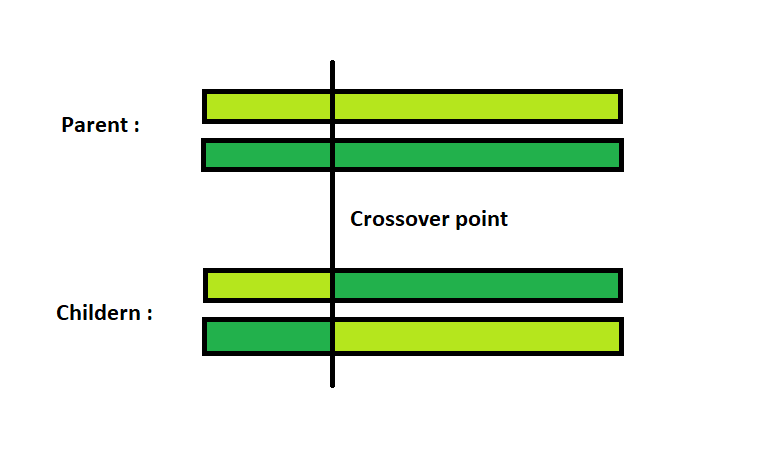
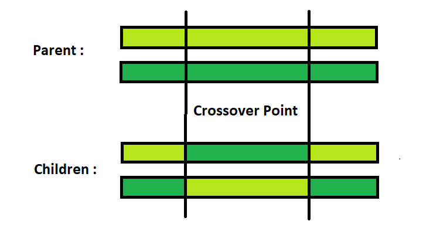
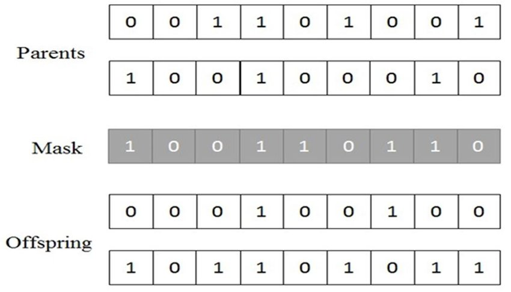
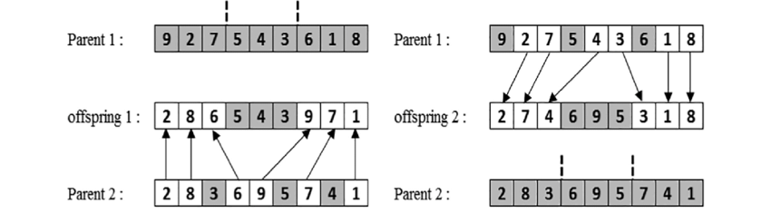
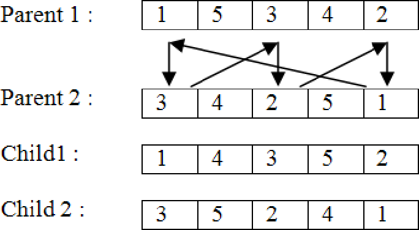
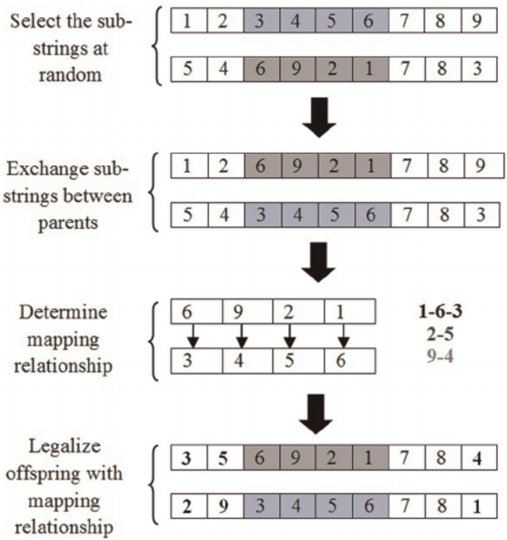

# Genetic Algorithms

> A genetic algorithm (or GA) is a search technique used in computing to find **true or approximate solutions** to optimization and search problems.

* GAs are categorized as **global search** heuristics;
* They use **techniques inspired by evolutionary biology** such as inheritance, mutation, selection, and crossover (also called recombination);
* The evolution usually starts from a **population of randomly generated individuals** and happens in **generations**;
* In each generation, the fitness of every individual in the population is evaluated; the fitness is usually the value of the objective function in the optimization problem being solved;
* Multiple **individuals** are **selected** from the current population to **breed** a new generation;
* The algorithm terminates when either a **maximum number of generations** has been produced, or a **satisfactory fitness level** has been reached for the population.

---

## Vocabulary

* **Individual** - a single solution to the problem we are trying to solve;
* **Population** - a collection of individuals;
* **Generation** - a single iteration of the algorithm;
* **Fitness** - a function that tells us how good each individual is;
* **Trait** - a characteristic of an individual;
* **Genome** - a collection of traits that define an individual;
* **Crossover** - a process of taking two individuals and producing a new individual from them;
**Offspring** - a new individual produced by crossover;
* **Mutation** - a process of randomly changing an individual.

---

## GA Operators

### Common Representation Methods

* **Binary representation** - each individual is represented as a string of bits;
* **Array of integers** - each individual is represented as an array of integers;
* **Array of letters** - each individual is represented as an array of letters.

### Methods of Selection

* **Roulette wheel selection** - each individual is assigned a slice of the wheel proportional to its fitness; individuals with higher fitness have a higher chance of being selected (larger slice);
* **Elitist selection** - the best individuals are selected to be parents;
* **Cutoff selection** - only individuals with a fitness above a certain threshold are selected;
* **Fitness proportionate selection** - each individual has a probability of being selected proportional to its fitness;
* **Scaling selection** - the fitness of each individual is scaled to a value between 0 and 1;
* **Rank selection** - each individual is assigned a rank based on its fitness.

### Methods of Reproduction

* **Crossover** - two individuals are selected and a two new individuals are created by combining their genomes - the new individuals are called **offspring**;
  * There are many ways to perform crossover:
    * Randomly select a single point for crossover - **one-point crossover**;
    * Multiple points for crossover - **multi-point crossover**;
    * Uniform crossover - a random subset of genes is selected from each parent;
    * Order crossover - a random subset of genes is selected from each parent and the remaining genes are copied from the other parent in the order they appear;
    * Cycle crossover - a random subset of genes is selected from each parent and the remaining genes are copied from the other parent in cycles;
* **Mutation** - a random change is made to an individual's genome;
  * There are many ways to perform mutation:
    * Flip a single bit;
    * Flip multiple bits;
    * Randomly change a single gene;
    * Randomly change multiple genes.

---

### One-Point Crossover

  

### Two-Point Crossover

  

### Uniform Crossover

  

### Order Crossover - OX

  

### Cycle Crossover - CX

  

### Partially Mapped Crossover - PMX

  

---

## Methods

1. `getInitialSolution()`: returns a random solution;
2. `getInitialPopulation()`: returns a random population - use the `getInitialSolution()` method;
3. `selectParents(population)`: performs selection on the given population and returns a list of parents;
4. `crossover(parents)`: performs crossover on the given parents and returns a list of offspring;
5. `mutate(solution)`: performs mutation on the given solution and returns the mutated solution;
6. `evaluate(solution)`: returns the fitness of the given solution;
7. `isOptimal(solution)`: returns true if the given solution is optimal.