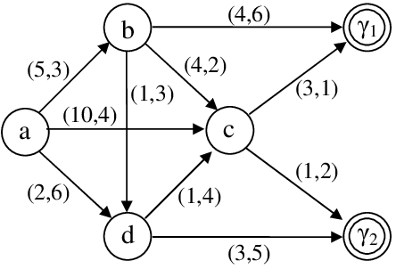

# Problem Solving as Search

## State Space

> A state space is a **graph** whose nodes correspond to **problem situations**, and a given problem is reduced to **finding a path** through the graph from the initial state to a goal state. Possible moves are represented by **edges**, that lead to the next state.

    

* Problem solving involves graph searching and exploring alternatives;
* The basic strategies for solving problems are:
    * **Depth-first search**;
    * **Breadth-first search**;
    * **Iterative deepening**.

### Implementation

* The state space is represented by a relation `s(X, Y)` which is true if there is a legal move in the state space from a node `X` to a node `Y`;
  * `Y` is the **successor** of `X`;
  * If there are costs associated with the moves, then the relation `s(X, Y, Cost)` is used, where `Cost` is the cost of the move.

_more to come..._