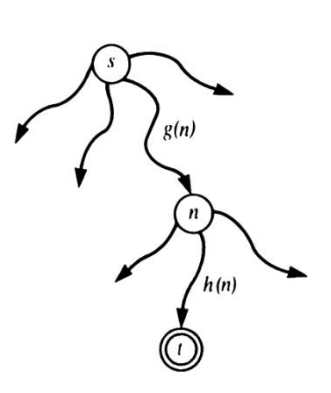

# Heuristic Search and the A* Algorithm

* Graph searching in problem solving typically leads to the problem of **combinatorial complexity** due to the proliferation of alternatives;
* **Heuristic search** is a technique that attempts to reduce the number of alternatives that must be generated and examined by the search algorithm;
* One way of using heuristic information is to **estimate** the cost of reaching the goal from a given node;
* The idea is to continue the search always from the most promising node in the candidate set - **Best-First Search** (A* algorithm);
* A best-first search can be derived as a refinement of a breadth-first search.

## Implementation

* `c(n, n')` is the cost of the arc from node `n` to node `n'`;
* The **heuristic estimator** is a function `f`, such that for each node `n` in the state space, `f(n)` is an estimate of the cost of the cheapest path from `n` to a goal node;
* `f(n) = 0` if `n` is a goal node;
* `f(n) = g(n) + h(n)`, where `g(n)` is the cost of the cheapest path from the start node to `n`, and `h(n)` is the heuristic estimate of the cost of the cheapest path from `n` to a goal node;

  

* `g(n)` can be computed as the sum of the arc costs on the path from the start node to `n` - this path is not necessarily the optimal path;
* `h(n)` is typically a heuristic guess, based on the algorithm's general knowledge of the problem domain;

## Search Process

* The search process consists of a number of competing subprocesses, each of them exploring its own alternative path;
* Among all these competing processes, only one is active at any given time - the one with the **lowest** `f` value, that is, the one that is currently the **most promising**;
* The remaining processes have to wait until the current process change its value of `f` to a value that is lower than the value of `f` of any of the other processes - the current process is then **suspended** and the process with the lowest `f` value is activated.

## Admissible Heuristic Function

> An A* algorithm that uses a heuristic function `h` such that for all nodes `n` in the state space, `h(n) <= h*(n)`, where `h*(n)` is the true cost of the cheapest path from `n` to a goal node, is guaranteed to find an optimal solution.

* If `h(n) = 0` for all nodes `n`, then the A* algorithm reduces to a breadth-first search, still guaranteeing an optimal solution, but without heuristic power.