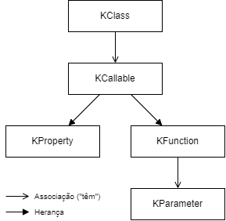

# [Reflection](https://kotlinlang.org/docs/reflection.html)

* Object oriented API for metadata;
* Conjunto de features que permitem examinar a estrutura de código em runtime.

| Kotlin         | Java              |
| -------------- | ----------------- |
| kotlin.reflect | java.lang.reflect |
| KClass         | Class             |
| KCallable      | Member            |
| KFunction      | Method            |
| KProperty      | Field             |

<p align="center">
    
</p>

---

## [KClass](https://kotlinlang.org/api/latest/jvm/stdlib/kotlin.reflect/-k-class/)

_Represents a class and provides introspection capabilities._

`val c: KClass<MyClass> = MyClass::class`

ou

```
val instance = MyClass()
val c: KClass<MyClass> = instance::class
```

Propriedades e métodos relevantes:

* `constructors`;
* `isAbstract`;
* `isCompanion`;
* `isData`;
* `isSealed`;
* `members`;
* `objectInstance`;
* `qualifiedName`;
* `simpleName`;
* `visibility`;
* `annotations`;
* `declaredMemberFunctions`;
* `declaredMemberProperties`;
* `declaredMembers`;
* `java`
* `primaryConstructor`;
* `createInstance`
* `createType`;
* `findAnnotation`;
* `hasAnnotation`;
* `isSubclassOf`;
* `isSuperclassOf`;

---

## [KCallable](https://kotlinlang.org/api/latest/jvm/stdlib/kotlin.reflect/-k-callable/)

_Represents a callable entity, such as a function or a property._

Propriedades e métodos relevantes:

* `KCallable<out R>.call(args):R`;
* `name`;
* `parameters`;
* `returnType`;
* `typeParameters`;
* `visibility`;
* `annotations`;
* `callBy`;
* `instanceParameter`;
* `findParameterByName`;
* `findAnnotation`;
* `hasAnnotation`;

### [KProperty](https://kotlinlang.org/api/latest/jvm/stdlib/kotlin.reflect/-k-property/)

_Represents a property, such as a named val or var declaration._

To access properties as first-class objects in Kotlin, use the :: operator:

```
var x = 1

::x.get()
::x.set(2)
::x.name
```

The expression `::x` evaluates to a `KProperty<Int>` type property object.

Propriedades e métodos relevantes:

* `isConst`;
* `isLateinit`;
* `getter`;

É superclasse de KMutableProperty, que tem a propriedade `setter`.

### [KFunction](https://kotlinlang.org/api/latest/jvm/stdlib/kotlin.reflect/-k-function/)

_Represents a function with introspection capabilities._

You can use the function as a function type value, that is, pass it to another function. To do so, use the `::` operator:

`fun isOdd(x: Int) = x % 2 != 0` é referenciada por `::isOdd` -> here `::isOdd` is a value of function type `(Int) -> Boolean`.

Propriedades e métodos relevantes:

* `isInline`;
* `isOperator`;
* `isSuspend`;

#### [KParameter](https://kotlinlang.org/api/latest/jvm/stdlib/kotlin.reflect/-k-parameter/)

_Represents a parameter passed to a function or a property getter/setter, including this and extension receiver parameters._

Propriedades e métodos relevantes:

* `isOptional`;
* `isVararg`;
* `kind`;
* `name`;
* `type`;
* `findAnnotation`;
* `hasAnnotation`;

---

## [Annotations](https://kotlinlang.org/docs/annotations.html)

Permitem adicionar metadata ao código.

São criadas da seguinte forma: 

`annotation class Fancy`

Podemos anotar anotações com outras anotações:

`@Target`: specifies the possible kinds of elements which can be annotated with the annotation (such as classes, functions, properties, and expressions); os parâmetros possíveis são `AnnotationTarget.`:

* `CLASS`;
* `ANNOTATION_CLASS`;
* `PROPERTY`;
* `FIELD`;
* `CONSTRUCTOR`;
* `FUNCTION`;
* `PROPERTY_GETTER`;
* `PROPERTY_SETTER`;
* `TYPE`;
* `TYPE_PARAMETER`;
* `LOCAL_VARIABLE`;
* `VALUE_PARAMETER`;
* `EXPRESSION`;
* `FILE`;
* `TYPEALIAS`.

`@Retention`: especifica se a anotação é guardada em metadada e se é visível por reflection; os parâmetros possíveis são `AnnotationRetention.`:

* `SOURCE`: anotação apenas no source code, não é guardada em metadada;
* `RUNTIME`: anotação é guardada em metadada e é visível por reflection;
* `BINARY`: anotação é guardada em metadada, mas não é visível por reflection.

`@Repeatable`: allows using the same annotation on a single element multiple times;

Os parâmetros permitidos em construtores de anotações são:

* Primitive types;
* String;
* KClass;
* Enum;
* Annotations;
* Arrays.

Na Reflection API, existe o tipo `KAnnotatedElement` que é superclasse de todos os tipos de elementos anotados, como KClass, KCallable, KParameter, etc.

Este tipo possui as funções:

* `hasAnnotation<T: Annotation>(): Boolean`;
* `findAnnotation<T: Annotation>(): T?`.


---
---

### Logger

* Usado para fazer log (registar) de mensagens num determinado output (consola, file, ...);
* É configurável, com diferentes níveis de log, e com diferentes outputs;
* Pode ser ligado ou desligado.