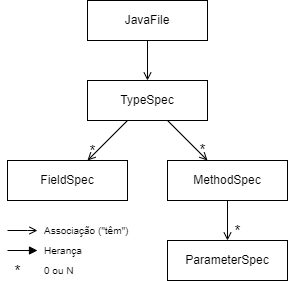

# Metaprogramming

* Habilidade de ler, gerar, transformar ou modificar programas dinamicamente (em runtime);
* Tem como objetivo aumentar o desempenho, visto que a reflexão tem custos elevados.

---

## [JavaPoet](https://github.com/square/javapoet)

_`JavaPoet` is a Java API for generating `.java` source files._


<p align="center">
    
</p>

### JavaFile

Represents a Java file containing a single top level class.
Example:

```
val file = JavaFile
    .builder("com.example", typeSpec)
    .build()
```

### TypeSpec

Represents a generated class, interface, or enum declaration.
Example:

```
val typeSpec = TypeSpec
    .classBuilder("MyClass")
    .addField(fieldSpec)
    .addMethod(methodSpec)
    .build()
```

### FieldSpec

Represents a generated field declaration.
Example:

```
val fieldSpec = FieldSpec
    .builder(String::class.java)
    .addModifiers(Modifier.PRIVATE)
    .build()
```

### MethodSpec

Represents a generated constructor or method declaration.

```
val methodSpec = MethodSpec
    .methodBuilder("myMethod")
    .addModifiers(Modifier.PUBLIC)
    .addParameter(parameterSpec)
    .returns(String::class.java)
    .addStatement("return \"Hello, World!\"")
    .build()
```

Para definir um constructor, utiliza-se o método `constructorBuilder`, em vez de `methodBuilder`.

#### ParameterSpec

Represents a generated parameter declaration.
Não é muito utilizado, sendo que os parâmetros são definidos diretamente no método `addParameter`.
