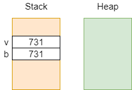

# JVM Type System

Os tipos na JVM estão divididos em **tipos primitivos** e **tipos de referência**:

| Tipos Primitivos           | Tipos de Referência    |
| -------------------------- | ---------------------- |
| "valor"                    | "objeto"               |
| instâncias locais no stack | instâncias no heap     |
| cópia é por valor          | cópia é por referência |
| não pode ser null          | pode ser null          |

* O tempo de vida das variáveis locais (no stack) é igual ao tempo de execução da função a que pertencem;
* O tempo de vida dos objetos no heap é maior que o da execução da função, e é alvo do GC quando os objetos estão _unreachable_, ou seja, não existe nenhuma referência para os mesmos.

---

## Tipos primitivos (TP)

| Java   | Kotlin |
| ------ | ------ |
| int    | Int    |
| long   | Long   |
| float  | Float  |
| double | Double |


Exemplo:

```
fun bar() {
    val v: Int = 731
    val b = v
}
```

* As variáveis v e b são locais a `bar`;
* A cópia de v é feita por valor; b fica com uma cópia do valor de v:

<p align="center">
    
</p>

---

## Tipos de referência (TR ou Wrapper)

| Java    | Kotlin  |
| ------- | ------- |
| Integer | Int?    |
| Long    | Long?   |
| Float   | Float?  |
| Double  | Double? |


Exemplo:

```
class Foo {};

fun bar() {
    val v = Foo()
    val b = v
}
```

* As variáveis v e b são locais a `bar`;
* A cópia de v é feita por referência; b fica a apontar para o mesmo objeto:

<p align="center">
    
</p>

---

## Conversões de tipos

* TR -> TR: casting;
* TP -> TP: coercion;
* TP -> TR: boxing;
* TR -> TP: unboxing.

Definições:

* **Casting**: mantém a instância e só muda a referência;
* **Coercion**: transformação do valor;
* **Boxing**: cópia do valor primitivo para o heap;
  * `<Wrapper>.valueOf(<primitive>)`;
* **Unboxing**: cópia do valor do heap para o valor primitivo;
  * `<Wrapper>.<primitive>Value()`.

Existem dois tipos de casting:

* **Upcasting**: generalização; "Filho -> Pai";
* **Downcasting**: especificação; "Pai -> Filho".

### Instrução `checkcast`

* Verifica se a referência no topo do stack é compatível com o tipo de referência especificado;
* Ser compatível é ser do mesmo tipo ou de um tipo derivado;
* Utilizada apenas em **downcasting**.

Se a verificação tiver sucesso, o cast é realizado, caso contrário é lançada a exceção `ClassCastException`.
