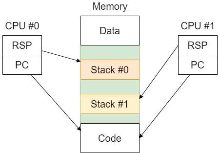

# Threads

* **Computação sequencial**;
* Mecanismo fornecido pelos OS para possibilitar a existência de múltiplas computações sequenciais a executar simultaneamente no mesmo processo;
* Na JVM, uma thread é criada chamando o construtor **Thread**, passando-lhe um **Runnable** (objeto com método run, que define uma computação sequencial) como argumento;
* Os OS permitem a implementação de múltiplas threads através de multiplexagem temporal de um conjunto de M Threads por N CPUs; isto é realizado por um componente chamado **scheduler**.

## Motivação

* **Performance**: tirar vantagem da existência de múltiplos CPUs;
* **Organização do código**: por vezes é mais simples organizar o código em múltiplas computações sequenciais.

### NOTA: Memória Virtual

* Existe um espaço de endereçamento físico e múltiplos virtuais;
* Mapeamento de endereços virtuais em físicos;
* Cada processo utiliza a sua memória virtual.

---

## Relação entre Threads

* Threads do mesmo processo não estão isoladas, ou seja, **partilham o mesmo espaço de memória**, incluindo o código e os dados;
* Contudo, existe **um stack por cada computação**, visto que o estado da computação é armazenado nesse stack.

    

**NOTA**: isto não significa que existe um stack por CPU, mas sim por computação, visto que uma computação pode ser executada em múltiplas CPUs.

### Stack

* Pilha de stack frames;
* LIFO: last in first out;
* Armazena:
  * invocações de funções;
  * variáveis locais;
  * argumentos;
* No x86, o stack cresce para baixo.

### Desvantagens

* Não existe uma proteção contra interferência de threads;
* Isto é perigoso quando existe partilha de dados mutáveis -> **Concurrency Hazards**.

---

## Thread States

Uma thread que ainda não tenha terminado está num destes 3 estados:

* **Running**: atribuída a um CPU;
* **Ready**: não atribuída a um CPU, porque não há CPUs disponíveis;
* **Non-Ready**: não atribuída a um CPU, porque apenas pode executar após uma condição ser verdadeira.

    

### Running -> Ready (Context-Switch)

* Pode acontecer em duas situações:
  * **Cooperativa**: a própria thread solicita ao OS para desistir do CPU (yield);
  * **Promotiva**: 
    * o scheduler decide que a running thread tem de ser substituída; 
    * isto pode acontecer porque está a usar o CPU à muito tempo;
    * ocorre via sistema de interrupção, entre instruções assembly.
* Chama-se **context-switch** porque o **contexto da thread** que estava running é guardado em memória e o contexto da thread estava ready é carregado.

#### Thread Context

* Informação que é necessária salvar em memória para a mesma thread ser retomada corretamente, quando é carregada essa informação no CPU;
* Stack pointer, instruction pointer, etc.

### Ready -> Running

* Quando o scheduler decide atribuir um CPU para uma ready thread;
* Isto também implica context-switch.

### Running -> Non-Ready

* Quando uma thread executa uma operação que o resultado ainda não está disponível, logo não pode continuar a executar.

### Non-Ready -> Ready

* Quando a condição necessária para a thread continuar a executar é verdadeira.

---

## [Threads na JVM](https://docs.oracle.com/javase/8/docs/api/java/lang/Thread.html)

* Representadas pela classe `Thread`;
* Tem um estado do tipo `Thread.State`:
  * `NEW`: thread ainda não iniciada;
  * `RUNNABLE`: thread a executar;
  * `BLOCKED`: thread bloqueada, à espera de um lock;
  * `WAITING`: thread à espera de uma condição, passivamente;
  * `TIMED_WAITED`: em espera passiva com tempo de espera (`Thread.sleep()`);
  * `TERMINATED`: terminada.

Alguns métodos relevantes:

* `start()`: inicia a thread;
* `sleep(long millis)`: suspende a thread por um tempo;
* `join()`: sincroniza-se com a terminação da thread;
* `interrupt()`: interrompe a thread, ou seja, coloca o interrupt status a true;
* `interrupted()`: verifica se o interrupt status é true.

### Interrupções

* Mecanismo implementado para suportar cancelamento;
* Uma `InterrupterException` pode ser lançada por métodos bloqueantes quando o interrupt status é true;
* Uma thread tem uma flag chamada **interrupt status**;
* Alguns métodos bloqueantes limpam o status e lançam a exceção.