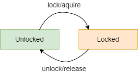

# Data Synchronization

* Coordenação entre threads, necessária para assegurar a consistência dos dados mutáveis partilhados;
* Obtida através de exclusão mútua (locks);

## Exclusão Mútua e Locks

* Assegura que apenas uma thread pode aceder a um certo recurso, num dado momento, ou seja, não mais que uma thread acede ao mesmo recurso simultaneamente;
* Um objeto de exclusão mútua é chamado de **Lock** e tem dois estados:
  * **Locked**: uma thread tem a posse do lock, para aceder ao recurso;
  * **Unlocked**: nenhuma thread tem a posse do lock.
* Também tem duas operações:
  * lock/acquire: obtém a posse do lock;
  * unlock/release: liberta a posse do lock.

<p align="center">
    
</p>

* Um lock unlocked e acquired pela thread T1, passa para o estado locked;
* Um lock locked por T1, passa para o estado unlocked se T1 der unlock;
* Se T1 der acquire num lock locked por T2, T1 fica bloqueada até T2 der unlock.

### Reentrant Locks

* Locks com reentrant acquisition;
* Um acquire num lock locked pela mesma thread, é bem sucedido, e não bloqueia a thread, visto que esta já tem a posse do lock; um reentrance counter é incrementado;
* Um release decrementa o reentrance counter, e o lock só fica unlocked quando o reentrance counter chegar a zero.

### AVISO

* Ter atenção nas operações realizadas na posse da exclusão mútua, incorrendo no risco de usar o lock demasiado tempo:
  * I/O operations;
  * Aquisição de outros locks (pode levar a **deadlocks**);
* A thead pode ficar num estado non-ready com a posse do lock, o que é negativo para o desempenho.

---

# Control Synchronization

* Mecanismo de coordenação entre threads, quando estas têm de esperar que certas condições sejam cumpridas por outras threads;
* Realizado por **sincronizadores**;
* Um **monitor** é um construtor de outros sincronizadores.

## [Condition](https://docs.oracle.com/javase/8/docs/api/java/util/concurrent/locks/Condition.html)

* Permite à thead suspender a sua execução até que uma condição seja true;
* Obter uma condição: `Lock.newCondition(): Condition`;
  
Métodos relevantes:

* `Condition.await()`: espera passiva, sem a posse do lock, até que a condição seja sinalizada ou que a thread seja interrompida;
* `Condition.signal()`: sinaliza uma thead à espera da condição;
* `Condition.signalAll()`: sinaliza todas as threads que estavam à espera;

**NOTAS**:

* O estado de saída do await não é necessariamente igual ao estado no momento do signal;
* Isto implica **reavaliação da condição**;
* A não realização de um signal sempre que o estado seja propício à evolução de uma thread origina threads que nunca vão evoluir;
* **Spurious Wake-up**: ocorre quando uma thread "acorda" de uma espera de uma condição, apenas para ver que a condição ainda não é verdadeira.

#### Fast-Path

* Existem condições para prosseguir;
* Altera o estado e termina;

#### Wait-Path

* Necessidade de espera;
* Ciclo:
  * await da condição;
  * reavaliação da condição:
    * se for verdadeira, alterar estado e terminar;
    * caso contrário, voltar ao início do ciclo.

---

## Técnicas de sincronização

### Monitor-Style

* A thread que altera o estado cria condições para a outra prosseguir, e sinaliza;
* A outra thread é que realiza a sua mudança de estado.

### Kernel-Style (Delegação de execução)

* A thread que altera o estado e cria condições para a outra prosseguir, realiza o que a outra pretender fazer e sinaliza.

---

## [Locks na JVM](https://docs.oracle.com/javase/8/docs/api/java/util/concurrent/locks/Lock.html)

* Existem duas formas de obter locks:
  * A interface `Lock` e as classes que a implementam (e.g. `ReentrantLock`);
  * **Locks intrínsecos**: todos os objetos da JVM possuem um lock:
    * São obtidos de duas maneiras:
      * Synchronized Statements;
      * Synchronized methods.

**Synchronized Statements:**

```
synchronized(obj) {
    // code
}
```

**Synchronized methods:**

* Em Kotlin utiliza-se a anotação `@Synchronized`;
* Em Java utiliza-se a keyword `synchronized`.

Para utilizar a condição do objeto:

* `this.wait()`;
* `this.notify()`;
* `this.notifyAll()`.

---

# Alguns Sincronizadores

### [Semaphore](https://docs.oracle.com/javase/8/docs/api/java/util/concurrent/Semaphore.html)

* Usado para restringir o acesso da thread a algum recurso;
* Tem um contador inicializado com um número de unidades;
* Métodos:
  * `acquire`: espera até que uma unidade esteja disponível e decrementa o contador;
  * `release`: incrementa o contador;
* Pode ser fair ou unfair, sendo que fair implementa a topologia FIFO.

---

### [Exchanger](https://docs.oracle.com/javase/8/docs/api/java/util/concurrent/Exchanger.html) 

* Ponto de sincronização onde threads emparelham e trocam valores;
* Único método `exchange(T value)`, que espera até que outra thread queira trocar um valor, ou troca se alguma já estiver à espera.

---

### [Thread Pool](https://docs.oracle.com/javase/8/docs/api/java/util/concurrent/ExecutorService.html)

* Coleção de worker threads que executam computações assíncronas;
* Usada para reduzir o número de threads da aplicação;
* Em Java, a classe `Executors` é uma factory para Thread Pools;
* A interface `Executor` tem um único método para submeter instâncias Runnable para execução: `execute(Runnable runnable)`. 