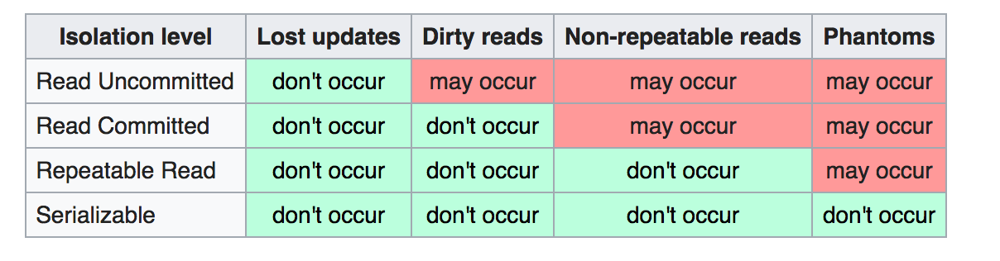

# Transaction Processing

## Definições e Representações

* **Dirty read**: leitura de um registo que foi modificado por outra transação que ainda não terminou;
* **Dirty write**: escrita de um registo que foi modificado por outra transação que ainda não terminou; esmagamento de updates;

* **Leitura**: `r(t1, x1)` -> leitura do registo x1 na transação t1;
* **Escrita**: `w(t1, x1)` -> escrita do registo x1 na transação t1;
* **Commit**: `c(t1)` -> commit da transação t1;
* **Abort**: `a(t1)` -> abort da transação t1;

---

## Transações

Porquê transações?

* Recuperação de dados;
* Anulamento de processamentos anteriores;
* Controlo de concorrência.

**Ação atómica**: aquela que, quando executada num determinado nível de abstração, ou é executada completamente com sucesso, (produzindo todos
os seus efeitos), ou, então, não produz quaisquer efeitos diretos ou laterais.

Diz-se num determinado nível de abstração, porque uma ação pode ser atómica num nível de abstração mais elevado, mas não num nível de abstração mais baixo. Por exemplo: uma instrução SQL é atómica ao nível do SQL, mas quando executada por instruções de um CPU é realizada por um conjunto de instruções cuja execução parcial pode, a este nível, produzir efeitos.

As **transações** são uma forma de os programadores poderem definir, com base em conjuntos de ações (com determinadas características) num nível de abstração, ações atómicas num nível de abstração superior.

---

### Objetivos

* Fornecer mecanismos de recuperação em caso de falhas do sistema;
* Facilitar o tratamento de erros ao nível das aplicações;
* Fornecer mecanismos que permitam controlar de forma eficiente as interferências entre aplicações que concorrem no acesso aos mesmos recursos.

---

### Propriedades (ACID - Atomicity, Consistency, Isolation, Durability)

* **Atomicidade (Atomicity)**: uma transação é indivisível no seu processamento, isto é, a transação é executada completamente, ou não é executada de todo ou em parte;
* **Consistência (Consistency preservation)**: uma transação conduz a base de dados de um estado consistente para outro estado consistente;
* **Isolamento (Isolation)**: transações concorrentes não devem interferir umas com as outras durante a sua execução;
* **Durabilidade (Durability)**: o resultado de uma transação válida deve ser tornado persistente (mesmo na presença de falhas, após commit).

---

### NOTA: Tipos de ações

* **Não protegidas**: aquelas cujos efeitos não necessitam de ser anulados. Por exemplo, uma operação sobre um ficheiro temporário;
* **Protegidas**: aquelas cujo efeito pode e tem de ser anulado, ou reposto se a transação falhar. Por exemplo, a escrita de um valor num registo. **São estas que são objeto do tratamento transacional.**
* **Reais**: aquelas ações, tipicamente sobre objetos físicos, cujo efeito não pode, em geral, ser anulado. Por exemplo, o lançamento de um míssil.

---

### Estados

* **Active**: estado após o início da transação, onde ocorrem escritas e leituras;
* **Parcialmente commited**: quando a última operação é executada, indicando que a transação deve terminar com sucesso;
* **Commited**: quando atinge o _commit point_ (escreve commit no log);
* **Failed**: _a transaction is said to be in a failed state if any of the checks made by the database recovery system fails. A failed transaction can no longer proceed further._;
* **Aborted**: se a transação falhar, é executado o rollback de todas as operações de escrita; após isto, podem ser executadas duas operações: recomeçar a transação ou abortar a transação. 

---
---

## Escalonamentos

Um escalonamento de um conjunto de transações {T1, ...,Tn} é uma ordenação S das operações em cada um dos Ti, tal que todas as ações de
cada Ti aparecem em S pela mesma ordem em que ocorrem em Ti.

Existe **conflito** entre duas operações num escalonamento, se se verificarem, simultaneamente, as seguintes condições:

1. As operações pertencem a **transações diferentes**;
2. Ambas as operações acedem ao **mesmo recurso**;
3. Pelo menos uma das operações é uma ação de **escrita**.

Os escalonamentos podem ser mostrados como linhas de tempo, nas quais as ações são colocadas nos tempos correspondente às posições que ocupam no escalonamento:

Tipos de escalonamento:

* **_Cascadeless_**
* **Recuperável**
* **Estrito**
* **Série**

---

### Escalonamento __Cascadeless__

Nenhuma transação lê um item escrito por outra ainda não terminada.
Não contém **dirty reads**.

---

### Escalonamento Recuperável

Nenhuma transação faz commit, tendo lido um item escrito por outra transação que ainda não terminou com sucesso.
Admite **dirty reads**, se a transação que fez a escrita termina antes da transação que lê.

Não ser recuperável => Não ser __cascadeless__.

---

### Escalonamento Estrito

Nenhuma transação lê ou escreve um item que foi escrito por outra transação que ainda não terminou.
Não contém **dirty reads** nem **dirty writes**.

---

### Escalonamento Série

Se para cada transação, as suas operações são executadas consecutivamente, sem interposição de operações de outras transações.
Para cada N transações, existem N! escalonamentos série possíveis.

---

### Equivalência de escalonamentos

Dois escalonamentos são **equivalentes do ponto de vista de conflito** se a ordem de quaisquer duas operações conflituantes for a mesma nos dois escalonamentos.

---

### Escalonamento serializável

Um escalonamento S diz-se **“serializável (do ponto de vista de conflito)”** se for equivalente, do ponto de conflito, a um dos escalonamentos “série” possíveis com as transações de S.

---
---

## Anomalias

---

**NOTA**: Na norma, as anomalias não existem desde que os efeitos negativos a elas associados não se verifiquem.
Contudo, consideramos que as anomalias existem se ocorrer um efeito negativo, mesmo que ele não se verifique.

Exemplo: na norma, um dirty read só é considerado se existir o commit da transação que lê antes do término da outra.
Nós consideramos que existe um dirty read a partir do momento que é dados instáveis são lidos, mesmo que a outra transação termine com sucesso antes do término da que lê.

---

### Dirty write

* Conflito W/W;
* _Overwriting uncommited data_;
* _Lost update_;
* É consesual que não deve ocorrer com a norma ISO SQL;
* Escalonamentos não estritos, ainda que _cascadeless_;
* <w(t1, x1), w(t2, x1), ...>.

---

### Dirty read

* Conflito W/R;
* _Uncommited dependency_;
* _Temporary updade_;
* Escalonamentos não _cascadeless_;
* <w(t1, x1), r(t2, x1), ...>.

---

### Non-repeatable read

* Conflito R/W;
* _Inconsistent analysis_;
* _Fuzzy read_;
* Quando numa transação, ocorrem leituras do mesmo registo com valores diferentes;
* Quando uma transação escreve num registo lido por outra ainda não terminada;
* Escalonamento não serializável, ainda que _cascadeless_ e recuperável;
* <r(t1, x1), w(t2, x1), ...>.

---

### Phantom read

* Conflito R/W;
* Quando ocorre uma leitura com um predicado, mas existem novos registos no result set;
* _New rows are added or removed by another transaction to the records being read_;
* Quando uma transação faz uma escrita em registos lidos com um predicado por outra transação que ainda não terminou;
* <r(t1, P), w(t2, in P), ...>.

---
---

## Níveis de isolamento

Definem como uma transação é isolada de outras transações.

É consesual que _lost updates_ (dirty writes) não devem ocorrer com a norma ISO SQL.

---

### Protocolo _two phase lock_ (2PL)

_A method of concurrency control in DBMS that ensures serializability by applying a lock to the transaction data which blocks other transactions to access the same data simultaneously._

Cada transação protege-se das outras tanto quanto necessário, escolhendo o nível de isolamento adequado.

* **Leituras** utilizam locks partilhados (**shared**);
* **Escritas** utilizam locks exclusivos (**exclusive**);

#### Tipos de Ação:

* **Ação bem formada**: protegida por um par lock/unlock: lock -> action -> unlock;
* **Ação de duas fases**: nãoe xecuta unlock antes de locks de outras ações da mesma transação: lock -> action -> (other actions...) -> unlock.

* **Transação bem formada**: todas as suas ações são bem formadas;
* **Transação de duas fases**: todas as suas ações são de duas fases.

| Nível de isolamento                      | Leitura                                               | Escrita                       |
| ---------------------------------------- | ----------------------------------------------------- | ----------------------------- |
| Read Uncommited                          | não é bem formatada                                   | bem formatada e de duas fases |
| Read Commited                            | bem formatada                                         | bem formatada e de duas fases |
| Repeatable Read                          | bem formatada e de duas fases                         | bem formatada e de duas fases |
| Serializable                             | bem formatada e de duas fases + **predicate locking** | bem formatada e de duas fases |
| Chaos (não compatível com norma ISO SQL) | não é bem formatada                                   | bem formatada                 |

**NOTA**: Na prática, o _predicate locking_ é substituído por um lock a toda a tabela.

**NOTA**: O nível de isolamento _Chaos_ apresenta a anomalia _dirty write_.