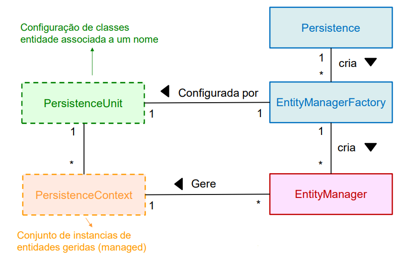

# Data Access Layers

_A data access layer (DAL) in computer software is a layer of a computer program which provides simplified access to data stored in persistent storage of some kind, such as an entity-relational database._

---
---

## Funções CRUD

* **CREATE**: Criar entidades;
* **READ**: Ler entidades;
* **UPDATE**: Atualizar dados de entidades;
* **DELETE**: Apagar entidades.

As operações CRUD devem ser independentes de características
específicas do SGBD, do modelo de dados (relacional, objetos, XML,
ficheiros) e da tecnologia de acesso utilizada (JDBC, JPA, etc.)

---
---

## Padrões de acesso a dados

* [**JSON**](https://www.json.org/json-en.html): JavaScript Object Notation is a lightweight data-interchange format. It is easy for humans to read and write. It is easy for machines to parse and generate.

* [**XML**](https://developer.mozilla.org/en-US/docs/Web/XML/XML_introduction): Extensible Markup Language is a markup language similar to HTML, but without predefined tags to use. Instead, you define your own tags designed specifically for your needs. This is a powerful way to store data in a format that can be stored, searched, and shared.

* **DTO**: Data Transfer Objects, as the name suggests, is an object made to transfer data. DTOs are most commonly used by the Services layer in an N-Tier application to transfer data between itself and the UI layer.

Quando se adota uma abordagem “domain model” pura, os dados
deverão ser manipulados na forma de objetos entidade. Neste caso,
podemos considerar duas possibilidades:

* **Entidades com comportamento CRUD**: cada objeto entidade
implementa os comportamentos CRUD respetivos;
* **Entidades sem comportamento CRUD**: o comportamento CRUD
é implementado por outros objetos (Data access objects - DAO,
Mapper objects, Repository objects, etc.)

---

* **Data Mapper**: responsável por realizar as operações CRUD da entidade a que está associado:

```
public interface IMapper<T, Tid> {
    void Create(T entity);
    T Read(Tid id);
    void Update(T entity);
    void Delete(T entity);
}
```

* **Repository**: responsável por manipular as entidades de uma forma mais complexa, como por exemplo, lendo coleções de entidades com um determinado critério de seleção. As implementações dos repositórios podem usar os Mappers já existentes, criando uma nova camada de abstração que, basicamente, virtualiza as fontes de dados:

```
public interface IRepository<Tentity,Tkey> {
    List<Tentity> GetAll();
    Tentity Find(Tkey k);
    
    //Outras operações envolvendo coleções
    void Add(Tentity entity);
    void Delete(Tentity entity);
    void Save(Tentity e);
}
```

* **UnitOfWork**: simplifica a gestão do ciclo de vida das entidades e facilita, sem obrigar, a utilização desligada (as ligações à base de dados apenas são estabelecidas durante a leitura das entidades e quando se pretende propagar valores para a BD, ficando, entretanto, as entidades armazenadas no objeto que implementa o padrão):

```
public interface IUnitOfWork {
    void NotifyInsert(object entity);
    void NotifyUpdate(object entity);
    void NotifyDelete(object entity);
    void Commit();
    void Rollback();
}
```

---
---

## Jakarta Persistence

_With the Jakarta Persistence API, the system can perform the serialization of Java Objects into the Database or read data into objects. You can use Jakarta JPA to read and write Java instances easily from and to the database._

Arquitetura lógica:

<p align="center">
    
</p>

Exemplo:

```
EntityManagerFactory emf = Persistence.createEntityManagerFactory("Example");
EntityManager em = emf.createEntityManager();

try
{
    em.getTransaction().begin();
    
    Student s = new Student();
    s.setId(555);
    s.setName("Rui Silva");
    
    em.persist(s);
    em.getTransaction().commit();
finally {
    em.close();
    emf.close();
}
```

---

### [Entity Manager](https://docs.oracle.com/javaee/7/api/javax/persistence/EntityManager.html)

Estes objetos permitem manter os contextos de persistência, controlando os acessos à base de dados, as transações e o ciclo de vida das instâncias das entidades geridas.

Alguns métodos:

* `void clear()` – fecha o EM, ou seja, faz detach de todas as managed instances;
* `void close()` – fecha o entity manager;
* `void detach(Object entity)` – coloca a entidade entity no estado “detached”;
* `void flush()` – executa as operações de persistência pendentes;
* `T merge(T entity)` – faz o merge da entidade entity;
* `void persist(Object o)` – persiste a entidade o;
* `void refresh(Object o)` – atualiza a entidade o;
* `void remove(Object o)` – remove a entidade o;
* `Boolean contains(Object o)` – verifica se a entidade o está persistida.

---

### Mapeamento de entidades

_An entity is a lightweight persistence domain object. Typically, an entity represents a table in a relational database, and each entity instance corresponds to a row in that table._

Algumas anotações relevantes:

* _The **@Entity** annotation defines that a class can be mapped to a table. And that is it, it is just a marker, like for example Serializable interface._

* _The **@Table** annotation allows you to specify the details of the table that will be used to persist the entity in the database._

* _The **@Id** annotation specifies the primary key of an entity._

* _The **@Column** annotation is used to specify the mapped column for a persistent property or field._

**Exemplo**

SQL: 
```
CREATE TABLE students (
    id INTEGER PRIMARY KEY,
    name VARCHAR(80) NOT NULL,
);
```

Java with JPA:
```
@Entity
@Table(name = "students")
public class Student {

    public students() {} // Needed for JPA
    
    @Id
    private int id;
    
    @Column(name = "name") // Can be omitted because the default is the same as the property name
    private String name;

    // Getters and setters...
}
```

---

### Mapeamento de associações

* _The **@OneToOne** annotation defines a one-to-one association between two entities._

* _The **@OneToMany** annotation defines a one-to-many association between two entities._

* _The **@ManyToOne** annotation defines a many-to-one association between two entities._ 

* _The **@ManyToMany** annotation defines a many-to-many association between two entities._

* _The **@JoinColumn** is used to specify a column for joining an entity association or element collection. This annotation indicates that the enclosing entity is the owner of the relationship and the corresponding table has a foreign key column which references to the table of the non-owning side._

Exemplos:

SQL:
```
CREATE TABLE lockers (
    id INTEGER PRIMARY KEY,
    description VARCHAR(80) NOT NULL,
);

CREATE TABLE students (
    id INTEGER PRIMARY KEY,
    name VARCHAR(80) NOT NULL,
    locker INTEGER REFERENCES lockers(id)
);
```

Java with JPA:
```
@Entity
@Table(name = "lockers")
public class Locker {
    @Id
    private int id;
    private String description;

    @OneToOne(mappedBy = "locker") // Name of the property in the other entity
    private Student student;
}

public class Student {
    ...

    @OneToOne
    @JoinColumn(name = "locker") // Foreign key
    private Locker locker;
}
```

---

### Query Language

TODO

---

### Procedimentos armazenados e funções

TODO

---

### Transações

TODO
