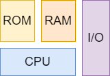
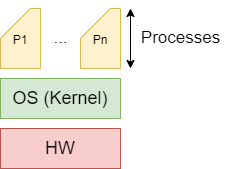
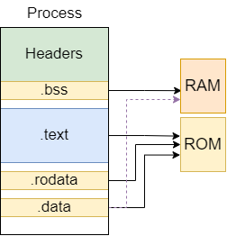

# Introduction

## Computer Architecture

    

The **CPU** (Central Processing Unit) follows the **instruction cycle** to execute instructions:

1. **Fetch** - fetch the instruction from memory;
2. **Decode** - decode the instruction;
3. **Execute** - execute the instruction.

### I/O

* Input/Output (I/O) is the communication between the CPU and external devices;
* Read/Write (R/W), as in the computer memory;
* Address Bus, Data Bus.

### Process

* A process is a program in execution;
* The programs execute in isolated environments called processes:

    

    

* The **.text** and .**rodata** sections are read-only, so they are in the read-only memory (**ROM**);
* The **.data** is stored in the **ROM**, but in **run-time it is copied to the RAM**;
* The **.bss** is stored in the **RAM**, but it is not initialized;